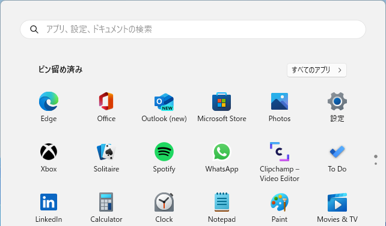
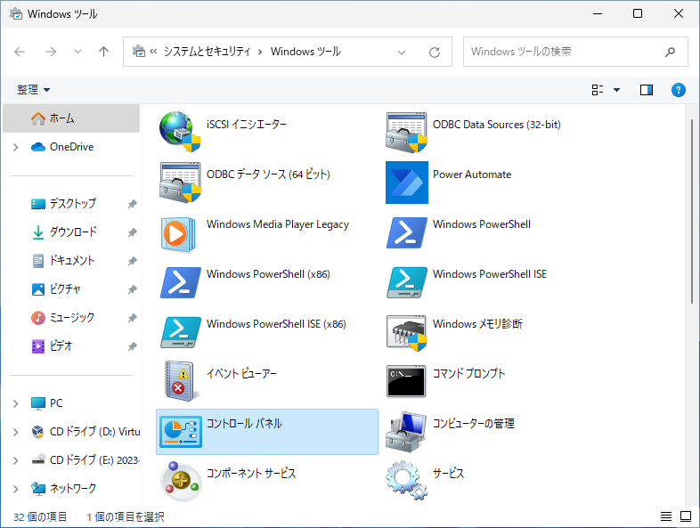

# Windows 11 に Hyper-V をインストールする方法
tag: Hyper-V 初心者向け 新人教育 Windows11

Hyper-V（ハイパーブイ）は仮想マシンを動かすための Windows の機能です。Hyper-V を使うと異なるオペレーティングシステムを Windows 上で動かすことができます。マイクロソフトが評価のために [Windows Server 2022](https://www.microsoft.com/ja-jp/evalcenter/download-windows-server-2022)、[Windows 11 開発環境](https://developer.microsoft.com/ja-jp/windows/downloads/virtual-machines/)、[Windows Hardware Lab Kit](https://learn.microsoft.com/ja-jp/windows-hardware/test/hlk/) の仮想マシンを公開しています。ここでは 18 歳の新入社員向けに Hyper-V のインストール方法を説明します。

## Hyper-V の目的
Hyper-V の目的を２つ挙げます。

### アプリケーションのテスト
ソフトウェア開発者やテスターは Hyper-V を使用して異なる環境でアプリケーションをテストできます。

### 一貫性のある共通環境の提供
Hyper-Vは、仮想マシンごとに異なる環境を提供し、それぞれの環境が物理ハードウェアや他の仮想マシンに影響を与えないように分離します。これによりどこにいても同じ環境でアプリケーションやサービスを実行できます。

## Hyper-V のシステム要件
Hyper-V のシステム要件は以下の通りです。

- オペレーティングシステム: Windows 8 以降のプロフェッショナル エディション（Pro、Enterprise、または Education）で利用できます。
- プロセッサ: Intel VT-x もしくは AMD-V に対応する 64 ビットのプロセッサが必要です。
- RAM: 仮想マシンに割り当てるための十分な物理メモリが必要です。
- BIOS/UEFI: ハードウェア仮想化およびデータ実行防止が有効になっている必要があります。

ここでは Windows 11 に Hyper-V をインストールする手順を説明します。

## Hyper-V のインストール手順

タスクバー中央にあるスタートボタンをクリックします。

スタートメニューが表示されたら、右上にある「すべてのアプリ」をクリックします。

アプリ一覧が表示されたら下にスクロールし、「Windows ツール」をクリックします。

Windows ツールが表示されたら、「コントロールパネル」をクリックします。

コントロールパネルが表示されたら、「プログラム」をクリックします。

プログラムが表示されたら、「Windowsの機能の有効化または無効化」をクリックします。

Windows の機能が表示されたら、「Hyper-V」にチェックをつけ、「OK」をクリックします。

この後、Windows を再起動すれば、インストール完了です。

## Hyper-V GUI 管理ツールの起動手順

スタートメニューから「Windows ツール」をクリックします

「Hyper-V マネージャー」をクリックします。

「Hyper-V マネージャー」で仮想マシンの作成や仮想ネットワークの構築を行うことができます。

