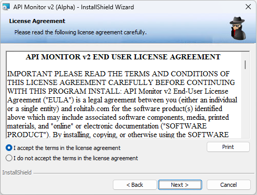
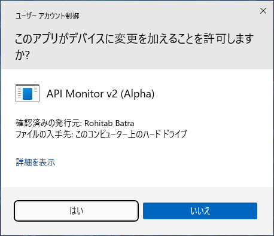

# API 監視ソフト API Monitor のインストール
tag: APIMonitor Windows11 初心者向け 新人教育 C言語

API Monitor は無料で使える API 呼び出しを監視するソフトウェアです。プログラムがライブラリの関数を呼び出す際の引数や戻り値を表示することができます。ここでは 18 歳の新入社員向けに API Monitor のインストール手順を説明します。

## API Monitor の目的
API Monitor は以下のような用途で使われます。

### ソフトウェアのデバッグ
プログラムの API 呼び出しが期待通りに動作しているか、または予期しない動作やエラーが発生していないかを確認するのに使用できます。

### APIの監視
ソースコードのないプログラムの動作を解析する際、プログラムがどのAPIを呼び出し、どのようなデータを処理しているかを明らかにするのに役立ちます。

### セキュリティ分析
マルウェアや悪意のあるプログラムがシステムのどの部分とやりとりをしているか、どのような行動を取っているかを特定するために使うことができます。

:::note warn
ソフトウェアの内部構造を解析し、動作原理を特定する行為は、リバースエンジニアリングと呼ばれます。商用ソフトウェアは使用許諾契約書でリバースエンジニアリングを禁止していることがあります。他人のソフトウェアをリバースエンジニアリングすることは避けましょう。
:::

## API Monitor のシステム要件
API Monitor は以下の環境で動作します。

- オペレーティングシステム:Windows 2000, XP, Vista, 7, 8 以降
- 対象API: Win32 API を含む ダイナミックリンクライブラリ（DLL） のAPI

ここでは API Monitor V2 Aplha r13 を例にして Windows 11 へのインストール方法を紹介します。

## API Monitor のインストール手順

API Monitor のダウンロードページにアクセスし、「API Monitor v2 (Alpha-r13) - x64 64-bit」のリンクをクリックします。

[http://www.rohitab.com/downloads](http://www.rohitab.com/downloads)

ダウンロードが完了したら、インストーラを実行します。

インストーラのセットアップ画面が表示されたら、「Next」をクリックします。

ライセンス契約の内容を確認して、「I accept the terms in the license agreemt」を選択し、「Next」をクリックします。

インストールタイプの選択が表示されたら、「Next」をクリックします。

インストーラのセットアップ画面が表示されたら、「Install」をクリックします。

ユーザーアカウント制御が表示されたら、「はい」をクリックします。

ファイルのインストールが完了したら、「Finish」をクリックします。

以上でインストール作業は終了です。
