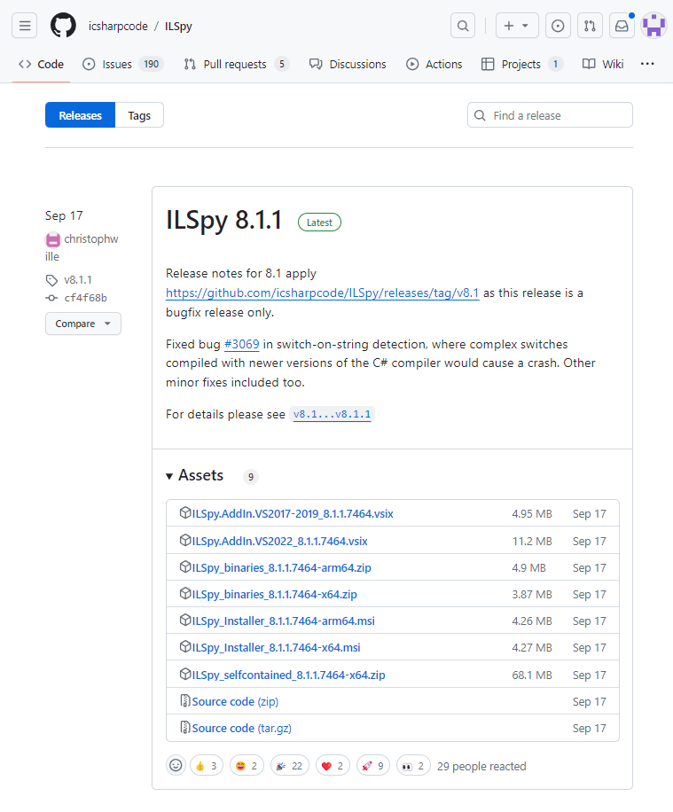
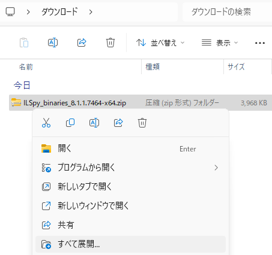
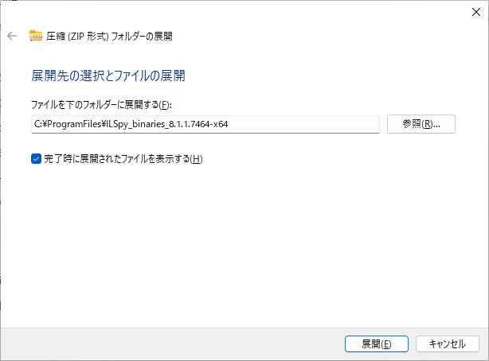
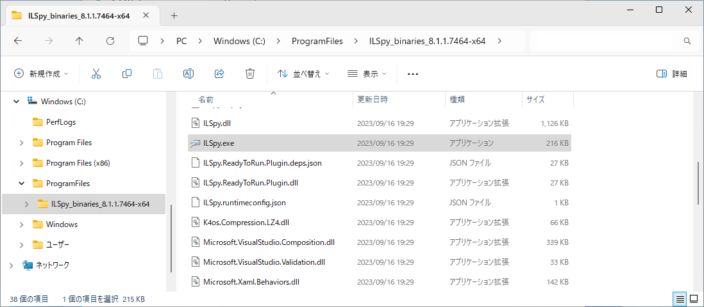

# .NET 逆コンパイラ ILSpy のインストール
tag: 初心者向け 新人教育 ILSpy Windows11 C#

ILSpy は無料で使える .NET の逆コンパイラです。.NET プログラムのバイナリコードを C# 言語のソースコードに変換することができます。ここでは 18 歳の新入社員向けに ILSpy のインストール方法を紹介します。

## ILSpy の目的
ILSpy は以下のような用途で使われます。

### デバッグと解析
.NET アプリケーションの内部動作を理解するために使われます。

### セキュリティ調査
セキュリティ研究者がアプリケーションのセキュリティ診断や悪意のあるコードの検出に ILSpy を使用します。

### リバースエンジニアリング
特定のアセンブリがどのように機能するかを理解し、必要に応じて改善や拡張を行うために使用されます。

:::note warn
ソフトウェアの内部構造を解析し、動作原理を特定する行為は、リバースエンジニアリングと呼ばれます。商用ソフトウェアでは使用許諾契約書でリバースエンジニアリングを禁止していることがあります。他人のソフトウェアをリバースエンジニアリングすることは避けましょう。
:::

## ILSpy のシステム要件
ILSpy は以下の環境で動作します。

- オペレーティングシステム：Windows 7, 8, 10, 11 以降
- .NET Framework: .NET 6.0.2 以降

ここでは ILSpy 8.1.1 を例にして、Windows 11 へのインストール方法を紹介します。

## ILSpy のインストール手順

ILSpy のダウンロードページにアクセスします。ILSpy 8.1.1 の「Assets」セクションから「ILSpy_binaries_8.1.x.x-x64.zip」（x はバージョン番号）のリンクをクリックします。

[https://github.com/icsharpcode/ILSpy/releases](https://github.com/icsharpcode/ILSpy/releases)

ダウンロードした ZIP ファイルを右クリックし、コンテキストメニューから「すべて展開」をクリックします。

ファイルの展開先を指定します。ここでは例として C:\ProgramFiles\ILSpy_binaries_8.1.1.7464-x64 というフォルダに展開します。

これでセットアップ作業は完了です。ILSpy を使う時は C:\ProgramFiles\ILSpy_binaries_8.1.1.7464-x64\ILSpy.exe を起動します。

