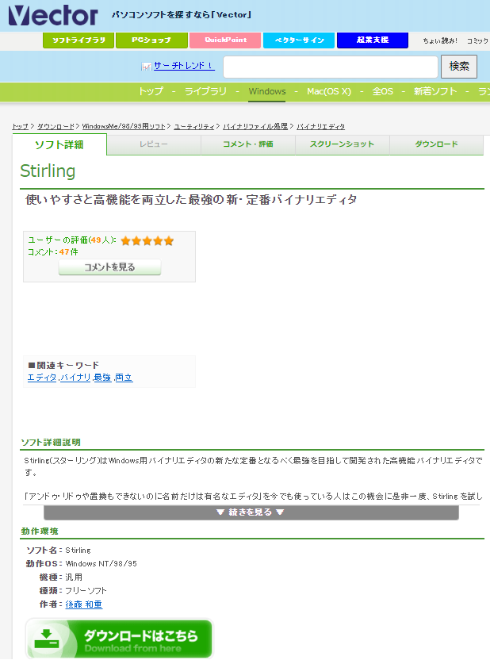
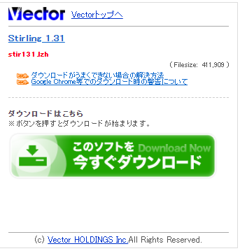
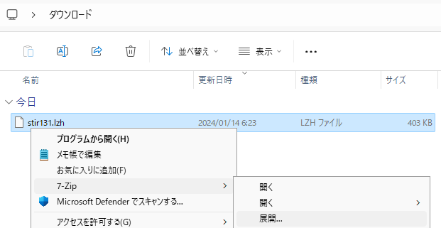
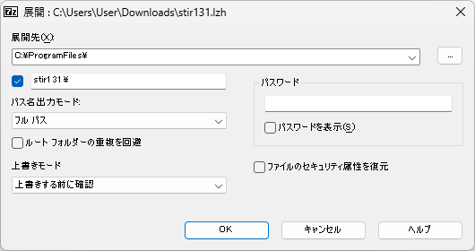
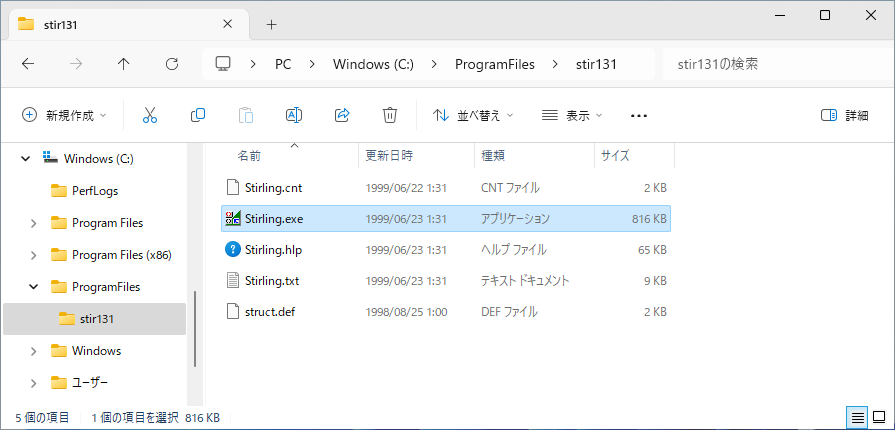

# バイナリエディタ　Stirling のインストール
tag:バイナリエディタ 初心者向け 新人教育 Stirling Windows11

Stirling は Windows 向けの無料のバイナリエディタです。Stirling はアンドゥ・リドゥ機能や比較機能を持つ、高機能なバイナリエディタです。ここでは 18 歳の新入社員向けに Stirling のインストール手順を説明します。

## Stirling を使う目的
Stirling は以下のような用途で使われます。

### ファイルの解析と修正
ファイルのバイナリ表現を直接操作することで特定のファイル形式の内部構造を調査し、必要に応じて修正できます。これは、ファイルのデータ構造が不明確である場合や特定の問題を修正するために使用されます。

### データの比較
2つのバイナリファイルを比較し、違いを特定するのに使用できます。これはプログラムのバージョン管理やセキュリティチェックに役立ちます。

### データの抽出
バイナリデータから特定の情報やリソースを抽出できます。たとえば、実行可能ファイルからアイコンやリソースを抽出することができます。

:::note warn
ソフトウェアの内部構造を解析し、動作原理を特定する行為は、リバースエンジニアリングと呼ばれます。商用ソフトウェアでは「使用許諾契約書」でリバースエンジニアリングを禁止していることが多いです。他人のソフトウェアをリバースエンジニアリングすることは避けましょう。
:::

## Stirling のシステム要件
Stirling は以下の環境で動作します。

- オペレーティングシステム：Windows95, 98, NT4.0以降
- その他：LZH ファイルの解凍ソフトウェア（[7-Zip](https://qiita.com/mmake/items/e18ef5978f365b2ead3a)等）がインストールされていること。

ここでは Stirling Version 1.31 を例にして、Windows 11 へのインストール方法を紹介します。

## Stirling のインストール手順

ベクターの Stirling の紹介ページにアクセスし、「ダウンロードはこちら」をクリックします。

[https://www.vector.co.jp/soft/win95/util/se079072.html](https://www.vector.co.jp/soft/win95/util/se079072.html)

ダウンロードページが表示されたら、「このソフトを今すぐダウンロード」をクリックします。

ダウンロードした stir131.lzh を右クリックし、コンテキストメニューが表示されたら、7-Zip の展開をクリックします。

ファイルの展開先を指定します。ここでは例として C:\ProgramFiles というフォルダに展開します。

これでセットアップ作業は完了です。Stirling を使う時は C:\ProgramFiles\stir131\Stirling.exe を起動します。

