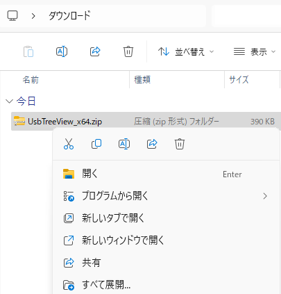
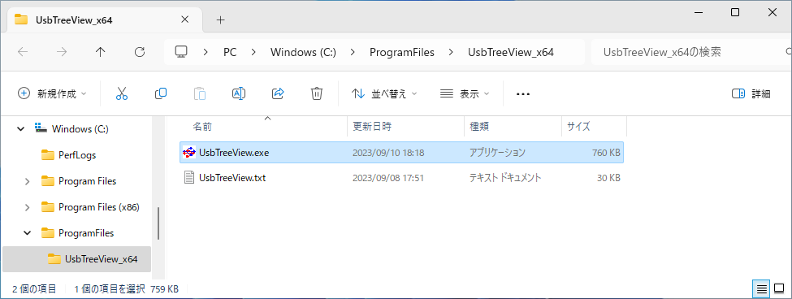

# USB のトラブルシューティングツール USB Device Tree Viewer のインストール
tag: USBDeviceTreeViewer 初心者向け 新人教育 Windows11

USB Device Tree Viewer（ユーエスビー　デバイス　ツリー　ビューワー）は、PC に接続されている USB デバイスの情報を表示する無料のソフトウェアです。このソフトウェアはプロフェッショナルがUSBデバイスの診断を行う際に役立ちます。ここでは18歳の新入社員向けに USB Device Tree Viewer のインストール方法を紹介します。

## USB Device Tree Viewer の目的
USB Device Tree Viewer は以下のような用途で使われます。

### デバイスの識別
USB デバイスに関する接続されているUSBデバイスの各種情報（製造者、製品ID、ベンダーID、リビジョン、使用中のドライバ、速度、消費電力など）を詳細に表示します。

### 接続関係の確認
USB デバイスがどのハブに接続されているか、またはどのポートを使用しているかを確認できます。

### トラブルシューティング
USBデバイスが認識されない、接続が不安定などの問題を特定できます。

## USB Device Tree Viewer のシステム要件
USB Device Tree Viewer は以下の環境で動作します。

- オペレーティングシステム: Windows 8, 10, 11

ここでは USB Device Tree Viewer V3.8.9 を例にして、Windows 11 へのインストール手順を説明します

## USB Device Tree Viewer のインストール手順
USB Device Tree Viewer  のダウンロードページにアクセスし、Download latest release: -> x64 をダウンロードします。

[https://www.uwe-sieber.de/usbtreeview_e.html#download](https://www.uwe-sieber.de/usbtreeview_e.html#download)

ダウンロードしたファイルを右クリックし、コンテキストメニューからすべて展開をクリックします。

ファイルの展開先を指定します。ここでは例として C:\ProgramFiles\UsbTreeView_x64 というフォルダに展開します。

これでセットアップ作業は完了です。USB Device Tree Viewer を使う時は C:\ProgramFiles\UsbTreeView_x64\UsbTreeView.exe を起動します。

