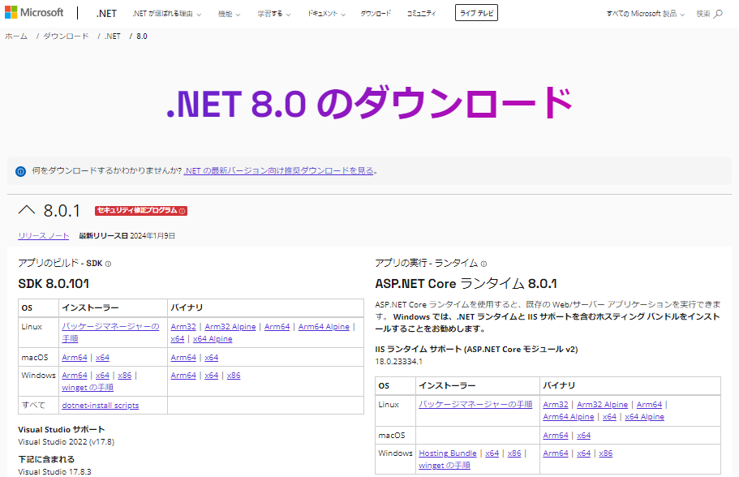
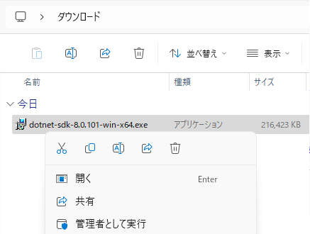
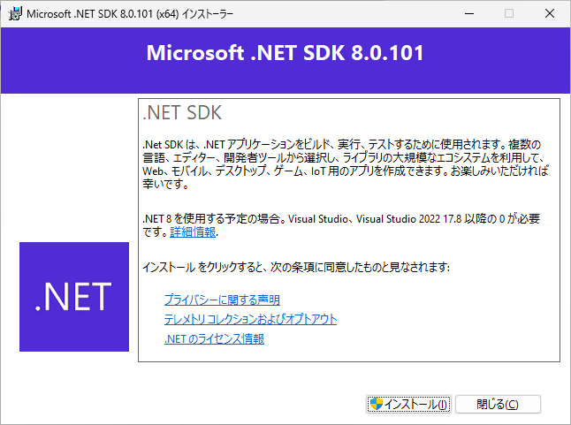
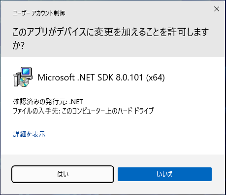
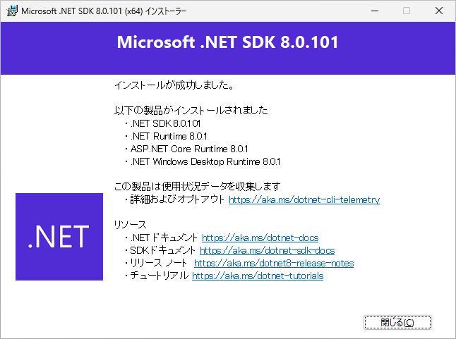

# プログラム開発ツール .NET 8 のインストール
tag: .NET 初心者向け 新人教育 新人応援 Windows11　

.NET 8 は無料で使える C# プログラム開発ツールです。.NET 8 は Windows や Linux, macOS で動くソフトウェアを開発するために利用されます。この記事では 18 歳の新入社員向けに .NET 8 のインストール手順を説明します。

## .NET 8 の目的
.NET 8 は以下のような用途で使われます。

### クロスプラットフォーム開発
.NET 8 はWindows、Linux、macOS をサポートしています。１つのソースコードで複数のプラットフォームに対応するアプリケーションを構築できます。

### クラウドアプリケーションの開発
ASP.NET Core を使うと Azure クラウドで動く Web アプリケーションを開発できます。

### .NET アプリケーションの高速化
.NET 8 は多くの最適化が行われ、.NET 6 よりアプリケーションのパフォーマンスが向上しています。

## .NET 8 のシステム要件
[.NET 8 のシステム要件](https://github.com/dotnet/core/blob/main/release-notes/8.0/supported-os.md)は、使用する OS によって異なります。Windows OS のシステム要件を以下に示します。

- オペレーティングシステム:　Windows 10 (1607 以降), 11, Windows Server 2012 以降

ここでは .NET 8.0.1 を Windows 11 にインストールする手順を説明します。

## .NET 8 のインストール手順

.NET 8 の公式ページにアクセスします。

[https://dotnet.microsoft.com/ja-jp/download/dotnet/8.0](https://dotnet.microsoft.com/ja-jp/download/dotnet/8.0)

ページが表示されたら、SDK 8.0.x（x はバージョン番号）の Windows OS のインストーラーの「x64」のリンクをクリックします。

インストーラをダウンロードしたら、ファイルをダブルクリックし、インストーラを起動します。

.NET SDK 8 のインストール画面が表示されたら、「インストール」をクリックします。

ユーザーアカウント制御が表示されたら、「はい」をクリックします。

インストール完了画面が表示されたら、「閉じる」をクリックします。

以上で、インストール作業は終了です。