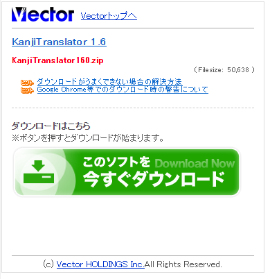
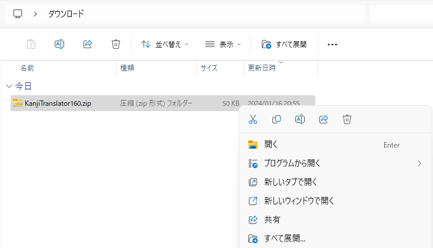
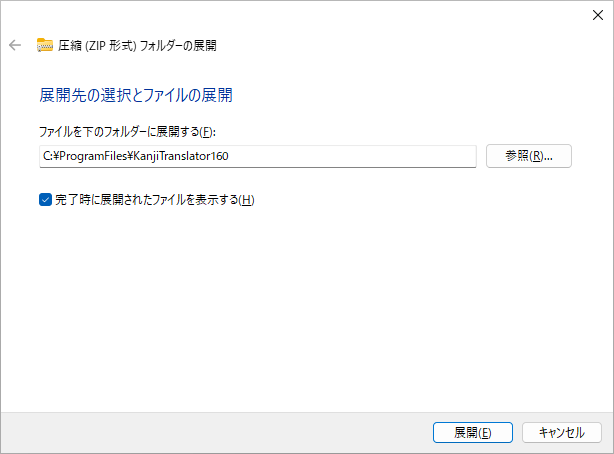
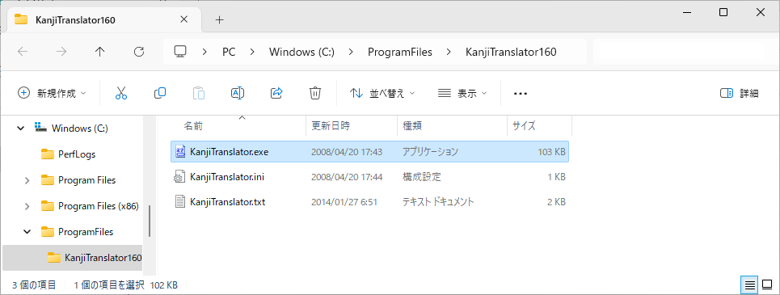

# 文字コード、改行コード変換ツール KanjiTransrator のインストール
tags: KanjiTransrator 初心者向け 新人教育 Windows11 文字コード

KanjiTransrator（読み方：カンジ　トランスレータ）はファイルの文字コードと改行コードを一括して変換できる無料のソフトウェアです。ここでは18歳の新入社員向けに KanjiTransrator のインストール方法を紹介します。

## KanjiTransrator の目的
KanjiTransrator は以下のような用途で使われます。

### ファイルの文字コードの変換
大量ファイルの文字コード（ShiftJIS, ISO-2022-JP, EUC-JP, UTF-8）を一括で変換することができます。

### ファイルの改行コードの変換
Mac と UNIX の改行コードが混在する複数のファイルを、まとめて Windows 用に変換することができます。

## KanjiTransrator のシステム要件
KanjiTransrator は以下の環境で動作します。

- オペレーティングシステム: Windows 98, ME, NT4.0 SP6a, 2000, XP, Vista, 7, 8, 8.1

ここでは KanjiTransrator 1.6 を例にして、Windows 11 へのインストール手順を説明します

## KanjiTransrator のインストール手順
### ダウンロード
ベクターの KanjiTransrator の紹介ページにアクセスし、「ダウンロードページへ」をクリックします。

[https://www.vector.co.jp/soft/dl/win95/util/se326595.html](https://www.vector.co.jp/soft/dl/win95/util/se326595.html)

ダウンロードページが表示されたら、「このソフトを今すぐダウンロード」をクリックします。

### ファイルの展開
ダウンロードが完了したら、ファイルを右クリックし、コンテキストメニューから「**すべて展開**」をクリックします。

### 展開先フォルダの指定
ファイルの展開先を指定します。ここでは例として **C:\ProgramFiles\KanjiTranslator160** というフォルダに展開します。

以上でインストール作業は終了です。

KanjiTransrator を使う時は **C:\ProgramFiles\KanjiTranslator160\KanjiTranslator.exe** を実行します。

