# コードエディタ Visual Studio Code のインストール
tag: 初心者向け 新人教育 新人応援 VisualStudioCode Windows11

Visual Studio Code（読み方：ビジュアル　スタジオ　コード、略称：VSCode ）は無料で使えるオープンソースのコードエディタです。
VS Code は動作が軽量で拡張性が高く、様々なプログラミングタスクに対応できるため、多くの開発者に愛用されています。
ここでは 18 歳の新入社員向けに VS Code  のインストール方法を紹介します。

## Visual Studio Code の特徴
VS Code の特徴を以下に挙げます。

### クロスプラットフォーム
VS Code は Windows、macOS、Linux で動作します。

### 強力なエディタ機能
VS Code はインテリセンス、コードナビゲーション、リファクタリングなど、効率的なコード編集のための機能が用意されています。

### 多くのプログラミング言語に対応
VSCode は多くのプログラミング言語に対応しており、シンタックスハイライト、コード補完、デバッグ機能などを提供します。

### 豊富な拡張機能
VS Code は拡張機能により機能を拡張できます。これにより、さまざまなプログラミング言語、フレームワーク、ツールに対応した環境を構築することができます。

## Visual Studio Code  のシステム要件
[VS Code の推奨スペック](https://code.visualstudio.com/docs/supporting/requirements) は以下の通りです。

- Windows： Windows 10 (64ビット版)、11
- プロセッサ： 1.6 GHz 以上のプロセッサ
- メモリ；　1 GB 以上

ここでは Visual Studio Code　version 1.85 を例にして、Windows 11 へのインストール方法を紹介します。

## Visual Studio Code のインストー手順
### ダウンロード

Visual Studio Code の公式ページにアクセスします。

[https://code.visualstudio.com/](https://code.visualstudio.com/)

ページにアクセスしたら、 「**Download for Windows**」ボタンをクリックします。

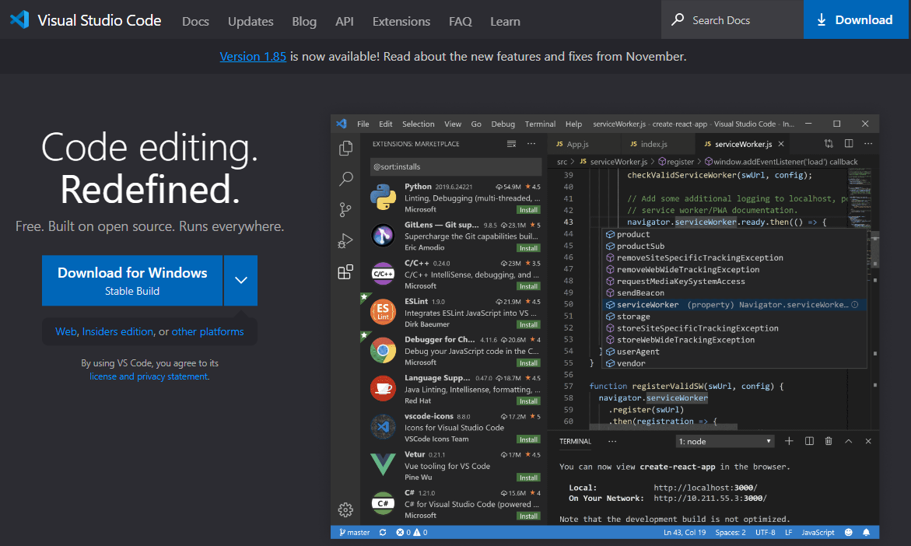

### インストーラの起動
ダウンロードが完了したら、ファイルをダブルクリックし、インストーラを実行します。

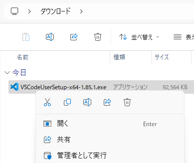

### ライセンスの確認
使用許諾契約の内容を確認して、「**同意する**」を選択し、「**次へ**」をクリックします。

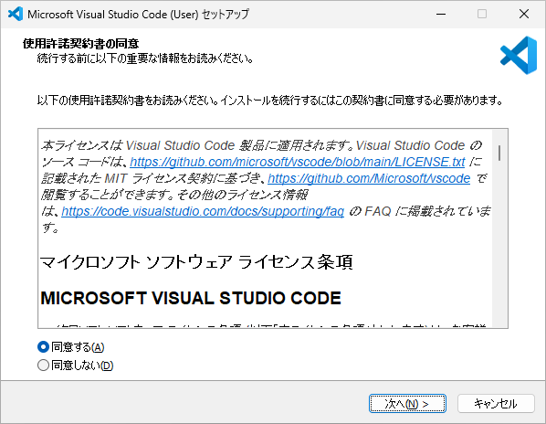

### インストール先の選択
インストール先フォルダの選択画面が表示されたら、「**次へ**」をクリックします

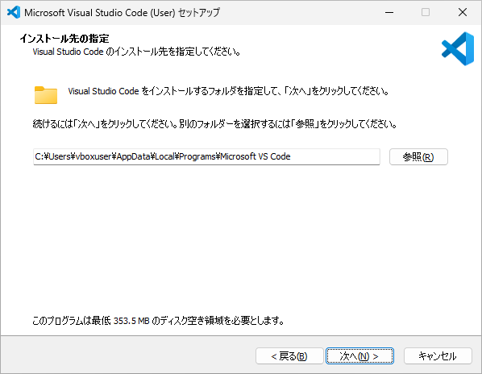

### スタートメニューの選択
スタートメニューフォルダの選択画面が表示されたら、「**次へ**」をクリックします

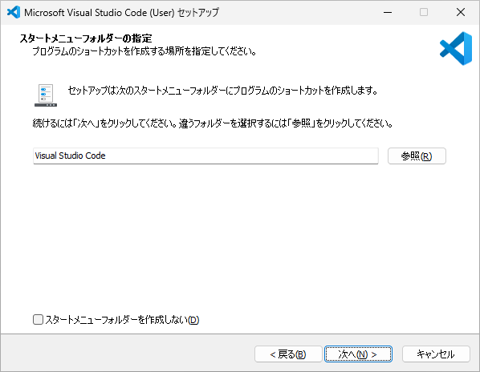

### 追加タスクの選択
追加タスクの選択画面が表示されたら、「**次へ**」をクリックします

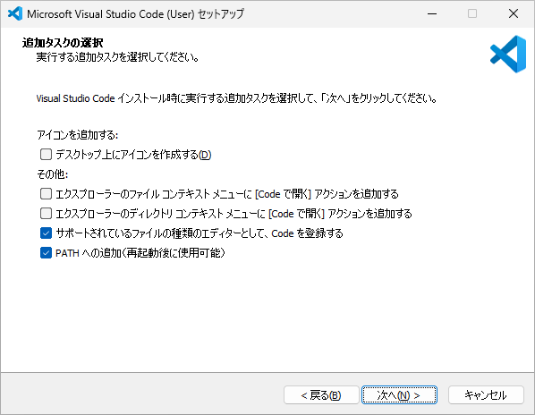

### インストールの確認
インストールの準備完了画面が表示されたら、「**インストール**」をクリックします

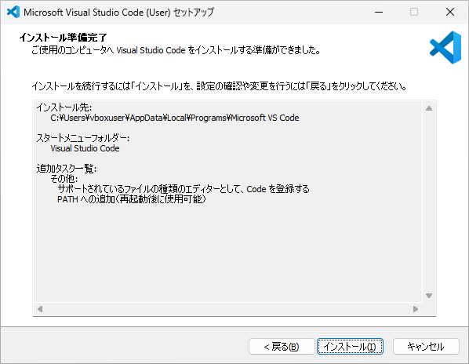

### インストールの終了
インストール完了画面が表示されたら、「**完了**」をクリックします。

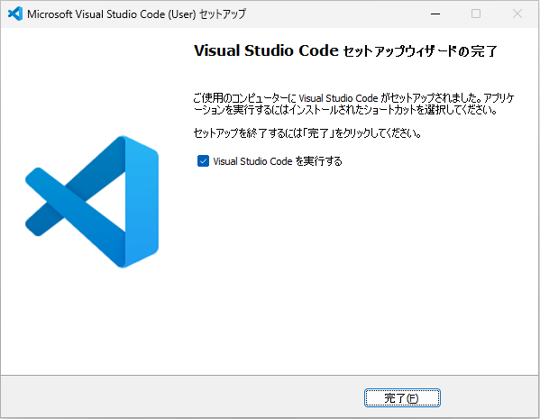

## 初回起動時の設定

### Visual Studio Codeの起動
Welcome 画面が表示されたら、Welcome の右横にある「**X**」をクリックして、Welcome 画面を閉じます。

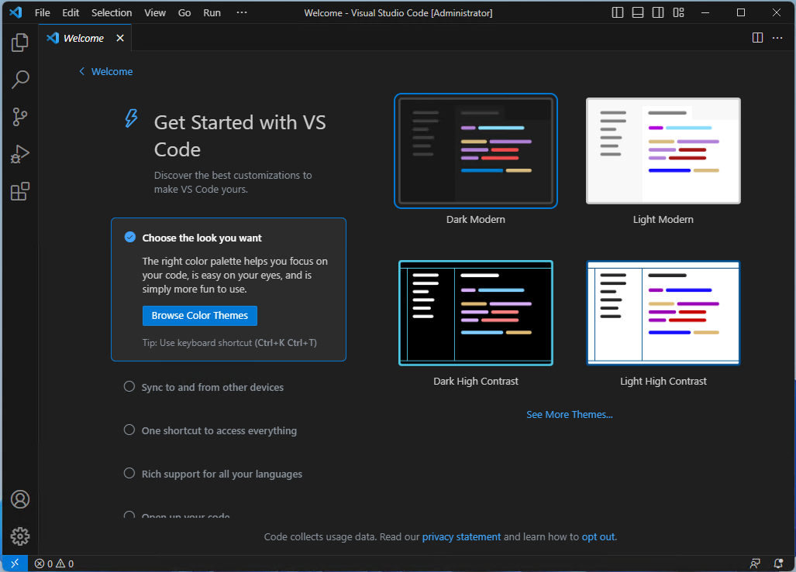

### 拡張機能の追加
左端にある「**Extension（拡張機能）**」アイコンをクリックします。

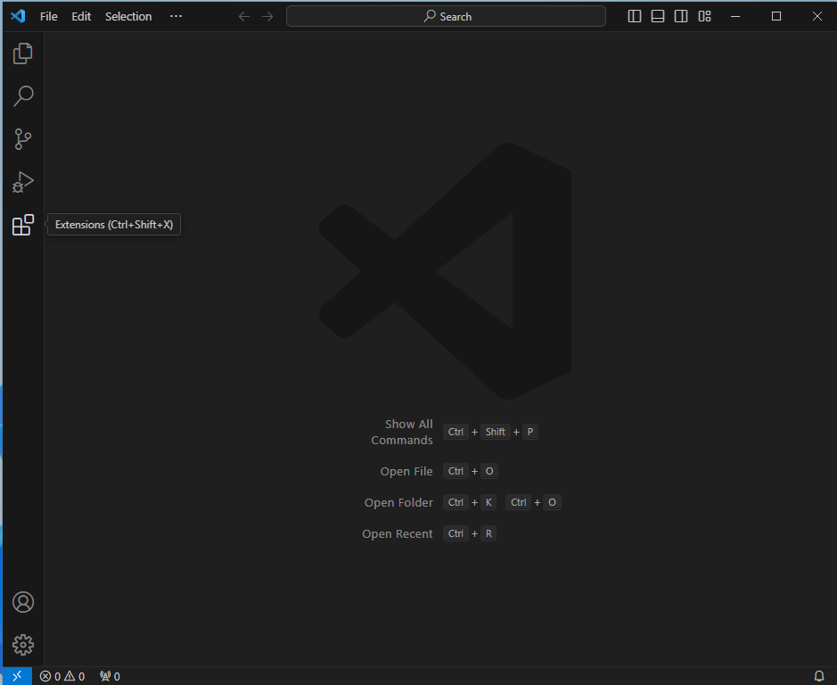

### 拡張機能の検索
拡張機能の検索ボックスに「**japanese**」と入力します。

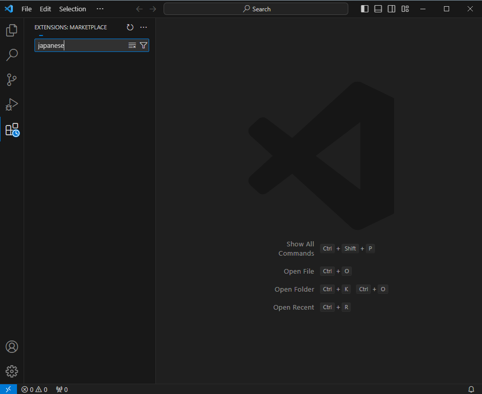

### 拡張機能のインストール
検索結果に Japanese Language Pack for Visual Studio Code が表示されたら、「**Install**」をクリックします。

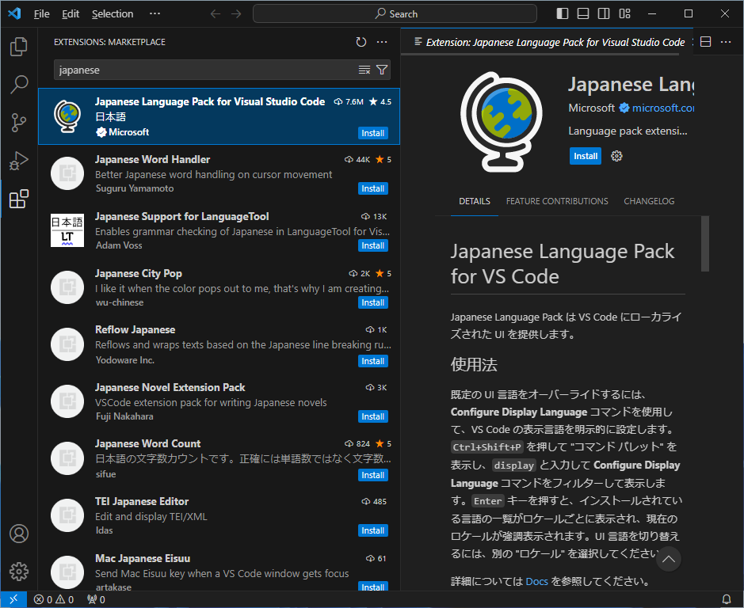

### VSCode の再起動
右下に再起動を促すダイアログが表示されたら、「**Change Language and Restart**」をクリックします。

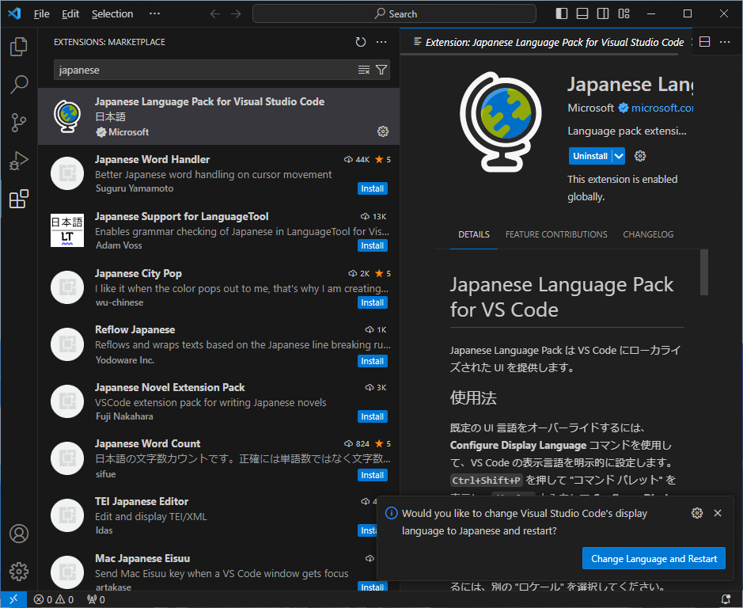

### 日本語化の終了
日本語のメニューが表示されれば、初期設定完了です。

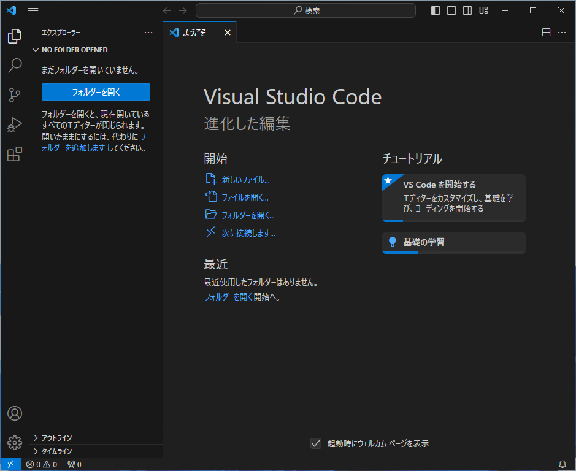

## まとめ
Visual Studio Code のインストール方法を説明しました。他の記事で各種のプログラム言語向けの使い方を紹介します。

(予定)
- C# NET6 向け拡張機能のインストール
- Python 向け拡張機能のインストール
- JupyterLab 向け拡張機能のインストール
- Markdown 向け拡張機能のインストール