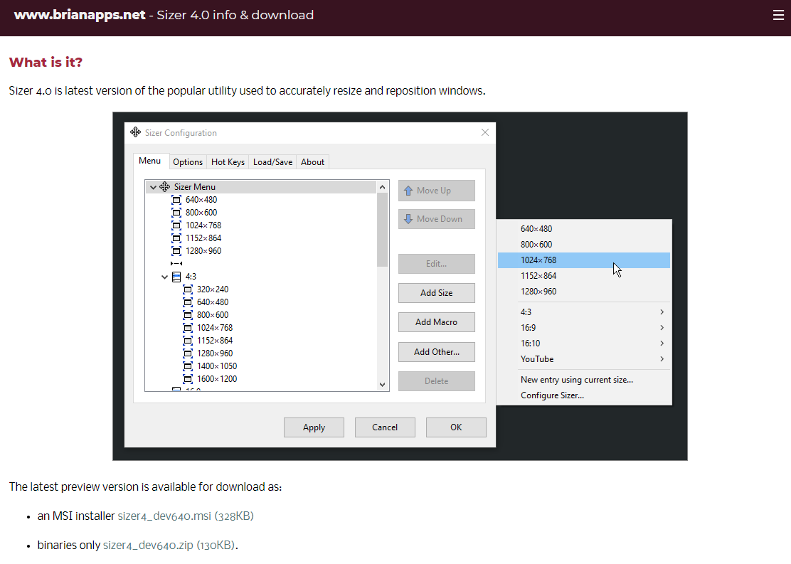
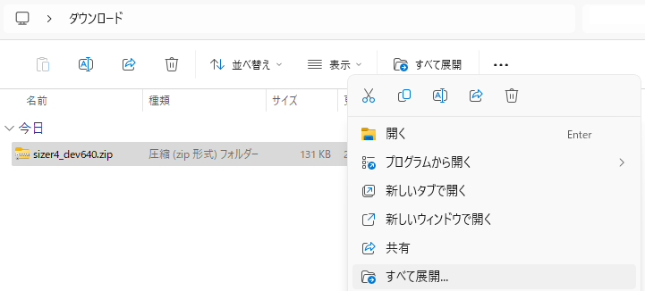
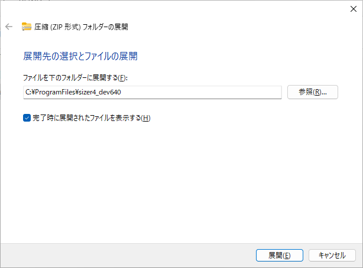
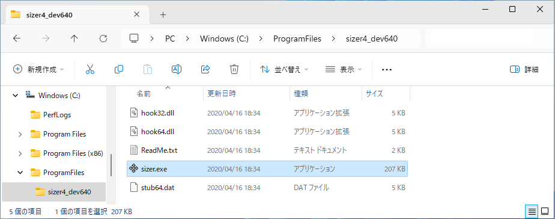
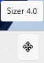
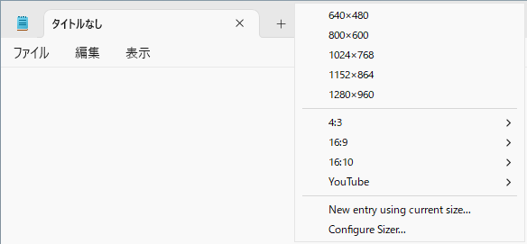
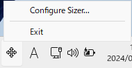
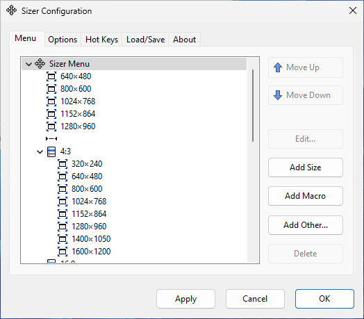

ウィンドウサイズ変更ソフト Sizer 4.0 の使い方
tag: sizer 新人教育 新人応援 初心者向け Windows11 

「Sizer」は無料で使える Windows 向けのソフトウェアです。Sizer を使うとウィンドウのサイズや位置を簡単に変えることができます。ここでは 18 歳の新人社員向けに Sizer 4.0 のインストール手順を紹介します。

## Sizer の目的
Sizer は以下のような目的で利用できます。

### スクリーンショットの撮影
マニュアル作成者が特定のサイズや解像度でスクリーンショットを撮影する場合、Sizerを使ってウィンドウを正確にそのサイズにリサイズすることができます。

### ウェブデザインやアプリのテスト
ウェブページやアプリが異なる画面サイズでどのように表示されるかをデザイナーが確認する際、Sizerを使ってウィンドウのサイズを変更してテストすることができます。

### マルチタスク作業
複数のアプリケーションやドキュメントを同時に開いて作業する場合、Sizerを使うと、各々のウィンドウを簡単に特定のサイズや位置に調整することができ、作業効率を向上させることができます。

## Sizer 4.0 のシステム要件
Sizer 4.0 は以下の環境で動作します

オペレーティングシステム：Windows 10, 11

ここでは Sizer 4.0 の zip 版を例にして、Windows 11 へのインストール方法を紹介します。

## Sizer 4.0  のインストール方法
### ダウンロード

Sizer 4.0 のダウンロードページにアクセスします。sizer4_dev640.zip のリンクをクリックします。

[https://www.brianapps.net/sizer4/](https://www.brianapps.net/sizer4/)

### ファイルの展開
ダウンロードが完了したら、ZIP ファイルを右クリックし、コンテキストメニューから「すべて展開」をクリックします。

### 展開先フォルダの指定
ファイルの展開先を指定します。ここでは例として **C:\ProgramFiles\sizer4_dev640** というフォルダに展開します。

以上でインストール作業は終了です。

## Sizer の使い方
次に Sizer の使い方を説明します。

Sizer を使う時は **C:\ProgramFiles\sizer4_dev640\sizer.exe** を実行します。

Sizer が起動すると、システムトレイにアイコンが表示されます。

適当なウィンドウの境界付近を右クリックすると、Sizerのツールチップが表示されます。ツールチップからサイズを選択すると、ウィンドウの大きさがそのサイズに変わります。

システムトレイにある Sizer のアイコンを右クリックし、「Configure Sizer」を選択すると、設定ダイアログが表示されます。

設定ダイアログでは、新しいエントリを追加したり、既存のエントリを編集することができます。

## まとめ

Sizer のようなツールは、特定のタスクを効率的に行うための補助的な役割を果たします。ウィンドウのサイズや位置の調整が頻繁に必要な作業を行う場合、このようなツールが非常に便利です。
