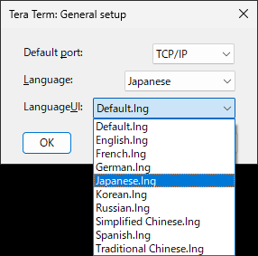
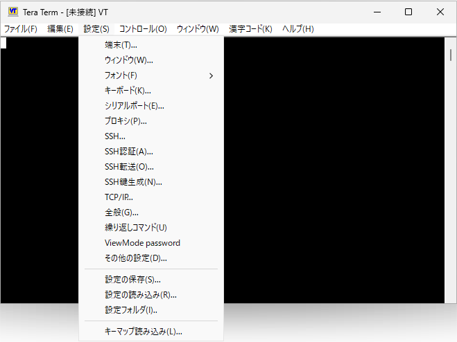

# ターミナルエミュレータ Tera Term v5 のインストール
tag:TeraTerm 初心者向け　新人教育 新人応援　Windows11

Tera Term　は　Windows　用の無料のターミナルエミュレータソフトウェアです。遠隔にあるサーバへのTelnet、SSHなどを介したリモート接続、周辺機器やセンサとのシリアル通信に使用されます。

## Tera Term を使う目的
Tera Term は以下のような用途で使われます。

### リモートサーバーへのアクセス
Tera Term v5 は SSHのrsa-sha2（RSA/SHA2）をサポートし、セキュアなアクセスが可能です。

### シリアル通信
Tera Term　はシリアルポートを介してデバイスとの通信を可能にし、組み込みシステムのデバッグやプログラムのアップロード/ダウンロードなどに使用されます。

### 作業の自動化
Tera Term は Tera Term Language (マクロ言語) を使って、オートログインなどの機能を実現することができます。 

## Tera Term v5のシステム要件
Tera Term v5 は 以下の環境で動作します。

オペレーティングシステム： Windows 7, 8, 10, 11

ここでは Tera Term ポータブル版 v5.1 を例にして Windows 11 へのインストール方法を紹介します。

## Tera Term のインストール方法
### ダウンロード
窓の杜の Tera Term の紹介ページにアクセスし、
Tera Term ポータブル版（v5系統）を「窓の杜からダウンロード」します。
[https://forest.watch.impress.co.jp/library/software/utf8teraterm/](https://forest.watch.impress.co.jp/library/software/utf8teraterm/)

### 展開先フォルダの作成
ファイルの展開先フォルダを作成します。ここでは例として C:\ProgramFiles というフォルダを新規作成します。

### ファイルの展開
ダウンロードした ZIP ファイルの中にある teraterm-5.1 のフォルダを C:\ProgramFiles にコピーします。

以上でインストール作業は終了です。

## 初回起動時の設定
TeraTerm を使う時は C:\ProgramFiles\teraterm-5.1\ttermpro.exe を実行します。

接続先選択画面が表示されたら、「**Cancel**」をクリックします。

メニューから、「**Setup**」->「**General**」をクリックします。

全般設定画面が表示されたら、「**LanguageUI**」->「**Japanese.lng**」を選択します。

「**OK**」をクリックします。

メニューから、「**設定**」->「**設定の保存**」をクリックします。

設定の保存画面が表示されたら、「**保存**」をクリックします。

確認画面が表示されたら、「**はい**」をクリックします。

これで日本語化作業の完了です。