# VSCode の C# 開発環境の構築
tag: VSCode Windows 初心者向け 新人教育 C＃

::: note
この記事は [「Win 11 への .NET 8 のインストール」](https://qiita.com/mmake/items/244662d50637f095a959) と [「Win 11 への VSCode の インストール」](https://qiita.com/mmake/items/2cf2131a0ab5bc431215) の続きの内容になります。
:::

この記事では 18 歳の新入社員向けに Windows の VSCode で C# 開発環境を構築する手順を説明します。

## 前回のおさらい

[「Win 11 への .NET 8 のインストール」](https://qiita.com/mmake/items/244662d50637f095a959) では Windows に .NET 8 をインストールしました。
[「Win 11 への VSCode のインストール」](https://qiita.com/mmake/items/2cf2131a0ab5bc431215) では VSCode をインストールしました。

引き続き VSCode に C# 拡張機能をインストールし、C# 開発を行う方法を説明します。

## C# 開発環境の構築
### Visual Studio Code の起動
スタートメニューから「**Visual Studio Code**」を起動します。

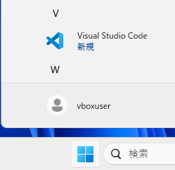

### 拡張機能の追加
左端にある「**Extension（拡張機能）**」アイコンをクリックします。

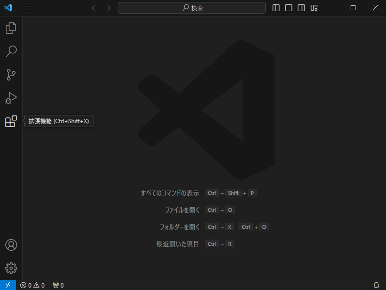

### 拡張機能の検索
拡張機能の検索ボックスに「**C#**」と入力します。

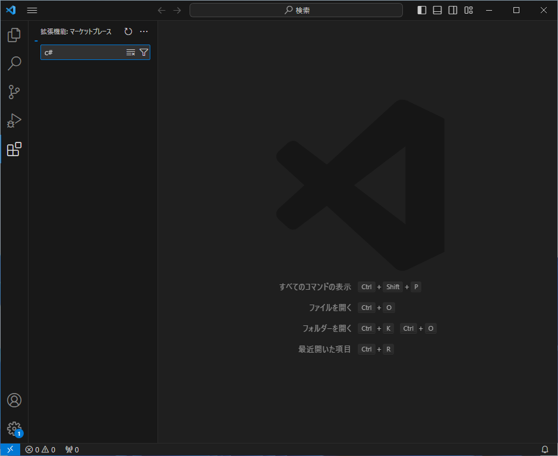

### 拡張機能のインストール
検索結果に C# Dev Kit が表示されたら、「**インストール**」をクリックします。

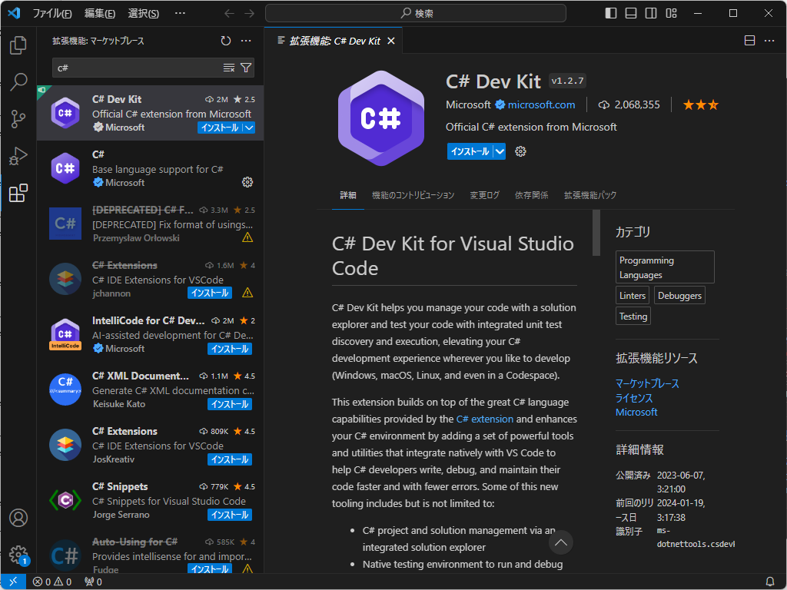

## C# アプリケーションの作成例
ここでは例としてコンソールアプリケーションを作成する手順を紹介します。

### コンソールを開く
Windows のスタートメニューから 「**ターミナル**」を起動します。

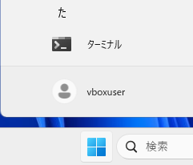

### 作業フォルダの作成
ターミナルが開いたら、キーボードから以下のコマンドを入力し、デスクトップに 「**hello**」という名前のフォルダを作成します。
``` コマンドプロンプト
cd .\Desktop
mkdir hello
```

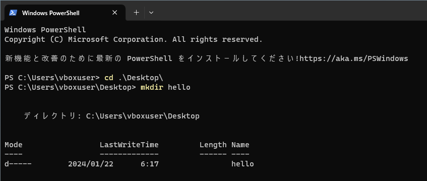

### C# プロジェクトの作成
続いてキーボードから以下のコマンドを入力し、C# プロジェクトを作成します。

``` コマンドプロンプト
cd hello
dotnet new console
```

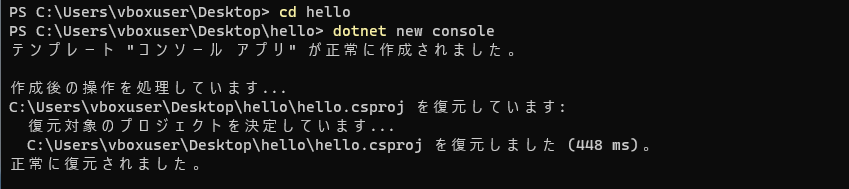

### 作業フォルダを開く
VSCode のメニューから「**ファイル**」 > 「**フォルダーを開く**」をクリックします。

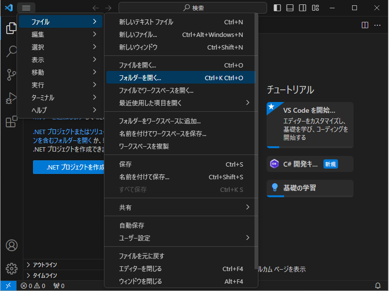

### フォルダの選択
フォルダを開く画面が表示されたら、hello を選択し「**フォルダーの選択**」をクリックします。

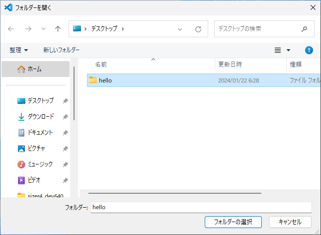

### フォルダの確認
フォルダの信頼画面が表示されたら、「**はい、作成者を森羅します**」をクリックします。

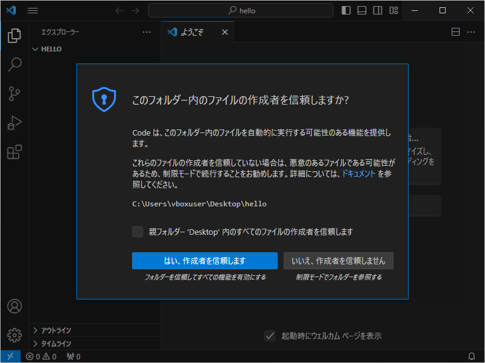

### ファイル一覧の表示
フォルダを開いたら、左側にファイル一覧が表示されます。

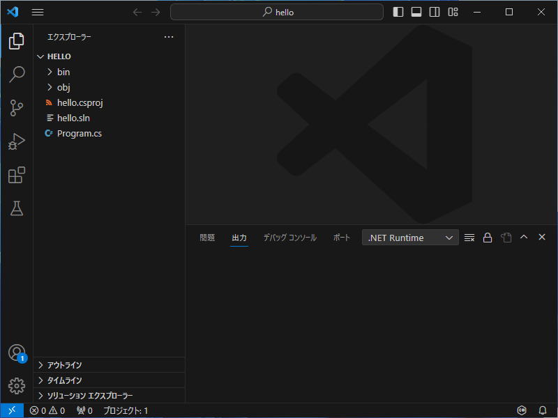

### C# ファイルの表示
ファイル一覧にある「**Program.cs**」 をクリックします。

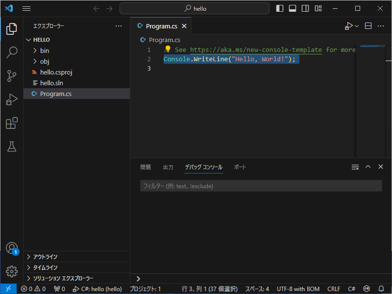

### ブレークポイントの設定
ファイルが表示されたら、行番号の左側の領域をクリックし、ブレークポイントを設定します。

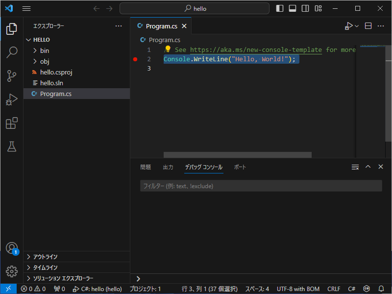

### デバッグの開始
VSCode のメニューから「**実行**」 > 「**デバッグの開始**」をクリックします。

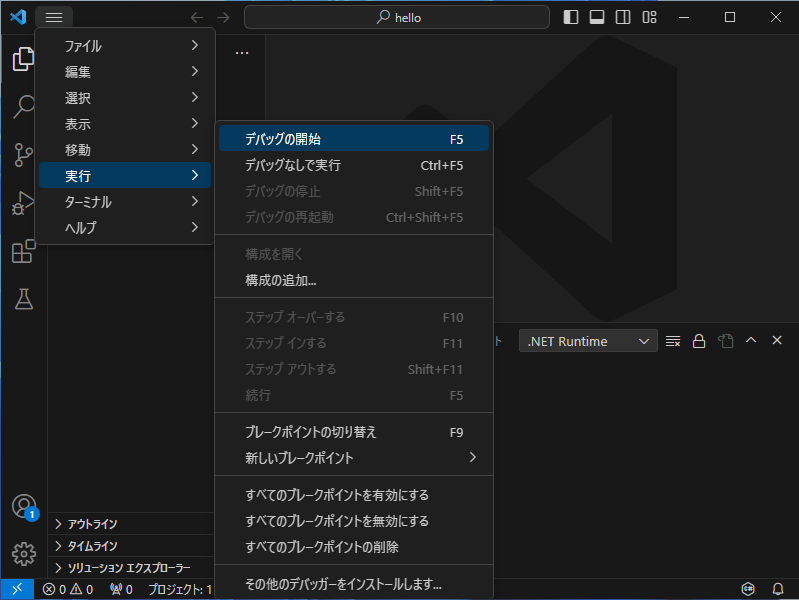

### デバッガの選択
デバッガの選択が表示されたら、「**C#**」をクリックします。

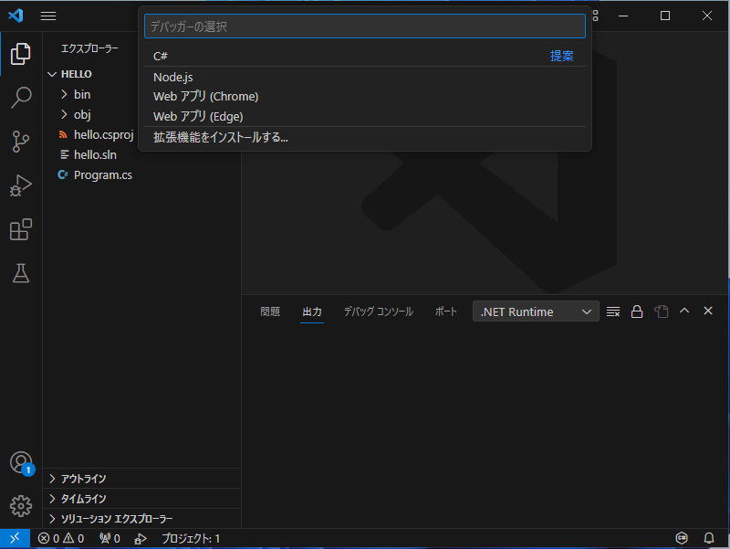

### 起動構成の選択
起動構成の選択が表示されたら、「**C#: hello**」をクリックします。

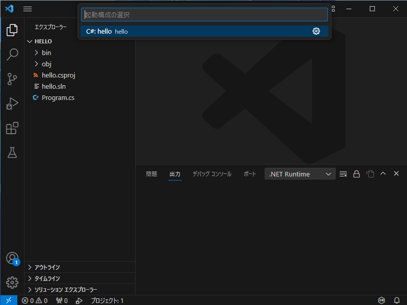

### ブレークポイントでの一時停止
デバッグが始まり、ブレークポイントで停止したら、▷をクリックし、実行を継続します。
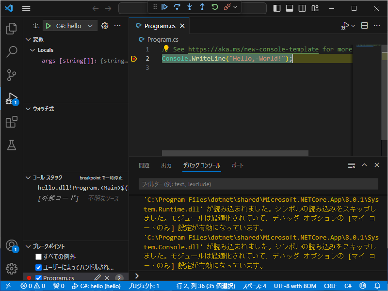

### プログラムの実行完了
デバッグコンソールに、「Hello, World!」 と表示されれば実行完了です。

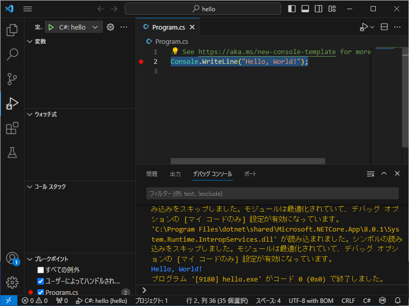

## 参考文献
- Getting Started with C# in VS Code
https://code.visualstudio.com/docs/csharp/get-started
