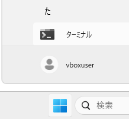

# VSCode の Jupyter 実行環境の構築
tag: VSCode Windows 初心者向け 新人教育 Jupyter

::: note
この記事は [「Win 11 への Python のインストール」](https://qiita.com/mmake/items/5197afbe5c055f82265e) と [「Win 11 への VSCode のインストール」](https://qiita.com/mmake/items/2cf2131a0ab5bc431215) の続きの内容になります。
:::

## Jupyter Notebook の概要
Jupyter Notebook（読み方：ジュピター　ノートブック）はテキストや画像と、実行可能な Python ソースコードをノートブックと呼ばれる 1 つの画面上で簡単に組み合わせることができるアプリケーションです。ノートブックはセルと呼ばれる領域に分割されており、各セルはコード、テキスト、数式、画像を含むことができます。コードセルでは Python や他のサポートされているプログラミング言語でコードを実行できます。
 
この記事では[「Win 11 への Python のインストール」](https://qiita.com/mmake/items/5197afbe5c055f82265e) 、[「Win 11 への VSCode のインストール」](https://qiita.com/mmake/items/2cf2131a0ab5bc431215) に引き続き、 18 歳の新入社員向けに VSCode の Jupyter Notebook 実行環境を構築する手順を説明します。

## Jupyter 実行環境の構築
### Visual Studio Code の起動
スタートメニューから「**Visual Studio Code**」を起動します。


### 拡張機能の追加
左端にある「**拡張機能**」アイコンをクリックします。


### 拡張機能 の検索
拡張機能の検索ボックスに「jupyter」と入力します。


### 拡張機能 のインストール
検索結果に **Jupyter (Jupyter Extension for Visual Studio Code)** が表示されたら、「**インストール**」をクリックします。


### ターミナルを開く
スタートメニューから「**ターミナル**」をクリックします。



### jupyter のインストール
ターミナルが開いたら、キーボードから「**pip install jupyter**」と入力し、Jupyter パッケージをインストールします。


以上で基本的な環境構築は完了です。

## Jupyter ノートブックの作成例
### 新しいファイルの作成
VSCode のメニューから「**ファイル**」 > 「**新しいファイル**」の順にクリックします。


### ファイルの種類の選択
ファイルの種類の選択が表示されたら「**Jupyter Notebook**」をクリックします。


### プログラムの入力
エディタが開いたら、以下のソース コードを入力します。

``` Untitled-1.py
msg = "Hello world!"
print(msg)
```


### プログラムの実行
画面右上にある **セルの実行ボタン ▷ **をクリックします。


### ネットワークアクセスの許可
Windows セキュリティの画面が表示されたら、「**許可**」をクリックします。。


### プログラムの動作完了
セルの下に、Hello World と表示されたら動作完了です。


# 参考文献
- Jupyter Notebooks in VS Code
https://code.visualstudio.com/docs/datascience/jupyter-notebooks