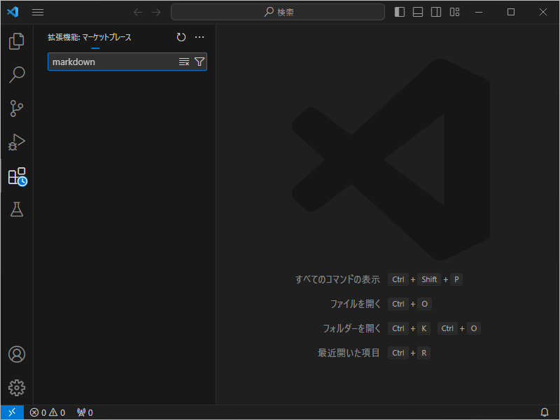
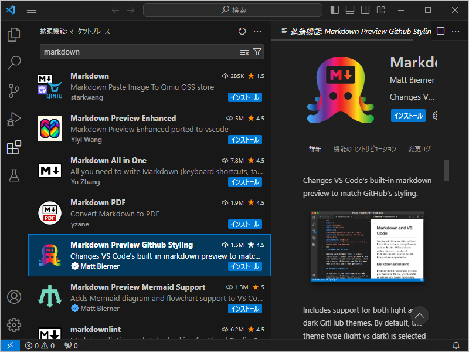
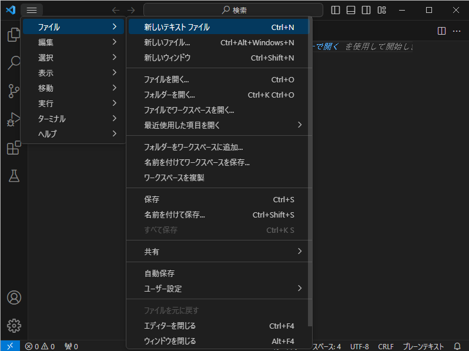
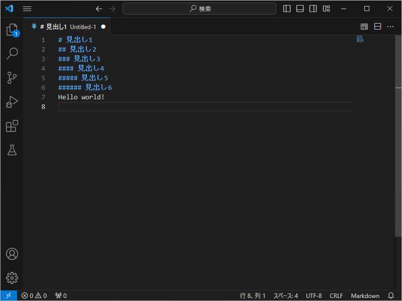
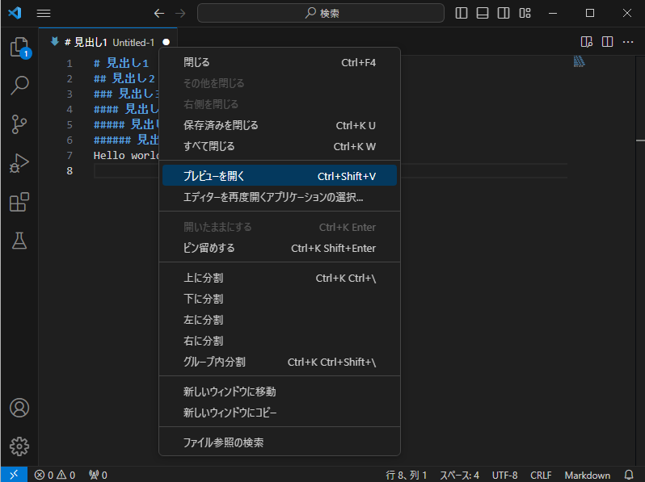
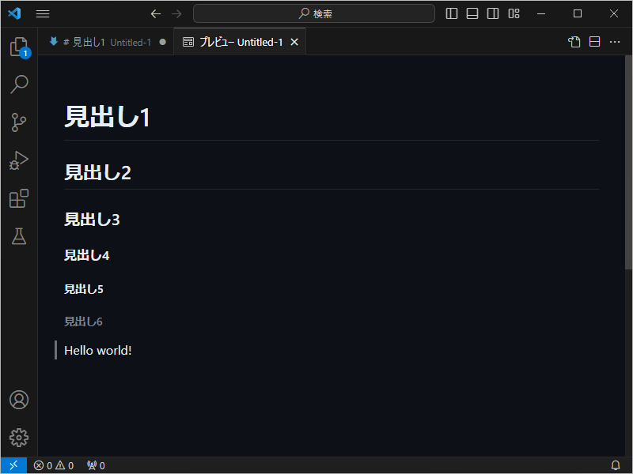

# VSCode の Markdown 作成環境の構築
tag: VSCode Windows 初心者向け 新人教育 Markdown

::: note
この記事は[「Win 11 への VSCode のインストール」](https://qiita.com/mmake/items/2cf2131a0ab5bc431215) の続きの内容になります。
:::

Markdown（マークダウン）は、装飾付きテキストを記述するためのマークアップ言語です。Markdown 構文はテキスト形式のため、簡単に読み書きできます。主にウェブでの文書作成、掲示板への投稿、README ファイルなどで利用されます。

この記事は[「Win 11 への VSCode のインストール」](https://qiita.com/mmake/items/2cf2131a0ab5bc431215) に引き続き、 18 歳の新入社員向けに VSCode の Markdown 作成環境を構築する手順を説明します。

## Markdown 作成環境の構築
### Visual Studio Code の起動
スタートメニューから「**Visual Studio Code**」を起動します。


### 拡張機能の追加
左端にある「**拡張機能**」アイコンをクリックします。


### 拡張機能 の検索
拡張機能の検索ボックスに「**markdown**」と入力します。



### 拡張機能 のインストール
検索結果に **Markdown (Markdown Preview Github Styling)** が表示されたら、「**インストール**」をクリックします。



以上で基本的な環境構築は完了です。

## Markdown ファイルの作成例

### 新しいファイルの作成
VSCode のメニューから「**ファイル**」 > 「**新しいテキストファイル**」の順にクリックします。



### Markdown テキストの入力
エディタが開いたら、以下のテキストを入力します。

``` Untitled-1.md
# 見出し1
## 見出し2
### 見出し3
#### 見出し4
##### 見出し5
###### 見出し6
Hello world!
```



### プレビューを開く
VSCode のエディターのファイル名で右クリックし、「**プレビューを開く**」をクリックします。



### プレビューの確認
プレビューとして、装飾されたテキストが表示されたら、動作完了です。




# 参考文献
- Markdown and Visual Studio Code
https://code.visualstudio.com/docs/languages/markdown
