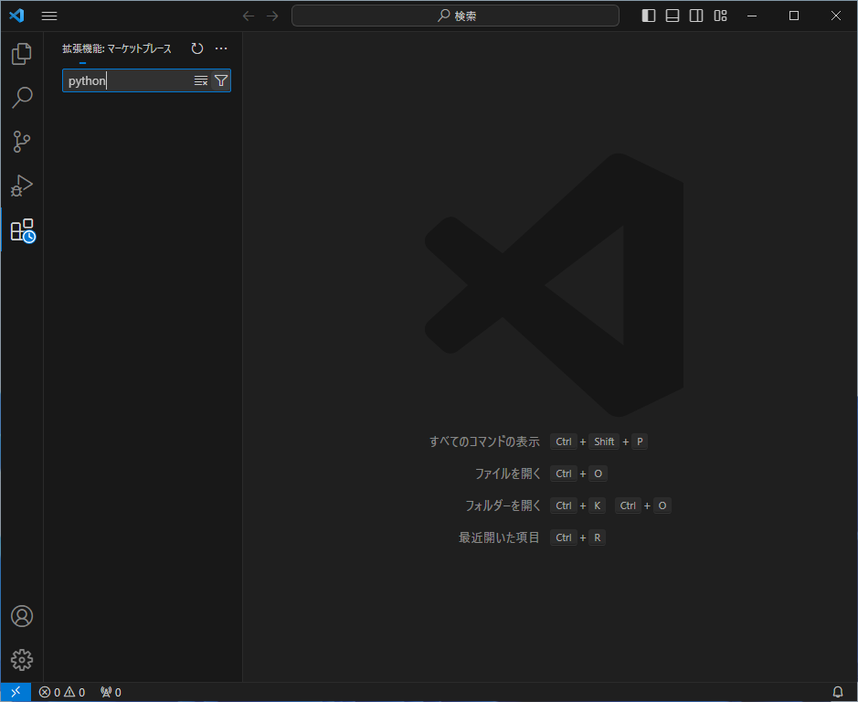
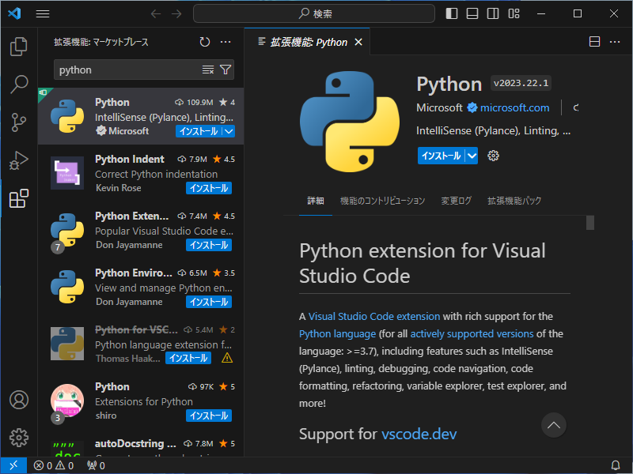
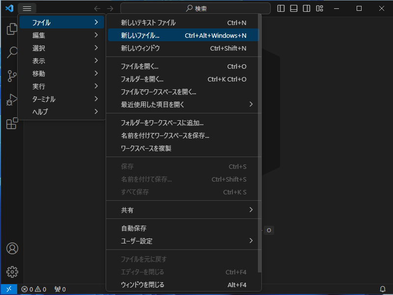
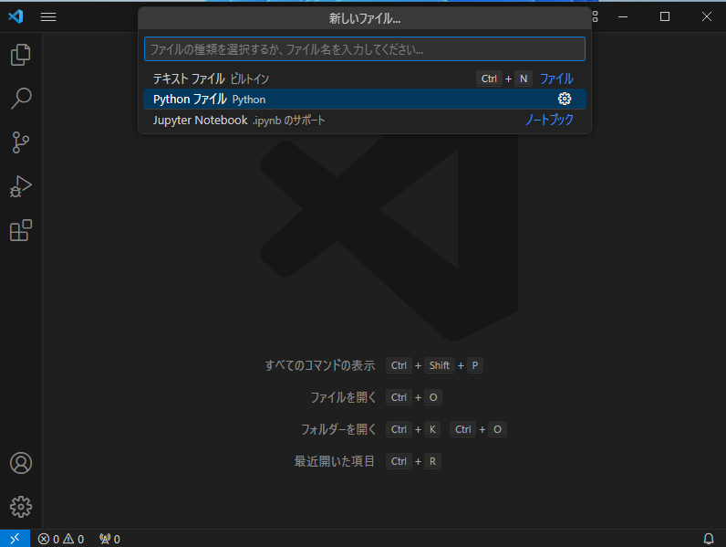
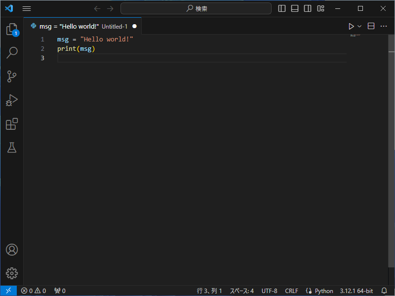
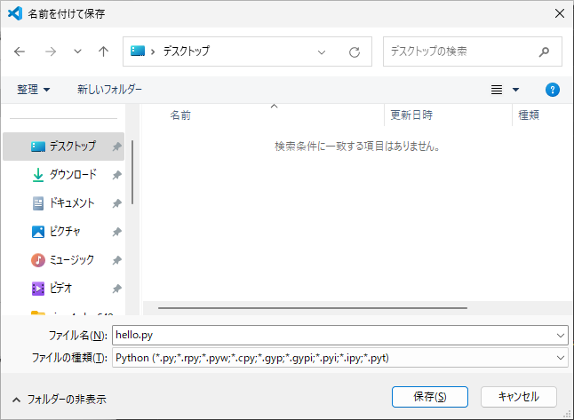
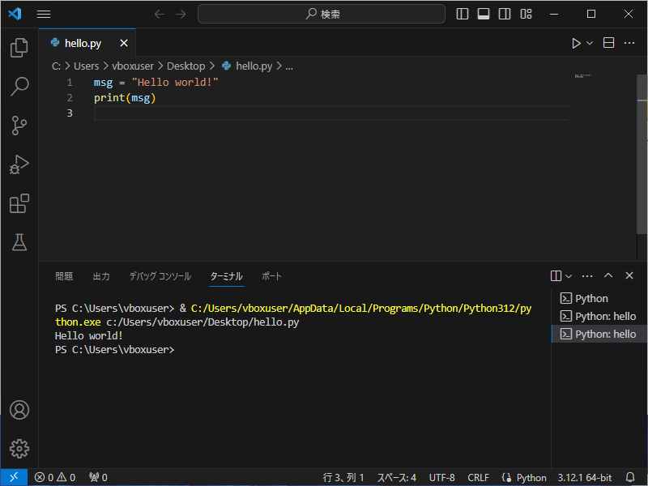

# Win 11 の VSCode の Python 開発環境の構築
tag: VSCode Windows 初心者向け 新人教育 Python

::: note
この記事は [「Win 11 への Python のインストール」](https://qiita.com/mmake/items/5197afbe5c055f82265e) と [「Win 11 への VSCode のインストール」](https://qiita.com/mmake/items/2cf2131a0ab5bc431215) の続きの内容になります。
:::

この記事では 18 歳の新入社員向けに VSCode の Python 開発環境を構築する手順を説明します。

## 前回のおさらい

[「Win 11 への Python のインストール」](https://qiita.com/mmake/items/5197afbe5c055f82265e) では Windows に Python3 をインストールしました。
[「Win 11 への VSCode のインストール」](https://qiita.com/mmake/items/2cf2131a0ab5bc431215) では VSCode をインストールしました。

引き続き VSCode に Python 拡張機能をインストールし、Python 開発を行う方法を説明します。

## Python 開発環境の構築
### Visual Studio Code の起動
スタートメニューから「**Visual Studio Code**」を起動します。


### 拡張機能の追加
左端にある「**拡張機能**」アイコンをクリックします。


### 拡張機能 の検索
拡張機能の検索ボックスに「python」と入力します。



### 拡張機能 のインストール
検索結果に Python extension for Visual Studio Code が表示されたら、「**インストール**」をクリックします。



## Python アプリケーションの作成例

### 新しいファイルを作成する
VSCode のメニューから「**ファイル**」 > 「**新しいファイル**」の順にクリックします。



### ファイルの種類の選択
ファイルの種類の選択が表示されたら「**Python ファイル**」を選択します。



### プログラムの入力
エディタが開いたら、以下のソース コードを入力します。

``` Untitled-1.py
msg = "Hello world!"
print(msg)
```

### プログラムの実行
画面右上にある 再生ボタン ▷ をクリックします。



### ファイルの保存
名前を付けて保存の画面が表示されたら、、デスクトップフォルダに hello.py として保存します。



### プログラムの動作完了
下の「ターミナル」に、Hello World と表示されたら実行完了です。



# 参考文献
- Getting Started with Python in VS Code
https://code.visualstudio.com/docs/python/python-tutorial
- Python.jp > Visual Studio Code でPython入門 【Windows編】
https://www.python.jp/python_vscode/windows/setup/index.html
