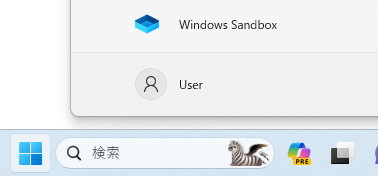

# Windows サンドボックスの紹介
tag:初心者向け 新人教育 Windows11

Windowsサンドボックス は、Windows に搭載されている仮想 OS 環境です。デスクトップアプリケーションの評価環境として使う事ができます。
ここでは 18 歳の新入社員向けに Windows サンドボックスを紹介します。

## Windows サンドボックスの特徴
仮想 OS 製品はいくつかあります。Windows サンドボックスの特徴は以下の通りです。

### 統合された環境
サンドボックスは Windows に組み込まれており、別途ダウンロードやインストールの必要がありません。

### 簡単な起動・終了
サンドボックスはアプリケーションのように簡単に起動・終了できます。

### 一時的な環境:
サンドボックスは一時的なもので、使用後に閉じるとすべてのソフトウェア、ファイル、状態は消去されます。これにより、新しいソフトウェアを安全にテストすることができます。

## Windows サンドボックスのシステム要件
Windows サンドボックスは以下の環境で動作します

- オペレーティングシステム：Windows 10 または 11で、エディションが Pro または Enterprise であること
- ハードウェア：仮想化が有効になっていることと、

## Windows サンドボックスの使い方
Windows サンドボックスは最初、システム言語が英語になっています。表示を日本語にするために以下の手順を行います。

### Windows サンドボックスの起動
スタートメニューから「**Windows Sandbox**」を実行します。



### Windows サンドボックスのUIを日本語にする
サンドボックス内のスタートメニューを右クリックし、「**Windows PowerShell(Admin)**」をクリックします。


### サンドボックスの言語設定の変更
Windows PowerShell のプロンプトに以下の内容を入力し、「Enter」キーを押します。

``` PowerShell
Set-WinUserLanguageList -Force ja-JP
```


### サンドボックスの再起動
サンドボックス内のスタートメニューを開き、「**Power**」>「**Restart**」と順にクリックします。


### 日本語化の完了
メニューが日本語になれば設定完了です。


## Windows サンドボックスでできないこと
以下のような動作はWindows サンドボックスでできません

- ユーザアカウントの追加
- レジストリの操作：VB6 のインストールすることはできません
- 外部の USB デバイスを接続する：デバイスドライバの動作確認はできません

## 参考文献
- Windows サンドボックス構成
https://learn.microsoft.com/ja-jp/windows/security/application-security/application-isolation/windows-sandbox/windows-sandbox-configure-using-wsb-file