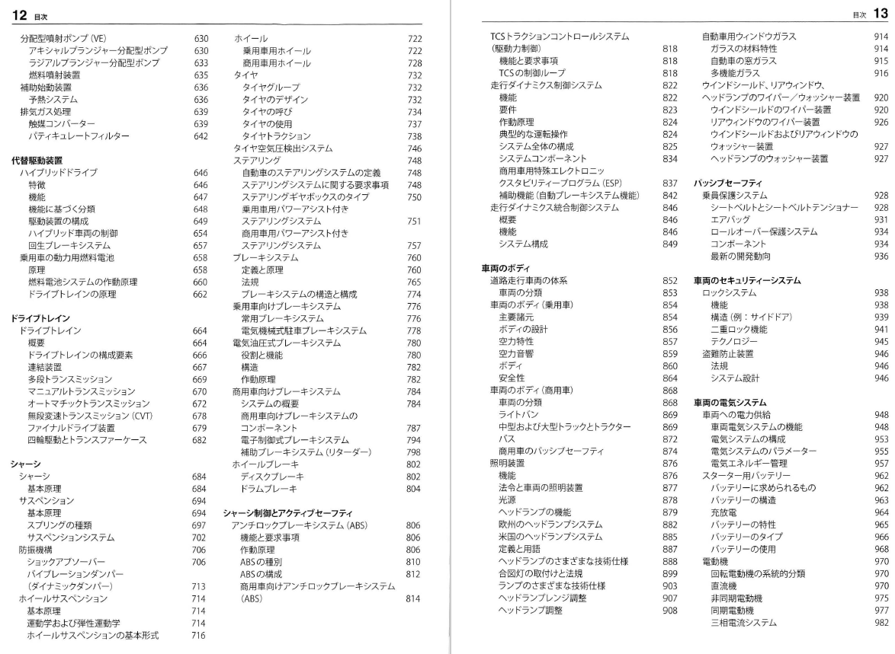

自動車工学の適用分野の紹介
マーケティング
工学
自動車工学
自動車

自動車工学は機械工学の一分野です。その範囲は広く、化学や電気工学、計算機工学といった幅広い領域も含まれます。この記事では実例として、ドイツのロバートボッシュ社が作成している「ボッシュ自動車ハンドブック」の章の題名を紹介します。

目次のイメージ

# 1章 物理学の基礎
## 1節 量と単位
- SI単位
- 法定単位
- その他の単位
- 物理定数
## 2節 力学で使用する基本方程式
- 直線運動と回転運動
- 力の伝達
- 摩擦
## 3節 振動
- 定義
- 運動方程式
- 振動の低減
- モード解析
## 4節 音響学
- 一般用語
- 排出騒音の測定値
- 侵入騒音測定値（防音）
- 主観的な音の評価
## 5節 流体静力学
- 密度と圧力
- 浮力
## 6節 流体力学
- 基礎原理
- 流体力学の基本方程式
- 圧力容器からの吐出
- 流れの中にある物体の抵抗
## 7節 熱力学
- エンタルビー（熱含量）
- 熱力学の法則
- 気体の状態変化
## 8節 電気工学
- 電磁界
- 電界
- 直流電流および直流電圧
- 時間依存性の電流
- 磁界
- 磁界と電流
- 電磁波の伝搬
- 金属導体の電気効果
## 9節 電子工学
- 半導体技術の基礎
- 半導体素子
- モノリシック集積回路
- ECUのマイクロプロセッサー
## 10節 電気化学
- 電解質電導と電気分解
- 応用

# 2章 数学と方法
## 1節 数学
- 記数法
- 関数
- 三角方程式
- 複素数
- 数学記号
- ギリシャ文字
## 2節 有限要素法
- 用途
- FEMの例
## 3節 制御工学
- 用語と定義
- 制御技術関連の伝達要素
- 制御タスクの設計
- 適応制御

# 3章 材料
## 1節 化学元素
- 名称
- 元素周期律表
## 2節 物質
- 物質の状態に関する用語
- 物質の特性
- 固体の特性
- 液体の特性
- 水蒸気の特性
- 気体の特性
## 3節 工業材料
- 工業材料の分類
- 金属材料関連のEN規格
## 4節 金属材料特性
- 鋳造材料と鋼材料
- 非鉄金属、重金属
- 非鉄金属、軽金属
- 焼結金属
- 磁性材料
- はんだと充填材
- 材料の電気的特性
## 5節 非金属材料の特性
- 絶縁材料
- セラミック材
- 積層材料
- プラスチック成形材料
- プラスチック材料の略称、化学名、特徴および商標名
- 自動車用塗料
## 6節 金属材料の熱処理
- 硬度
- 熱処理プロセス
- 熱化学的処理
## 7節 腐食および腐食防止
- 腐食のプロセス
- 腐食の種類
- 腐食試験
- 腐食防止
## 8節 被覆とコーティング
- 被覆
- 拡散浸透処理
- 化成処理

# 4章 燃料・潤滑剤・作動液
## 1節 潤滑剤
- 用語と定義
- エンジンオイル（エンジン潤滑油）
- トランスミッションオイル（ギヤオイル）
- 潤滑油
- グリス
## 2節 燃料
- 特性
- ガソリン
- ディーゼル燃料（軽油）
- 代替燃料
- 液体燃料および炭化水素の特性
- 気体燃料および炭化水素の特性
## 3節 ブレーキフルード
## 4節 冷却液

# 5章 機械要素
## 1節 ばね
- 基本原理
- 金属製ばね
## 2節 すベリ軸受
- 特徴
- 流体式すベリ軸受
- 焼結金属すべり軸受
- 乾式すべり軸受
## 3節 転がり軸受
- 用途
- 概要
- 転がり軸受の選定
- 荷重容量の計算
## 4節 ギヤと歯車装置
- ギヤについて
- スターターモータの歯車の設計
- 米国の歯車規格
- 歯車の耐荷重の計算
- 歯車の材質
## 5節 ベルト駆動装置
- 摩擦ベル卜駆動装置
- 歯付きベルト駆動装置
## 6節 チェーンドライブ
- 概要
- チェーンの構造
- スプロケッ卜
- チェーンテンショナーとチェーンガイド

# 6章 結合技術
## 1節 分離可能な結合
- 形状密着結合
- 摩擦結合
- ねじねじ締結部品
- プラスチック部品のスナップ結合
## 2節 分離できない結合
- 溶接技術
- はんだ付け技術
- 接着技術
- リベッ卜接合技術
- 打抜きクリンチング

# 7章 自動車の物理学
## 1節 自動車技術の基本概念
- 走行性の基本概念
## 2節 自動車の力学
- 縦運動（直線走行）の力学
- 路面のグリップ
- 加速と制動
- 一連の動作・反応、制動および停止
- 追い越し（追い抜き）
- 燃費
- 横運動（曲線走行）の力学
- 商用車の特殊走行力学
- ISOに準じた走行力学のテスト手順
## 3節 空力学
- 空力パラメーター
- 自動車用風洞
## 4節 自動車の音響学
- 自動車の車外騒音の測定と法定規制値
- 技術音響学
- サウンドデザイン

# 8章 内燃機関（ICエンジン）
## 1節 内燃機関（ICエンジン）
- 熱機関
- サイクル
- 実際のサイクル
## 2節 混合気形成燃焼、排気
- ガソリンエンジン
- ディーゼル工ンジン
- 融合型および代替作動システム
## 3節 ガス交換サイクルと過給
- ガス交換
- 可変バルブタイミング
- 過給プロセス
- 排気ガス再循環（EGR）
## 4節 往復動機関
- コンポーネント
- 往復動機関の種類
- クランクシャフ卜の設計
- トライボロジーと摩擦
- 計算用実験値およびデータ
## 5節 バンケル式ロータリーエンジン
- 構造および作動原理
- ロータリーエンジンの特性
## 6節 エンジン冷却システム
- 空冷式
- 水冷式
- インタークーラー（過給気の冷却）
- オイルと燃料の冷却
- 冷却モジュール技術
- 冷却システム技術
- インテリジェン卜な熱管理
- 排気ガスの冷却
## 7節 工ンジンの潤滑
- 圧送潤滑方式
- コンポーネン卜
## 8節 エアフィルター
- 空気中の不純物
- エアフィルター（エアクリーナ）
## 9節 ターボチャージャーとスーパーチャージャー
- スーパーチャージャー（機械式過給機）
- 圧力波スーパーチャージャー
- ターボチャージャ（排気タービン過給機）
- 複合過給システム
## 10節 排気装置
- 設計および目的
- 工キゾーストマニホールド
- 触媒コンバーター
- 微粒子フィルター
- マフラー
- 接続エレメン卜
- その他の消音装置
- 商用車の排気装置

# 9章 排出ガスと診断に関する法規定
## 1節 排出ガス規制
- 概要
- CARB規制（乗用車／小型商用車）
- EPA規制（乗用車／小型商用車）
- EU規制（乗用車／小型商用車）
- 日本の規制（乗用車／小型商用車）
- 米国の規制（大型商用車）
- EUの規制（大型商用車）
- 日本の規制（大型商用車）
- 米国のテストモード（乗用車／小型商用車）
- 欧州のテストモード（乗用車／小型商用車）
- 日本のテストモード（乗用車／小型商用車）
- 大型商用車のテストサイクル
## 2節 排出ガス測定方法
- シャシーダイナモメーターでの排出ガステスト
- 排出ガス測定装置
- ディーゼル黒煙排出テスト
- 蒸発物テスト
## 3節 診断
- はじめに
- 車両走行中のモニタリング
- 車載診断システム（OBD）
- OBDの機能
- 大型商用車向けOBD要件
- ワークショップにおける診断
- ECU診断およびサービスインフォメーションシステム

# 10章 火花点火機関（SIエンジン）の制御
- エンジン制御システムの説明
- システムの概要
- モロトニックのバージョン
## 1節 シリンターへの充填
- 構成成分
- 充填空気の制御
## 2節 燃料供給
- マニホールド噴射による燃料供給と燃料配分
- ガソリン直接噴射による燃料供給と燃料配分
- 燃料蒸発ガス処理装置
- フューエルフィルター
- 電動フューエルポンプ
- ガソリン直接噴射用高圧ポンプ
- フューエルレール
- フューエルプレッシャーレギュレーター
- フューエルプレッシャーアッテネーター（燃料圧力減衰器）
## 3節 混合気の形成
- 基本原理
- 混合気形成システム
- 吸気マニホールド噴射
- ガソリン直接噴射
- 混合気形成の構成部品
## 4節 イグ二ッション
- 基本原理
- 点火時期
- イグ二ッションシステム
- イグ二ッションコイル
- スパークプラグ
## 5節 排出ガスの触媒処理
- 触媒コンバーター
- λ制御

# 11章 代替燃料火花点火機関
## 1節 LPGによる作動
- 使用状況
- 構造
- LPGシステム
## 2節 天然ガス駆動のエンジン
- 使用状況
- 構造
- コンポーネン卜

# 12章 ディーゼルエンジンの制御
## 1節 ディーゼルエンジンの制御
- エンジン制御システムの概要
- 電子ディゼル制御（EDC）
## 2節 燃料供給システム（低圧ステージ）
- 燃料供給
- 燃料フィルター
## 3節 コモンレール噴射システム
- システムの概要
- インジェクター
- 高圧ポンプ
- レール
## 4節 時間制御式シングルシリンダー
## 5節 ポンプシステム
- 乗用車用ユニットインジェクターシステム
- 商用車用ユニットインジェクターシステム
- 商用車用ユニットポンプシステム
- コンポーネン卜
## 6節 分配型噴射ポンプ（VE）
- アキシャルプランジャー分配型ポンプ
- ラジアルプランジヤ一分配型ポンプ
- 燃料噴射装置
## 7節 補助始動装置
- 予熱システム
## 8節 排気ガス処理
- 触媒コンバーター
- パティキュレートフィルタ

# 13章 代替駆動装置
## 1節 ハイブリッドドライブ
- 特徴
- 機能
- 機能に基づく分類
- 駆動装置の構成
- ハイブリッド車両の制御
- 回生ブレーキシステム
## 2節 乗用車の動力用燃料電池
- 原理
- 燃料電池システムの作動原理
- ドライブ卜レインの原理

# 14章 ドライブトレイン
## 1節 ドライブトレイン
- 概要
- ドライブ卜レインの構成要素
- 連結装置
- 多段トランスミッション
- マニュアルトランスミッション
- オートマチックトランスミッション
- 無段変速トランスミッション（CVT）
- ファイナルドライブ装置
- 四輪駆動とトランスファーケース

# 15章 シャーシ
## 1節 シャーシ
- 基本原理
## 2節 サスペンション
- 基本原理
- スプリングの種類
- サスペンションシステム
## 3節 防振機構
- ショックアブソーバー
- パイブレションダンパー（ダイナミックダンパー）
## 4節 ホイールサスペンション
- 基本原理
- 運動学および弾性運動学
- ホイールサスペンションの基本形式
## 5節 ホイール
- 乗用車用ホイール
- 商用車用ホイール
## 6節 タイヤ
- タイヤグループ
- タイヤのデザイン
- タイヤの呼び
- タイヤの使用
- タイヤ卜ラクション
## 7節 タイヤ空気圧検出システム
## 8節 ステアリング
- 自動車のステアリングシステムの定義
- ステアリングシステムに関する要求事項
- ステアリンク、ギヤボックスのタイプ
- 乗用車用パワーアシスト付きステアリングシステム
- 商用車用パワアシス卜付きステアリングシステム
## 9節 ブレーキシステム
- 定義と原理
- 法規
- ブレーキシステムの構造と構成
## 10節 乗用車向けブレーキシステム
- 常用ブレーキシステム
- 電気機械式駐車ブレーキシステム
## 11節 電気油圧式ブレーキシステム
- 役割と機能
- 構造
- 作動原理
## 12節 商用車向けブレーキシステム
- システムの概要
- 商用車向けブレーキシステムのコンポネント
- 電子制御式ブレーキシステム
- 補助ブレーキシステム（リターダー）
## 13節 ホイールブレーキ
- ディスクブレーキ
- ドラムブレーキ

# 16章 シャーシ制御とアクティブセーフティ
## 1節 アンチロックブレーキシステム（ABS）
- 機能と要求事項
- 作動原理
- ABSの種別
- ABSの構成
- 商用車向けアンチロックブレーキシステム(ABS)
## 2節 TCSトラクションコントロルシステム（駆動力制御）
- 機能と要求事項
- TCSの制御ループ
## 3節 走行タイナミクス制御システム
- 機能
- 要件
- 作動原理
- 典型的な運転操作
- システム全体の構成
- システムコンポーネント
- 商用車用特殊エレク卜口二ツクスタビリティープログラム（ESP）
- 補助機能（自動ブレーキシステム機能）
## 4節 走行ダイナミクス統合制御システム
- 概要
- 機能
- システム構成

# 17章 車両のボディ
## 1節 道路走行車両の体系
- 車両の分類
## 2節 車両のボディ（乗用車）
- 主要諸元
- ボディの設計
- 空力特性
- 空力音響
- ボディ
- 安全性
## 3節 車両のボディ（商用車）
- 車両の分類
- ライトバン
- 中型および大型トラックとトラクター
- バス
- 商用車のパッシブセーフティ
## 4節 照明装置
- 機能
- 法令と車両の照明装置
- 光源
- ヘッドランプの機能
- 欧州のヘッドランプシステム
- 米国のヘッドランプシステム
- 定義と用語
- ヘッドランプのさまざまな技術仕様
- 合図灯の取付けと法規
- ランプのさまざまな技術仕様
- ヘッドランプレンジ調整
- ヘッドランプ調整
## 5節 自動車用ウィンドウガラス
- ガラスの材料特性
- 自動車の窓ガラス
- 多機能ガラス
## 6節 ウィンドシールド、リアウィンドウ、ヘッドランプのワイパー／ウォッシャー装置
- ウィンドシルドのワイパー装置
- リアウィンドウのワイパー装置
- ウィンドシールドおよびリアウィンドウのウォッシャー装置
- ヘッドランプのウォッシャー装置

# 18章 パッシブセーフティ
## 1節 乗員保護システム
- シートベル卜とシー卜ベルトテンショナー
- エアバック
- 口ルオーバー保護システム
- コンポーネン卜
- 最新の開発動向

# 19章 車両のセキュリティーシステム
## 1節 ロックシステム
- 機能
- 構造（例：サイドドア）
- 二重ロック機能
- テクノロジー
## 2節 盗難防止装置
- 法規
- システム設計

# 20章 車両の電気システム
## 1節 車両への電力供給
- 車両電気システムの機能
- 電気システムの構成
- 電気システムのパラメーター
- 電気エネルギー管理
## 2節 スターター用バッテリー
- バッテリーに求められるもの
- バッテリーの構造
- 充放電
- バッテリーの特性
- バッテリーのタイプ
- バッテリーの使用
## 3節 電動機
- 回転電動機の系統的分類
- 直流機
- 非同期電動機
- 同期電動機
- 三相電流システム
## 4節 オルタネーター
- 電気エネルギーの生成
- 作動条件
- 動力伝達効率
- クローポール型オルタネーターの種類
## 5節 始動装置
- スターター
- スターターの制御
## 6節 アクチュエータ
- 概要
- 電動式変換器および電磁式変換器
- 圧電アクチュエーター
- 流体機械式アクチュエーター
## 7節 ワイヤーハーネスおよびプラグインコネクター
- ワイヤハーネス
- プラグインコネクター
## 8節 電磁両立性（EMC）と電磁ノイズ抑制
- 要件
- 干渉の発生源
- 干渉を受ける可能性のある装置類
- 干渉のカップリング
- 静電放電
- 測定方法
- 規制と規格
- シンボル（記号）および回路図
- 回路記号
- 回路図
- 端子コード

# 21章 車両の電子システム
## 1節 自動車におけるソフトウェアエンジ二アリング
- ソフトウェアの開発動機
- 自動車搭載ソフトウェアの構造
- 自動車搭載ソフトウェアの重要な規格
- 開発プロセス
- ソフトウェア開発における品質保証
- 自動車搭載ソフトウェアの開発手順
- ソフトウェア機能のモデリングとシミュレーション
- ソフトウェア機能の設計と実装
- ソフトウェアとコントロールユニットの統合とテスト
- ソフトウエア機能の適合
- 展望
## 2節 自動車内のネットワークシステム
- バスシステム
- 技術的原理
## 3節 自動車内のバスシステム
- CAN
- FlexRay
- LIN
- イーサネット，IP
- PSIS
- MOSTバス
## 4節 電子システムのアーキテクチャー
- 概要
- 電子システムのアーキテクチャ一方式
## 5節 センサ
- 基本事項
- ポジションセンサー
- 速度および回転数センサー
- 加速度センサーと振動センサー
- 圧力センサー
- 流量計
- 気体センサー、濃度センサー
- 温度センサー
- フォースおよびトルクセンサー
- 光電センサー
- 運転者支援システム用センサー
- メカ卜口二クス
- メカ卜口二クスシステムおよびコンポーネン卜
- 開発の方法論
- 展望

# 22章 快適性と操作性向上のための装置
## 1節 車内空調制御
- 車内空調制御の要求事項
- エアコンディショナーユニッ卜の構造と作動原理
- 空調制御システム
- ハイブリッド車および電気自動車用空調和制御システム
- 補助ヒーターシステム
## 2節  ドアとルーフ部分の快適性と操作性向上のための装置
- パワーウィンドウ
- サンルーフ
## 3節 車室内の快適性と操作性に関する機能
- 電動調整式シー卜

# 23章 ユーザーインターフェース、テレマチック、マルチメディア
## 1節 表示と操作
- 双方向チャンネル
- 情報通信装置
## 2節 自動車でのラジオ／テレビ放送の受信
- 無線通信
- ラジオチューナー
## 3節 交通テレマチック
## 4節 EU記録装置
- 法的規制
- 仕様

# 24章 運転者支援システム
## 1節 運転者支援システム
## 2節 パーキングシステム
- 超音波センサーによる駐車支援装置
- パーキングエイドアシスタン卜
## 3節 自動車のナヒゲーション
- ナビゲーションシステム
- ナビゲーションの機能
- デジタルマップ
## 4節 アダプティブクルーズコン卜ロール
- 機能
- 構造と機能
- 制御アルゴリズム
- 適用範囲と今後の開発
## 5節 衝突予知緊急ブレーキシステム
## 6節 ビデオを基にした運転者アシス卜システム
- 車線逸脱警告機能および車線維持支援機能
- 道路標識認識機能
## 7節 ナイトビジョンシステム
- 用途
- 遠赤外線システム
- 近赤外線システム

# 25章 付録
- 技術用語索引
- 略語
