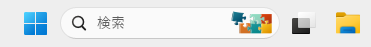
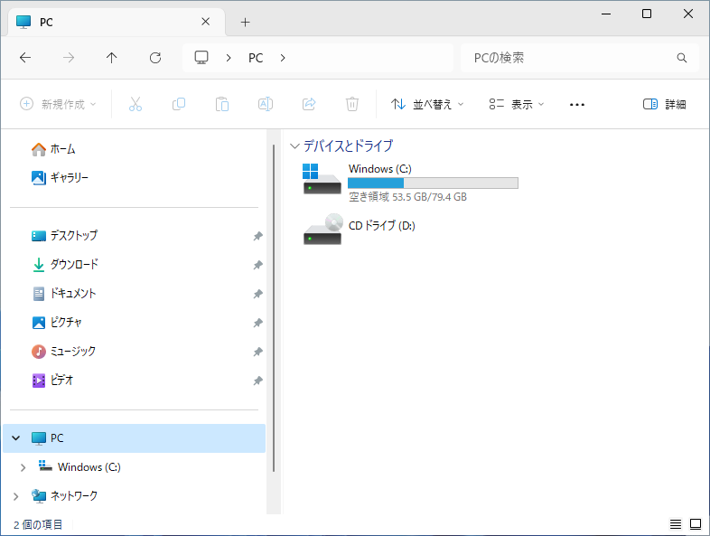
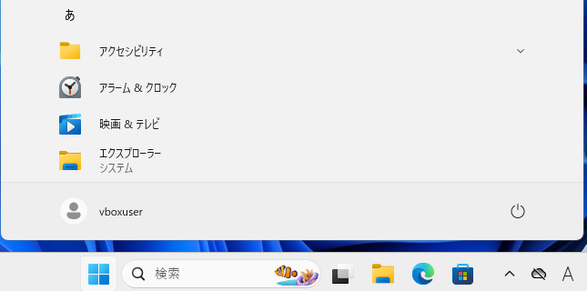
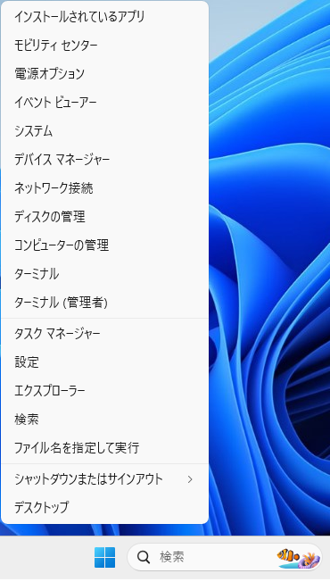
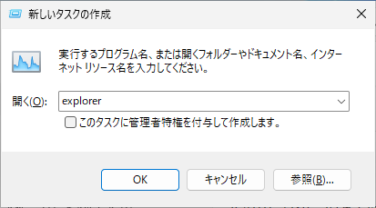

Windows 11 でエクスプローラを開く7つの方法
新人研修
初心者向け
パソコン未経験
エクスプローラ
Windows11

Windows のエクスプローラは、ファイルやフォルダーを管理するためのアプリケーションです。この記事では Windows 11 23H2 を例に、エクスプローラを開く方法を6つ紹介します。

## 方法一覧

||方法|クリック操作|キーボード操作|操作手数|備考|
|---|---|---|---|---|---|
|1|**タスクバーから起動**|必要|-|1|容易|
|2|デスクトップの PC アイコンから起動|必要|-|1|互換|
|3|スタートメニューから起動|必要|-|2|容易|
|4|全てのアプリから起動|必要|-|3|互換|
|5|**ショートカットキーから起動**|-|必要|1|互換|
|6|スタートメニューの右クリックから起動|必要|-|2|互換|
|7|タスクマネージャーから新しいタスクを作成|必要|必要|4||

## 方法1：タスクバーから起動
### タスクバーのアイコンをクリック
タスクバーにピン留めされているアイコンをクリックします。

### エクスプローラの表示
エクスプローラが表示されます。

## 方法2：デスクトップの PC アイコンから起動
### 事前設定：デスクトップにアイコンを表示
#### スタートメニューの表示
スタートボタンをクリックし、スタートメニューが表示されたら「設定」をクリックします。

#### 設定画面の表示
設定画面が表示されたら、左側の個人用設定をクリックします。

#### 個人用設定の表示
右側のテーマをクリックします。

#### テーマの表示
テーマの詳細が表示されたら、デスクトップアイコンの設定を開く

#### デスクトップアイコンの設定
デスクトップアイコンの設定が表示されたら、コンピュータにチェックをつけ、OKをクリックします。

#### デスクトップアイコンの表示
デスクトップ上に PC アイコンが表示されます。

### デスクトップのアイコンをクリック
デスクトップ上にある PC アイコンをクリックすると、エクスプローラが表示されます。

## 方法3：スタートメニューから起動
スタートボタンをクリックし、スタートメニューが表示されたら、ピン留め済みの「**エクスプローラ**」をクリックします。

## 方法4：全てのアプリから起動
スタートボタンをクリックし、スタートメニューが表示されたら「**すべてのアプリ**」をクリックします。

### すべてのアプリの表示
アプリ一覧が表示されたら下にスクロールし、「**エクスプローラ**」をクリックします。

## 方法5：ショートカットキーから起動
### 「Windowsロゴ」 + 「E」 を押す
キーボードの **「Windowsロゴ」 + 「E」** を押すと、エクスプローラが起動します。

## 方法6：スタートメニューの右クリックから起動
### スタートボタンを右クリック
タスクバー中央にあるスタートボタンを右クリックし、コンテキストメニューが表示されたら、「**エクスプローラー**」をクリックします。

## 方法7：タスクマネージャーから新しいタスクを作成
### 「Ctrl」＋「Alt」＋「Del」を押す
キーボードの「**Ctrl**」＋「**Alt**」＋「**Del**」を押します。メニューが表示されたら「**タスクマネージャー**」をクリックします。

### タスクマネージャの表示
タスクマネージャーが表示されたら、「**新しいタスクを実行する**」をクリックします。

### 新しいタスクの作成
新しいタスクの作成画面が表示されたら、「開く(O):」欄に「**explorer**」と入力し、「**OK**」をクリックします。

