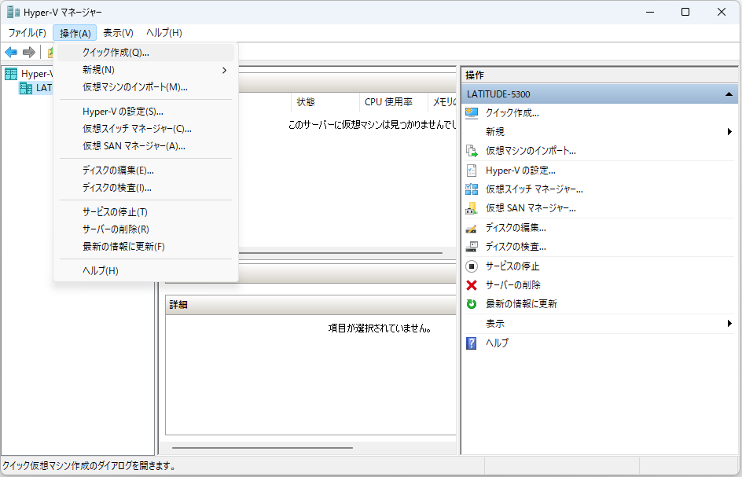
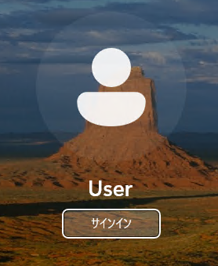
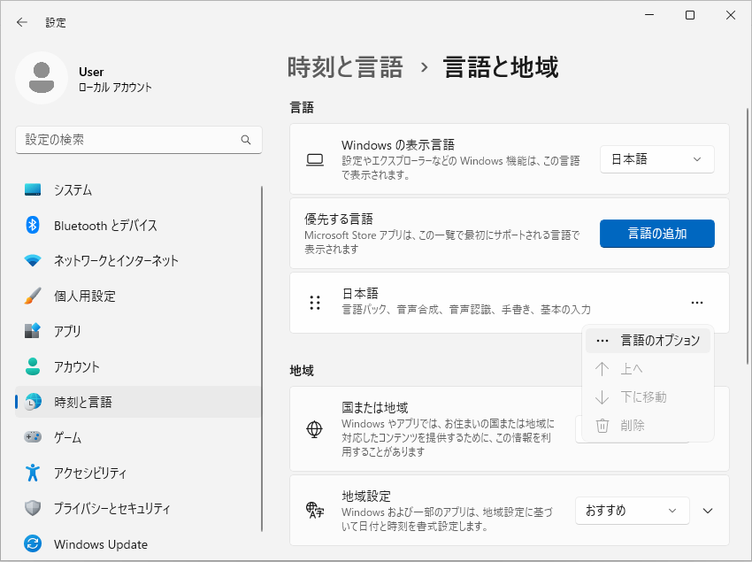
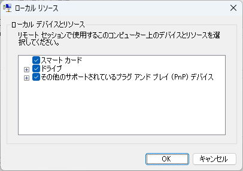

# Hyper-V に Windows 11 仮想マシンをインストールする方法
tag: Hyper-V 初心者向け 新人教育 Windows11

::: note
この記事は [Win 11 への Hyper-V のインストール](https://qiita.com/mmake/items/cd96a0c59226e8460af6) の続きの内容になります。
:::

この記事では 18 歳の新入社員向けに Hyper-V で Windows 11 を実行する方法を説明します。

## 前回のおさらい

[Win 11 への Hyper-V のインストール](https://qiita.com/mmake/items/cd96a0c59226e8460af6) では Hyper-V 機能を有効にする方法を説明しました。

ここでは、Hyper-V 上に Windows 11 90日評価版をインストールする方法を説明します。

## Windows 11 仮想マシンの入手
### Windows 11 評価版のダウンロード
Windows 11 開発環境のダウンロードページにアクセスします。

[https://developer.microsoft.coダウンロードp/windows/downloads/virtual-machines/](https://developer.microsoft.com/ja-jp/windows/downloads/virtual-machines/)、

### Hyper-V (Gen2) 仮想マシンのダウンロード
ページを下にスクロールし、「**Hyper-V (Gen2)**」をクリックします。仮想マシンのダウンロードが始まります。

### ファイルの展開
ダウンロードが完了したら、ファイルを右クリックし、「**すべて展開**」をクリックします。

### 展開先フォルダの指定
ファイルの展開先を指定します。ここでは例として **C:\Users\User\Downloads\WinDev2401Eval.HyperV** というフォルダに展開します。

### VHDX ファイル
WinDev2401Eval.vhdx ファイルができます。

## 仮想マシンの作成
### Windows ツールを開く
スタートメニューから 「**すべてのアプリ > Windows ツール**」 をクリックします

### Hyper-V マネージャーの起動
Windows ツールが表示されたら、「**Hyper-V マネージャー**」 をクリックします。

### 新しい仮想マシンの作成
Hyper-V マネージャーが表示されたら、メニューから 「**操作 > クイック作成**」 の順にクリックします

### インストール元の変更
クイック作成画面が表示されたら、「**ローカルインストール元**」をクリックします。

### 仮想マシンの選択
「**インストール元の変更**」をクリックします。

### VHDX ファイルの選択
先ほど展開した vhdx ファイルを選択し、「**開く**」をクリックします。

### 仮想マシンの作成
ファイル名が表示されたら、「**仮想マシンの作成**」をクリックします。

### 仮想マシンの作成完了
仮想マシンの作成完了画面が表示されたら、「**接続**」をクリックします。

### 仮想マシンの起動
接続画面が表示されたら、「**起動**」をクリックします。

### 仮想マシンへの接続
画面のサイズを選択し、「**接続**」をクリックします。

### 仮想マシンへのログイン
ログイン画面が表示されたら、「**Sign in**」をクリックします。

### ログイン完了
デスクトップ画面が表示されたら、接続完了です。

## 表示言語の変更
### 設定画面を開く
スタートメニューをクリックし、「**Settings**」をクリックします。

### 設定画面の表示
設定画面が表示されたら、左側の「**Time & language**」をクリックします。

### 時刻と言語の表示
Time & Language が表示されたら、右側の「**Language & region**」をクリックします。

### 言語と地域の表示
Language & region が表示されたら、「**Add a language**」をクリックします。

### 言語の検索
言語の検索画面が表示されたら、「**japanese**」と入力します。

### 日本語の選択
日本語を選択し、「**Next**」をクリックします。

### 日本語のインストール
「**Set as my Windows display language**」のチェックをオンにし、「**Install**」をクリックします。

### 英語の削除
Japanese のインストールが完了したら、**「English (United States)」の ...** をクリックし、「**Remove**」をクリックします。

### Remove の確認
確認画面が表示されたら、「**Yes**」をクリックします。

### Sign Out
「**Sign out**」をクリックします。

### 仮想マシンへのログイン
ログイン画面が表示されたら、「**Sign in**」をクリックします。

### 日本語への変更完了
デスクトップ画面のライセンス表示が日本語に変われば、設定完了です。

## 管理用言語の変更
### 設定画面を開く
スタートメニューをクリックし、「**設定**」をクリックします。

### 設定画面の表示
設定画面が表示されたら、左側の「**時刻と言語**」をクリックします。

### 時刻と言語の表示
時刻と言語が表示されたら、右側の「**言語と地域**」をクリックします。

### 管理用の言語の設定
「**管理用の言語の設定**」をクリックします。

### 設定のコピー
地域の管理画面が表示されたら、「**設定のコピー**」をクリックします。

### ようこそ画面の設定
ようこそ画面と新しいユーザアカウントの設定画面が表示されたら、「**ようこそ画面とシステムアカウント**」「**新しいユーザーアカウント**」のチェックをオンにし、「**OK**」をクリックします。

### 再起動の確認
再起動を促す画面が表示されたら、「**後で**」をクリックします。

### システムロケールの変更
引き続き、「**システムロケールの変更**」をクリックします。

### 現在のシステムロケールの変更
地域の設定が表示されたら、「**英語（米国）**」クリックします。

### 日本語を選択
リストが表示されたら、「**日本語**」を選択し、「**OK**」をクリックします。

### 再起動の確認
再起動を促す画面が表示されたら、「**今すぐ再起動**」をクリックします。

### 仮想マシンへの再接続
再接続画面が表示されたら、「**再接続**」をクリックします。

### 再起動の完了
ログイン画面にサインインと表示されたら、管理用言語の変更完了です。「**サインイン**」をクリックします。

## 地域の変更
### 設定画面を開く
デスクトップ画面が表示されたら、スタートメニューをクリックし、「**設定**」をクリックします。

### 設定画面の表示
設定画面が表示されたら、左側の「**時刻と言語**」をクリックします。

### 時刻と言語の表示
時刻と言語が表示されたら、右側の「**言語と地域**」をクリックします。

### 国または地域の表示
言語と地域が表示されたら、国または地域の「**米国 ｖ**」をクリックします。

### 国または地域
リストが表示されたら、「**日本**」を選択します。

## タイムゾーンの変更
### 設定画面を開く
スタートメニューをクリックし、「**設定**」をクリックします。

### 設定画面の表示
設定画面が表示されたら、左側の「**時刻と言語**」をクリックします。

### 時刻と言語の表示
時刻と言語が表示されたら、右側の「**タイムゾーン**」をクリックします。

### タイムゾーンの表示
タイムゾーンの詳細が表示されたら、「**(UTC-08:00) 太平洋標準時（米国およびカナダ）▽**」をクリックします。

### タイムゾーンの選択
リストが表示されたら、「**(UTC+9:00)大阪、札幌、東京**」を選択します。

### タイムゾーンの確認
時刻が変われば設定完了です。

<!--## キーボードの変更
### 設定画面を開く
スタートメニューをクリックし、「**設定**」をクリックします。

### 設定画面の表示
設定画面が表示されたら、左側の「**時刻と言語**」をクリックし、右側の「入力」をクリックします。

### 設定画面の表示
言語と地域の「日本語」の「…」をクリックし、「言語のオプション」をクリックします。

### 入力

### キーボードの詳細設定

### キーボードレイアウトの変更

### キーボードレイアウトの変更
ハードウェアキーボードのレイアウトの変更が表示されたら、「**英語キーボード(101/102キー)**」をクリックします。

### 日本語キーボードの選択
リストが表示されたら、「**日本語キーボード(106/109キー)**」を選択します。

### レイアウトの変更
「**今すぐ再起動する**」をクリックします。

-->
## リモートデスクトップの有効化
### 設定画面を開く
スタートメニューをクリックし、「**設定**」をクリックします。

### 設定画面の表示
設定画面が表示されたら、左側の「**システム**」をクリックします。

### リモートデスクトップの選択
右側のを下にスクロールし、「**リモートデスクトップ**」をクリックします。

### リモートデスクトップのON
リモートデスクトップの詳細が表示されたら、リモート デスクトップを「**オン**」にします。

### 確認
確認画面が表示されたら、「**確認**」をクリックします。

### リモートデスクトップの確認
リモートデスクトップがONになれば設定完了です。

### 仮想マシン接続の終了
Hyper-V 接続アプリの「X」をクリックして、仮想マシンから一旦切断します。

### 仮想マシン接続の終了
Hyper-V マネージャーの メニューから 「**操作 > 接続**」 の順にクリックします

## 接続時の設定
接続画面が開いたら、「**オプションの表示**」をクリックします。

## 接続時の設定
オプションの画面が開いたら、「**ローカルリソース > 詳細**」をクリックします。

## 接続時の設定
ローカルリソースの画面が開いたら、「**ドライブ**」のチェックをオンにし、「**OK**」をクリックします。

　
## 接続時の設定
「**接続**」をクリックします。

### ドライブの共有
仮想マシンにホストマシンのドライブが共有されます。

## 仮想マシンの停止
### 操作の停止
Hyper-V 接続アプリのメニューから 「**操作 > 停止**」 の順にクリックします

### 停止の確認
確認画面が表示されたら、「**停止する**」をクリックします。

## 参考文献
- Learn > 仮想化 > Windows 10 の Hyper-V > Hyper-V を使用した仮想マシンの管理 
https://learn.microsoft.com/ja-jp/virtualization/hyper-v-on-windows/user-guide/enhanced-session-mode