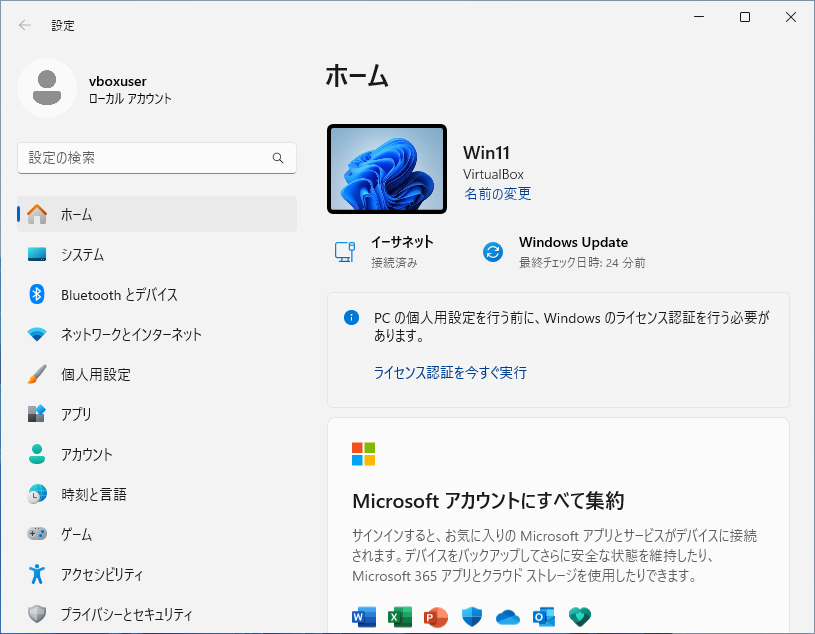
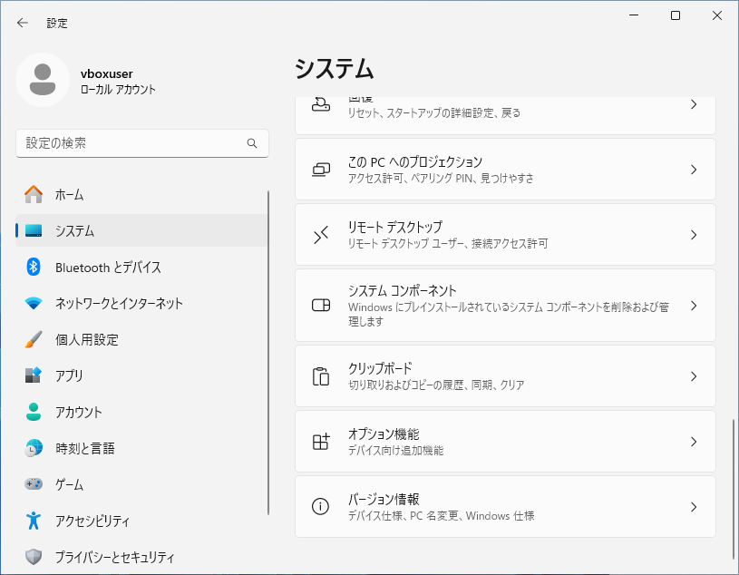
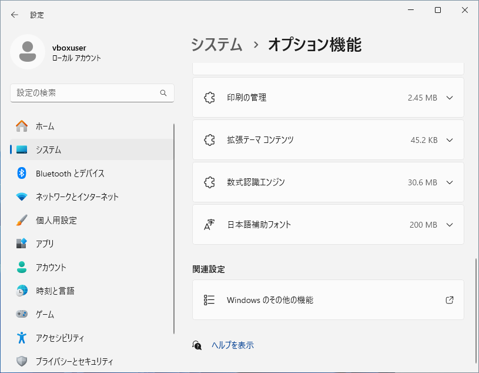

Windows 11 の機能を有効または無効にする3つの方法

新人研修
初心者向け
パソコン未経験
Windows11

Windows 11 にはさまざまな機能が含まれており、いくつかの機能はユーザーが必要に応じて有効または無効にできます。
この記事では 18 歳の新入社員向けに Windows 11 の機能を有効または無効にする方法を紹介します。

## 方法一覧
||方法|クリック操作|キーボード操作|操作手数|備考|
|---|---|---|---|---|---|
|1|設定画面から変更する|必要|-|1|容易|
|2|コントロールパネルから変更する|必要|-|2|	
|3|検索して実行する|必要|-|3|互換|
|4|コマンドプロンプトから変更する|必要|-|3|互換|

## 設定画面から変更する
### スタートメニューの表示
スタートボタンをクリックし、スタートメニューが表示されたら「**設定**」をクリックします。


### 設定画面の表示
設定画面が表示されたら、左側の「**システム**」をクリックします



### システムの表示
右側にシステムの詳細が表示されたら、下にスクロールし「**オプション機能**」をクリックします。



### オプション機能の表示
右側にオプション機能の詳細が表示されたら、下にスクロールし「**Windows のその他の機能**」をクリックします。



### Windows の機能の表示
Windows の機能が表示されたら、必要な機能を選択または非選択にし、「**OK**」をクリックします。


## コントロールパネルから開く
### スタートメニューの表示
スタートボタンをクリックし、スタートメニューが表示されたら「**すべてのアプリ >**」をクリックします。


### すべてのアプリの表示
アプリ一覧が表示されたら下にスクロールし、「**Windows ツール**」をクリックします。


### Windows ツールの表示
Windows ツールが表示されたら、「**コントロールパネル**」をクリックします。


### コントロールパネルの表示
コントロールパネルが表示されたら、「**プログラム**」をクリックします。


### プログラムの表示
プログラムが表示されたら、「**Windowsの機能の有効化または無効化**」をクリックします。


### Windows の機能の表示
Windows の機能が表示されます。


## 検索して実行する

### 検索文字を入力
キーボードから「**feature**」または「**機能**」などのキーワードを入力します。

### 検索結果の表示
検索結果に「**Windows の機能を有効化または無効化**」が表示されたら、クリックします。


### Windows の機能の表示
Windows の機能が表示されます。


## コマンドプロンプトまたは PowerShell を使用する方法
### コマンドプロンプトを開く
管理者権限でコマンドプロンプトまたはPowerShellを開きます。

### コマンドを入力する
以下のようなコマンドを使用して、特定の機能を有効または無効にします。

``` bash
Copy code
# 例: Telnetクライアントを有効にする場合
dism /online /enable-feature /featurename:TelnetClient
```

|操作|Windows 11|Dism|
|---|---|---|
|役割の確認|Get-WindowsOptionalFeature -Online|dism /Online /Get-Features|
|役割の有効化|Enable-WindowsOptionalFeature -Online -FeatureName 役割名|dism /Online /Enable-Feature:役割名|
|役割の無効化|Disable-WindowsOptionalFeature -Online -FeatureName 役割名|dism /Online /Disable-Feature:役割名|

## 有効化できる機能について

|表示名|機能名|
|---|---|
|.NET Framework 3.5 (.NET 2.0 および 3.0 を含む)|NetFx3|
|Windows Communication Foundation HTTP アクティブ化|WCF-HTTP-Activation|
|Windows Communication Foundation 非 HTTP アクティブ化|WCF-NonHTTP-Activation|
|.NET Framework 4.8 Advanced Services|NetFx4-AdvSrvs|
|ASP.NET 4.8|NetFx4Extended-ASPNET45|
|WCF サービス|WCF-Services45|
|HTTP アクティブ化|WCF-HTTP-Activation45|
|TCP アクティブ化|WCF-TCP-Activation45|
|TCP ポート共有|WCF-TCP-PortSharing45|
|メッセージ キュー (MSMQ) アクティブ化|WCF-MSMQ-Activation45|
|名前付きパイプのアクティブ化|WCF-Pipe-Activation45|
|Active Directory ライトウェイト ディレクトリ サービス|DirectoryServices-ADAM-Cl|ient|
|Hyper-V|Microsoft-Hyper-V|
|Hyper-V プラットフォーム|Microsoft-Hyper-V-All|
|Hyper-V Hypervisor|Microsoft-Hyper-V-Hypervisor|
|Hyper-V サービス|Microsoft-Hyper-V-Services|
|Hyper-V 管理ツール|Microsoft-Hyper-V-Tools-All|
|Hyper-V GUI 管理ツール|Microsoft-Hyper-V-Management-Clients|
|Windows PowerShell 用 Hyper-V モジュール|Microsoft-Hyper-V-Management-PowerShell|
|Linux 用 Windows サブシステム|Microsoft-Windows-Subsystem-Linux|
|Microsoft Defender Application Guard|Windows-Defender-ApplicationGuard|
|Microsoft PDF 印刷|Printing-PrintToPDFServices-Features|
|Microsoft XPS ドキュメント ライター|Printing-XPSServices-Features|
|Microsoft メッセージキュー(MSMQ) サーバー|MSMQ-Container|
|Microsoft メッセージキュー(MSMQ) サーバー コア|MSMQ-Server|
|MSMQ Active Directory Domain Services 統合|MSMQ-ADIntegration|
|MSMQ HTTP サポート|MSMQ-HTTP|
|MSMQ トリガー|MSMQ-Triggers|
|マルチキャスト サポート|MSMQ-Multicast|
|MSMQ DCOM プロキシ|MSMQ-DCOMProxy|
|MultiPoint Connector|MultiPoint-Connector|
|MltiPoint Connector サービス|MultiPoint-Connector-Services|
|MultiPoint マネージャーおよび MultiPoint ダッシュボード|MultiPoint-Tools|
|NFS 用サービス|ClientForNFS-Infrastructure|
|NFS クライアント|ServicesForNFS-ClientOnly|
|管理ツール|NFS-Administration|
|Remote Differential Compression API サポート|MSRDC-Infrastructure|
|SMB 1.0/CIFS ファイル共有のサポート|SMB1Protocol|
|SMB 1.0/CIFS クライアント|SMB1Protocol-Client|
|SMB 1.0/CIFS サーバー|SMB1Protocol-Server|
|SMB 1.0/CIFS 自動削除|SMB1Protocol-Deprecation|
|SMB ダイレクト|SmbDirect|
|Telnet クライアント|TelnetClient|
|TFTP クライアント|TFTP|
|Windows Identity Foundation 3.5|Windows-Identity-Foundation|
|Windows PowerShell 2.0|MicrosoftWindowsPowerShellV2Root|
|Windows PowerShell 2.0 エンジン|MicrosoftWindowsPowerShellV2|
|Windows TIFF IFilter|TIFFIFilter|
|Windows サンドボックス|Containers-DisposableClientVM|
|Windows ハイパーバイザー プラットフォーム|HypervisorPlatform|
|Windows プロジェクション ファイル システム|Client-ProjFS|
|Windows プロセス アクティブ化サービス|WAS-WindowsActivationService|
|.NET 環境|WAS-NetFxEnvironment|
|プロセス モデル|WAS-ProcessModel|
|構成API|WAS-ConfigurationAPI|
|インターネット インフォメーション サービス|IIS-WebServer|
|FTP サーバー|IIS-FTPServer|
|FTP Service|IIS-FTPSvc|
|FTP 拡張|IIS-FTPExtensibility|
|Web 管理ツール|IIS-WebServerManagementTools|
|IIS 6 管理互換|IIS-IIS6ManagementCompatibility|
|IIS 6 WMI 互換|IIS-WMICompatibility|
|IIS 6 スクリプトツール|IIS-LegacyScripts|
|IIS 6 管理コンソール|IIS-LegacySnapIn|
|IIS メタベース及び IIS 6 構成との互換性|IIS-Metabase|
|IIS 管理コンソール|IIS-ManagementConsole|
|IIS 管理サービス|IIS-ManagementService|
|IIS 管理スクリプトおよびツール|IIS-ManagementScriptingTools|
|World Wide Web サービス|IIS-WebServerRole|
|HTTP 共通機能|IIS-CommonHttpFeatures|
|HTTP エラー|IIS-HttpErrors|
|HTTP リダイレクト|IIS-HttpRedirect|
|WebDAV 発行|IIS-WebDAV|
|ディレクトリの参照|IIS-DirectoryBrowsing|
|既定のドキュメント|IIS-DefaultDocument|
|静的なコンテンツ|IIS-StaticContent|
|アプリケーション開発機能|IIS-ApplicationDevelopment|
|.NET 拡張機能 3.5|IIS-NetFxExtensibility|
|.NET 拡張機能 4.8|IIS-NetFxExtensibility45|
|Application Initialization|IIS-ApplicationInit|
|ASP|IIS-ASP|
|ASP.NET 3.5|IIS-ASPNET|
|ASP.NET 4.8|IIS-ASPNET45|
|CGI|IIS-CGI|
|ISAPI フィルター|IIS-ISAPIFilter|
|ISAPI 拡張|IIS-ISAPIExtensions|
|WebSocket プロトコル|IIS-WebSockets|
|サーバ側インクルード|IIS-ServerSideIncludes|
|セキュリティ|IIS-Security|
|IIS クライアント証明書マッピング認証|IIS-IISCertificateMappingAuthentication|
|IP セキュリティ|IIS-IPSecurity|
|SSL 証明書の集中サポート|IIS-CertProvider|
|URL 承認|IIS-URLAuthorization|
|Windows 認証|IIS-WindowsAuthentication|
|クライアント証明書マッピング認証|IIS-ClientCertificateMappingAuthentication|
|ダイジェスト認証|IIS-DigestAuthentication|
|基本認証|IIS-BasicAuthentication|
|要求のフィルタリング|IIS-RequestFiltering|
|パフォーマンス機能|IIS-Performance|
|静的なコンテンツの圧縮|IIS-HttpCompressionStatic|
|動的なコンテンツの圧縮|IIS-HttpCompressionDynamic|
|状態と診断|IIS-HealthAndDiagnostics|
|HTTP ログ|IIS-HttpLogging|
|ODBC ログ|IIS-ODBCLogging|
|カスタム ログ|IIS-CustomLogging|
|トレース|IIS-HttpTracing|
|ログ ツール|IIS-LoggingLibraries|
|要求の監視|IIS-RequestMonitor|
|インターネット インフォメーション サービスのホスト可能な Web コア|IIS-HostableWebCore|
|コンテナー|Containers|
|データ センターブリッジング|DataCenterBridging|
|デバイスのロックダウン|Client-DeviceLockdown|
|カスタム ログオン|Client-EmbeddedLogon|
|キーボード フィルター|Client-KeyboardFilter|
|シェル ランチャー|Client-EmbeddedShellLauncher|
|ブランドではないブート|Client-EmbeddedBootExp|
|統合書き込みフィルター|Client-UnifiedWriteFilter|
|メディア機能|MediaPlayback|
|Windows Media Player 従来版(アプリ)|WindowsMediaPlayer|
|リモートデスクトップ接続|Microsoft-RemoteDesktopConnection|
|レガシ コンポーネント|LegacyComponents|
|DirectPlay|DirectPlay|
|ワーク フォルダー クライアント|WorkFolders-Client|
|印刷とドキュメント サービス|Printing-Foundation-Features|
|LPD 印刷サービス|Printing-Foundation-LPDPrintService|
|LPR ポートモニタ|Printing-Foundation-LPRPortMonitor|
|インターネット印刷クライアント|Printing-Foundation-InternetPrinting-Client|
|仮想マシン プラットフォーム|VirtualMachinePlatform|
|簡易 TCP/IP サービス (echo, daytimeなど)|SimpleTCP|
|保護されたホスト|HostGuardian|

## 参考資料
- Windows 機能を追加または非表示にする
https://learn.microsoft.com/ja-jp/windows/application-management/add-apps-and-features
- DISM を使用して Windows の機能を有効または無効にする
https://learn.microsoft.com/ja-jp/windows-hardware/manufacture/desktop/enable-or-disable-windows-features-using-dism?view=windows-11
