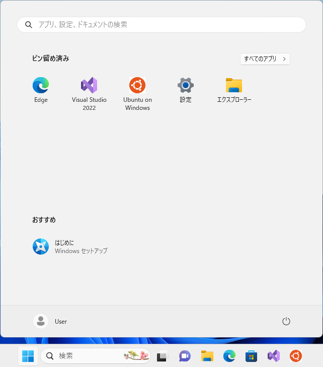
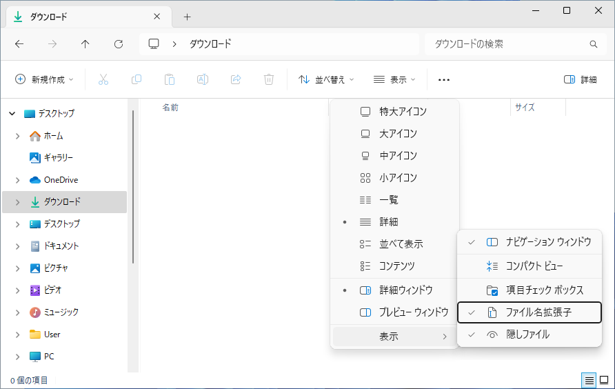
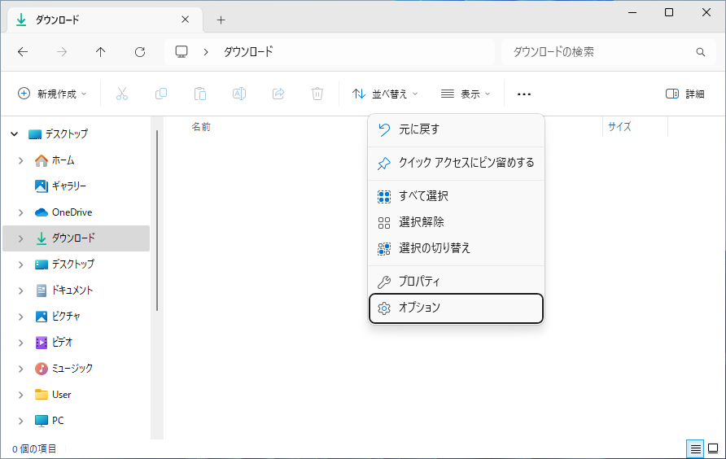
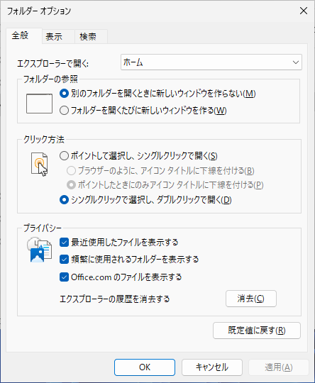
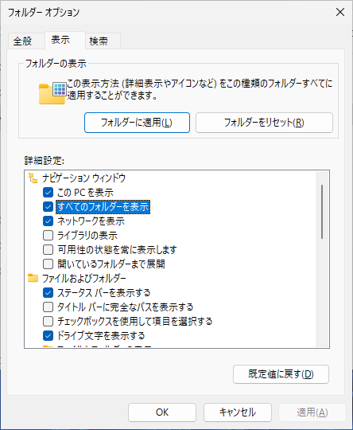
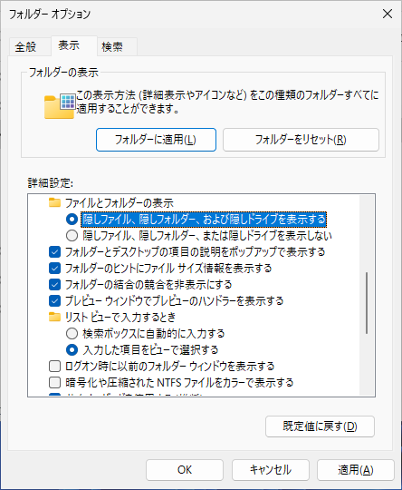
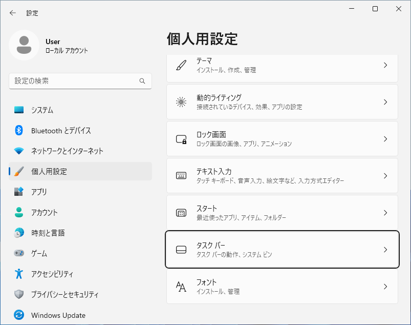
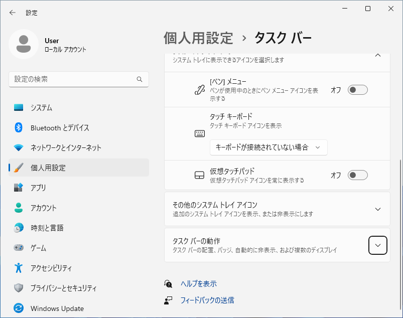
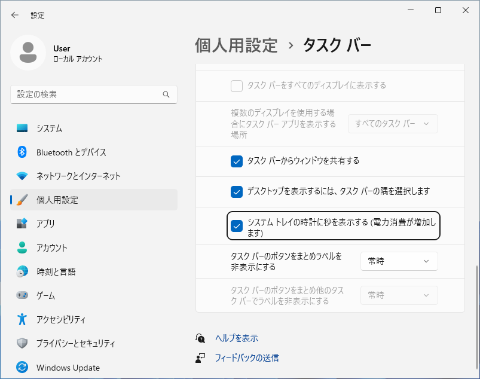
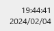

# Windows 11 の初期設定
Explorer
初心者向け
新人教育
新人応援
Windows11

Windows 11 では一般ユーザが利用しないファイルやディレクトリは表示されないようになっています。
しかし、プログラミング作業では、そういった特殊なファイルの操作も必要になります。
この記事では 18 歳の新入社員向けに Windows 11 のプログラミング向けの機能を有効にする手順を説明します。

## デスクトップに PC アイコンの表示
### スタートメニューの表示
スタートボタンをクリックします。スタートメニューが表示されたら「**設定**」をクリックします。

### 設定画面の表示
設定画面が表示されたら、左側の「**個人用設定**」をクリックします。

### 個人用設定の表示
個人用設定が表示されたら、右側の「**テーマ**」をクリックします。

### テーマの表示
テーマの詳細が表示されたら、「**デスクトップアイコンの設定**」をクリックします。

### デスクトップアイコンの設定
デスクトップアイコンの設定が表示されたら、「**コンピュータ**」、「**コントロールパネル**」、「**ネットワーク**」にチェックをつけ、「**OK**」をクリックします。

### デスクトップアイコンの表示
デスクトップ上にアイコンが表示されたら、アイコン設定の完了です。

## ファイル拡張子と隠しファイルの表示
### スタートメニューの表示
スタートボタンをクリックします。スタートメニューが表示されたら、ピン留め済みの「**エクスプローラ**」をクリックします。

### エクスプローラの表示
エクスプローラが表示されたら、リボンの「表示 > 表示 > ファイル名拡張子」 をクリックしてファイル拡張子を表示します。
同様に「表示 > 表示 > 隠しファイル」 をクリックして隠しファイルを表示します。

## すべてのフォルダー、システムフォルダの表示
### スタートメニューの表示
スタートボタンをクリックします。スタートメニューが表示されたら、「**エクスプローラ**」をクリックします。

### エクスプローラの表示
エクスプローラが表示されたら、リボンの「... > 設定」 をクリックします。

### フォルダーオプション画面の表示
フォルダーオプション画面が表示されたら、「表示タブ」をクリックします。

### 全てのフォルダーを表示
「すべてのフォルダーを表示」のチェックをオンにします。

### 隠しフォルダーを表示
「隠しファイル、隠しフォルダー、または隠しドライブを表示する」のチェックをオンにし、「OK」をクリックします。

## 時刻の秒単位の表示
#### スタートメニューの表示
スタートボタンをクリックします。スタートメニューが表示されたら「**設定**」をクリックします。

#### 設定画面の表示
設定画面が表示されたら、左側の「**個人用設定**」をクリックします。

#### 個人用設定の表示
個人用設定が表示されたら、「タスクバー」をクリックします。

#### タスクバーの設定
「タスクバーの動作」をクリックします。

#### タスクバーの動作
タスクバーの動作の詳細項目が表示されたら、画面をスクロールして、「システムトレイの時計に秒を表示する(電力消費が増加します)」のチェックをオンにします。

#### 設定完了
システムトレイの時計に秒が表示されたら、設定画面を閉じます。

## 参考文献
- Windowsエクスプローラの設定
https://www.python.jp/python_vscode/windows/setup/config_explorer.html
