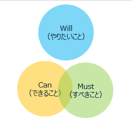

# キャリアに悩む人必見 Will-Can-Must による自己分析
Will-Can-Must は株式会社リクルートで使われている目標管理制度の方法です。この記事ではキャリアに悩み始める 3 年目以降のエンジニア向けに Will-Can-Must を使った自己分析方法を紹介します。

# 概要
Will-Can-Must は「やりたいこと・できること・すべきこと」からキャリアを考えるフレームワークです。3つが重なった部分が、自分の“生きがい”であり、理想だと言えるでしょう。

### Will の内容
Will では自分のやりたい事やなりたい姿を考えます。

- 仕事を通じて実現したいこと
- ロールモデル
- 理想の働き方・生き方

### Can
Can では等身大の自分を受けとめ、自分のできる事や得意なことを考えます。

- 今の自分ができること
- スキルやこれまでの経験

### Must
Must では就職した後にやらなければいけない事を考えます。

- 社会や会社からの要望
- 職種の役割／売上目標
- 将来的に身につけなければならないスキル・経験

# ミスマッチ分析
Will-Can-Must の重なっている部分や離れている部分に着目することで
ミスマッチに気づくことができます。

# Will Can Must がばらばらの場合

理想の就職は、誰でも知っている有名な大手企業で働くことではなく、自分の価値観にあった企業でいきいきと働くことです。

自分が何をしていたいか、どうありたいか、自分を見つめ直しょう。自分の価値観を見つける手段としてライフライン分析・エニアグラム等のいくつかの手法があります。別の機会に紹介します。

## Will と Must が重なっている場合

会社の業務と自分の能力の間にギャップを感じるパターンです。
このフェーズで大切なのはとにかく「できることを増やす」ことです。

# Will と Can が重なっている場合

周りの期待を無視して、自己中心的と思われている可能性があります。仕事仲間や上司と「仕事の目的は何か」会話してみましょう。

# Can と Must が重なっている状態

40歳以降の壮年世代で起きやすい状態です。このフェーズで大切なのは能力を維持し続けることです。能力維持や健康維持に努めましょう。

# ３つが重なっている状態

3つの部分が大きく重なっている事が、理想といえるでしょう。

# 組織開発への応用
主語を We に変えると、会社やチームの目標設定の方法として使えます。

# 参考文献
- 【Will-Can-Mustシート】リクルートの活用事例～メンバーの本当に実現したいことを対話する方法
https://www.recruit.co.jp/blog/culture/20230921_4189.html
- リクルートでも「Will」が書けずに悩む人もいる取り組みたいことに縛られる“Willの神格化”からの脱却
https://logmi.jp/business/articles/327467
- マイナビ　キャリアの悩みには「Will Can Must」　転職面接やビジネスで活用しよう
https://tameni.mynavi.jp/career/6055/
