Windows 11 の FTP サーバーのインストール
初心者向け
新人教育
Windows11
FTP
IIS

FTP（読み方：エフティーピー） はコンピュータ間でファイルを転送するためのプロトコルです。FTP はコンピュータ間でファイルを共有および転送するのに役立ちます。この記事では 18 歳の新入社員向けに Windows 11 に FTP サーバーをインストールする手順を説明します。 

## Windows の FTPサーバー機能の有効化
### スタートメニューの表示
**スタートボタン**をクリックし、スタートメニューが表示されたら「**設定**」をクリックします。

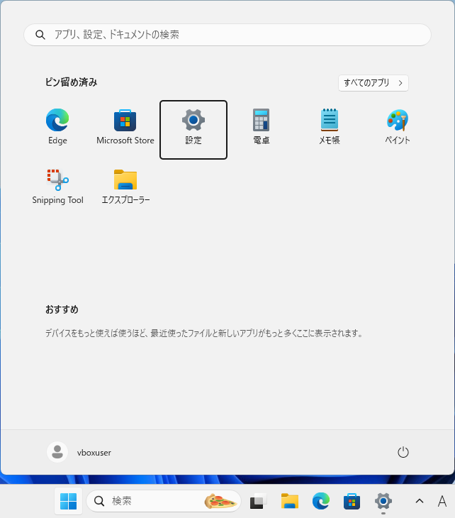

### 設定画面の表示
設定画面が表示されたら、左側の「**システム**」をクリックします

### システムの表示
システムの詳細が表示されたら、下にスクロールし「**オプション機能**」をクリックします。

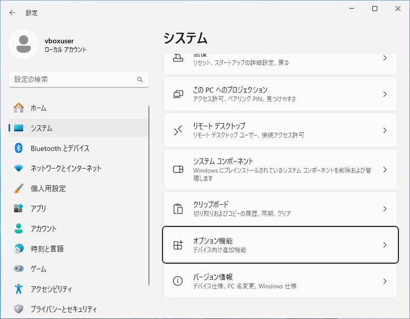

### オプション機能の表示
オプション機能の詳細が表示されたら、下にスクロールし「**Windows のその他の機能**」をクリックします。

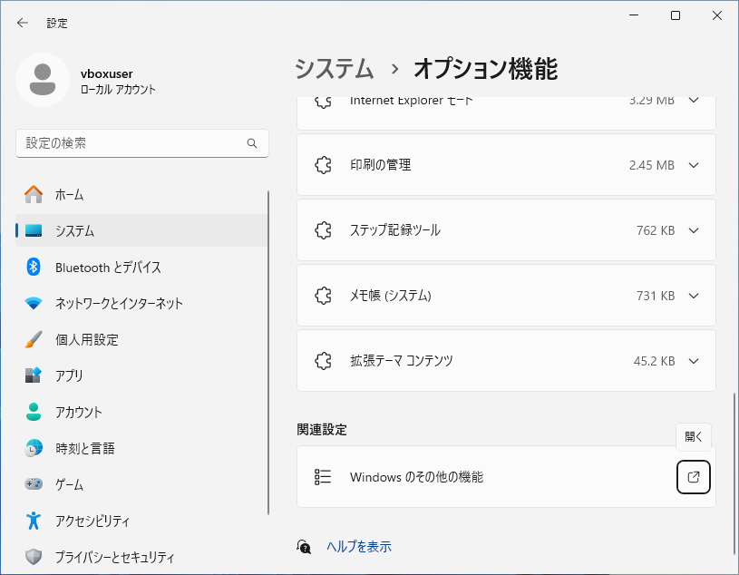

### IIS の選択
Windowsの機能が表示されたら、インターネット インフォメーション サービスの下の「**FTPサーバー**」と「**Web 管理ツール**」のチェックをオンにし、「**OK**」をクリックします。

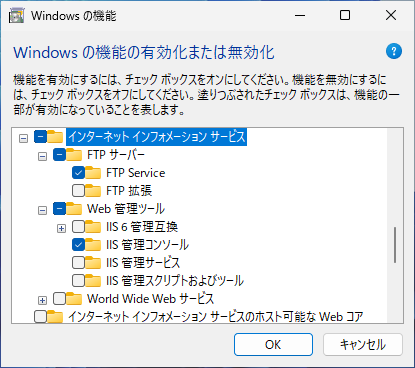

### Windows 機能の変更
Windows 機能の変更が完了したら「**閉じる**」をクリックします。

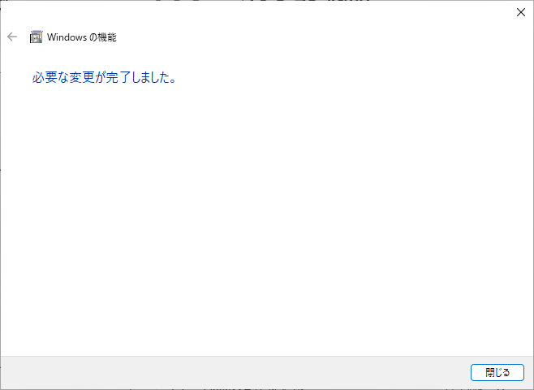

## IIS マネージャの起動
### スタートメニューの表示
スタートボタンをクリックし、スタートメニューが表示されたら「**すべてのアプリ**」をクリックします。

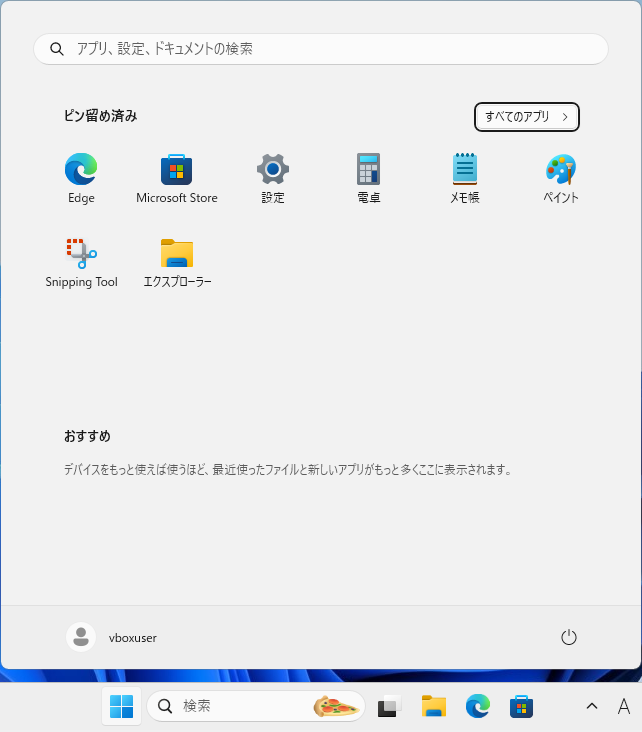

### Windows ツールの表示
アプリ一覧が表示されたら下にスクロールし、「**Windows ツール**」をクリックします。

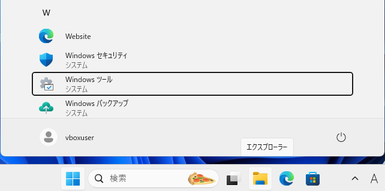

### IIS マネージャの表示
Windows ツールが表示されたら、「**インターネット インフォメーション サービス（IIS）マネージャー**」をクリックします。

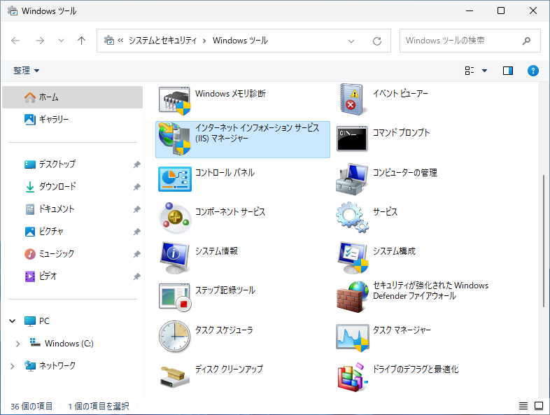

## FTP サーバの設定
### FTP サイトの追加
インターネット インフォメーション サービス マネージャの画面が表示されたら、 左側の「**サイト**」をクリックし、 右側の「**FTP サイトの追加**」をクリックします。

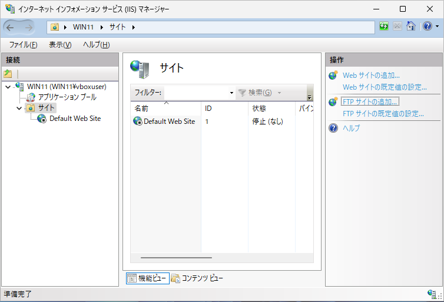

### サイト情報の入力
サイト情報が表示されたら、「**FTP サイト名**」と「**物理パス**」を入力し、「**次へ**」をクリックします。ここでは例として FTPサイト名に「FTP-test」、物理パスに 「C:\inetpub\ftproot」を入力します。

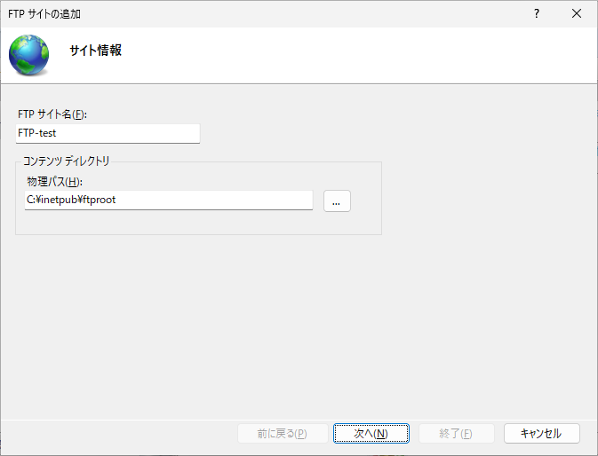

### バインドと SSL の設定
バインドと SSL の設定が表示されたら、SSLの「**無し**」を選択し、「**次へ**」をクリックします。

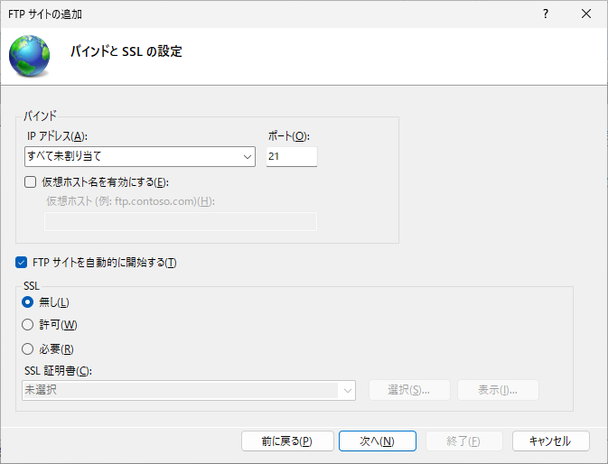

### 認証および承認の情報
認証の情報が表示されたら、「**匿名**」のチェックをオンにし、アクセス許可は「**匿名ユーザー**」のアクセス許可の「**読み取り**」「**書き込み**」のチェックをオンにし、「**終了**」をクリックします。

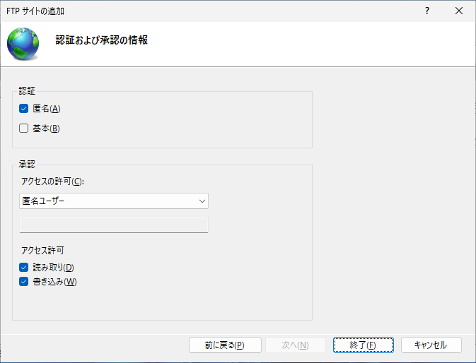

## ディレクトリの表示スタイルの設定
### IIS マネージャの表示
左側のサイトのリストにある「**FTP-test**」をクリックし、 中央の「**FTP ディレクトリの参照**」のアイコンをダブルクリックします。

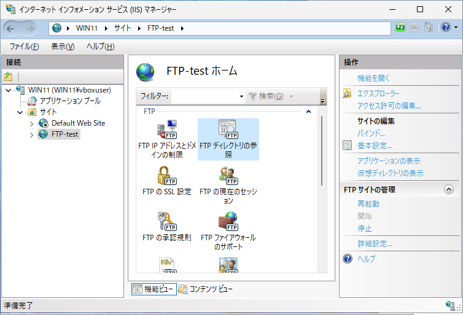

### FTP ディレクトリの参照
FTP ディレクトリの参照が表示されたら、右側の表示スタイルの「**UNIX**」をクリックし、「**適用**」をクリックします。

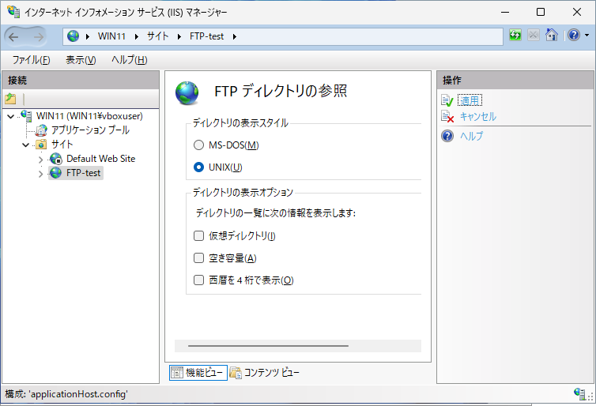

<!--
## タイムアウトの設定
### IISマネージャの表示
左側のサイトのリストにある「**FTP-test**」をクリックし、 右側の「**詳細設定**」をクリックします。

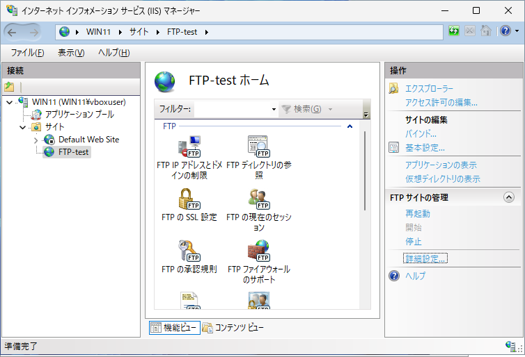

### タイムアウト
詳細設定が表示されたら、「コントロールチャネルのタイムアウト」に好きな数値を入力します。

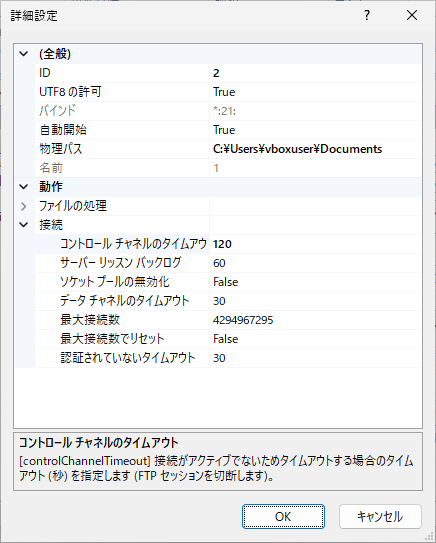

### FTP サーバの再起動
インターネット インフォメーション サービス マネージャの左側の「**サイト**」をクリックし、中央の「**FTP-test**」をクリックし、 右側の「**再起動**」をクリックします。

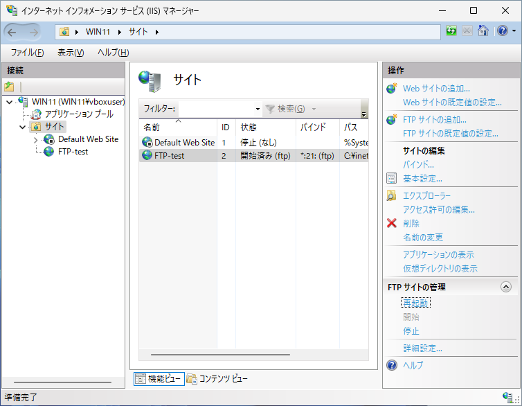
-->
## ファイアウォールの設定
### スタートメニューの表示
スタートボタンをクリックし、スタートメニューが表示されたら「**すべてのアプリ**」をクリックします。

### Windows ツールの表示
アプリ一覧が表示されたら下にスクロールし、「**Windows ツール**」をクリックします。

### Windows ファイアウォールの表示
Windows ツールが表示されたら、「**セキュリティが強化された Windows Defender ファイアウォール**」をクリックします。

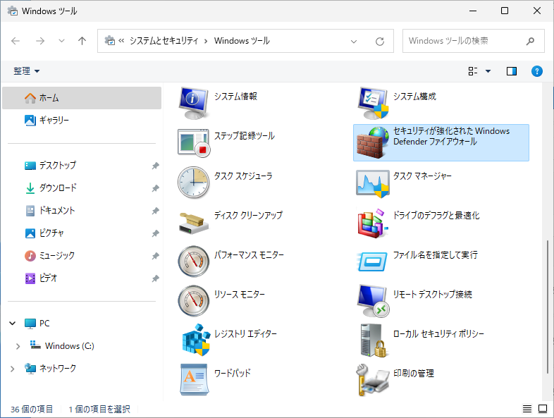

### 受信の規則の表示
Windows ファイアウォールが表示されたら、「**受信の規則**」をクリックします。

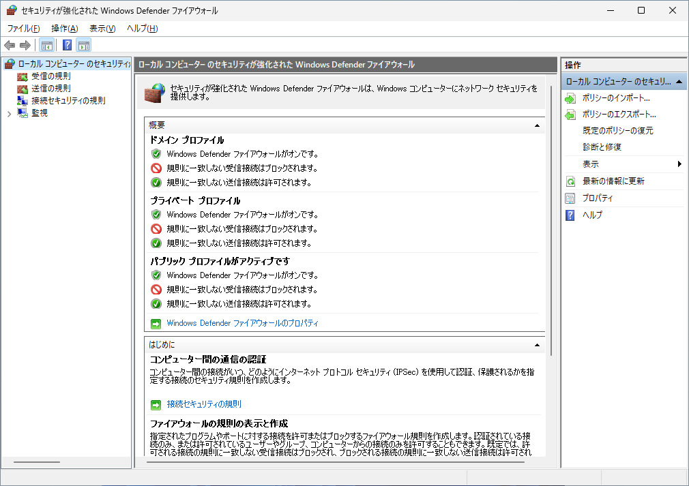

### 受信の規則の有効化
受信の規則が表示されたら、「**FTPサーバー（FTP トラフィック受信）**」、「**FTPサーバー セキュリティ（FTP SSL トラフィック受信）**」、「**FTPサーバー パッシブ（FTP パッシブ トラフィック受信）**」を選択して、右側の「**規則の有効化**」をクリックします。

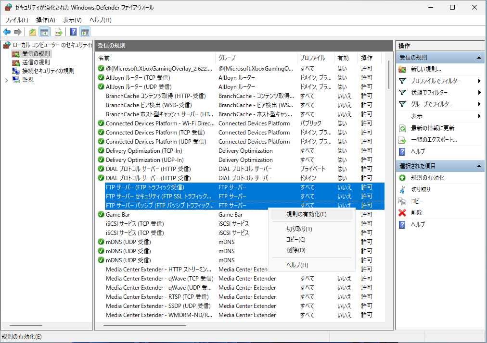

### 送信の規則の表示
Windows ファイアウォールの左側の「**送信の規則**」をクリックします。

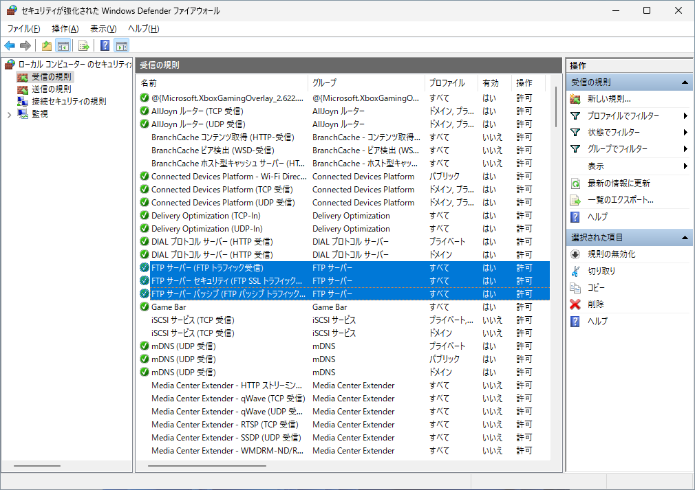

### 送信の規則の表示
送信の規則が表示されたら、「**FTPサーバー（FTP トラフィック送信）**」と「**FTPサーバー セキュリティ（FTP SSL トラフィック送信）**」を選択して、「**規則の有効化**」をクリックします。

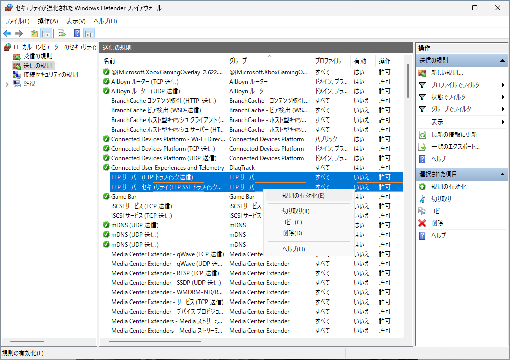

## 参考文献
- マイクロソフト > Learn > IIS > IIS で FTP サイトを構築する
https://learn.microsoft.com/ja-jp/iis/publish/using-the-ftp-service/scenario-build-an-ftp-site-on-iis
