# GPIB 通信ライブラリ NI-488.2 のオフラインインストール
tag: GPIB GP-IB LabVIEW Windows11 

NI-488.2（読み方：えぬあい よんはちはちに） は ナショナルインスツルメンツ（NI）社の GPIB コントローラを使うためのソフトウェアです。GPIB バスを介して接続された計測機器や制御機器との通信に使用されます。この記事では 18 歳の新入社員向けに NI-488.2 のオフラインインストール手順を説明します。

## NI-488.2 を使う目的
### GPIB 通信のサポート
NI-488.2は、GPIBバスを介して接続された計測機器や制御機器との通信をサポートします。

### 複数のプラットフォーム対応
NI-488.2 は、Windows、Linux、macOS など、さまざまなプラットフォームで利用できます。これにより、異なるオペレーティングシステム上で計測システムを構築できます。

### インタラクティブなデバッグ
NI-488.2 にはデバッグ機能が含まれており、GPIB 通信に関する不具合のトラブルシューティングが容易です。

## NI-488.2 のシステム要件
NI-488.2 は[以下の Windows 環境で動作します](https://www.ni.com/ja/support/documentation/release-notes/product.ni-488-2.html)。

- オペレーティングシステム:  Windows 10、11

ここでは NI-488.2 2023 Q3 を Windows 11 にインストールする手順を説明します。

### NI-488.2 のインストール
### ダウンロード
NI-488.2 のダウンロードページにアクセスします。

[https://www.ni.com/ja/support/downloads/drivers/download.ni-488-2.html](https://www.ni.com/ja/support/downloads/drivers/download.ni-488-2.html)

ページが表示されたら、サポートされている OS に「**Windows**」、バージョンに「**2023 Q3**」を選択し、「**オフラインでインストール**」をクリックします。

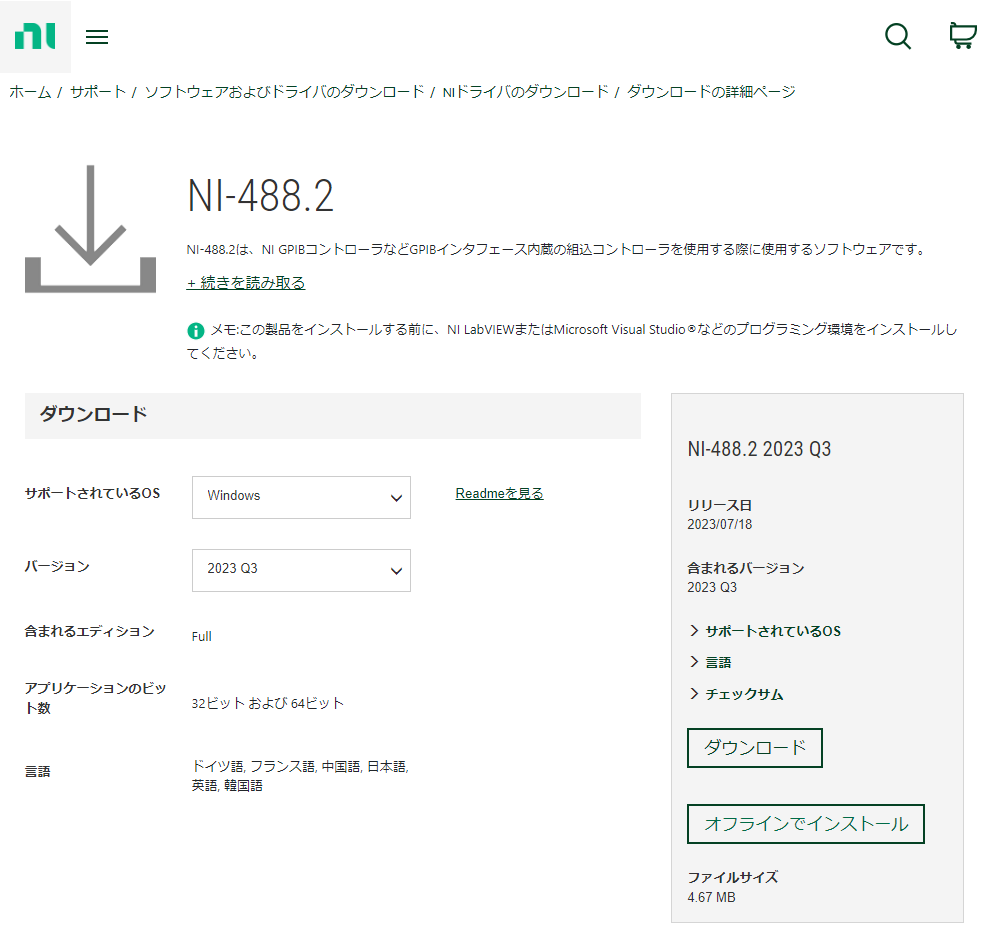

### オフラインインストーラのダウンロード
オフラインインストーラのダウンロードが表示されたら、「**ダウンロード**」をクリックします。

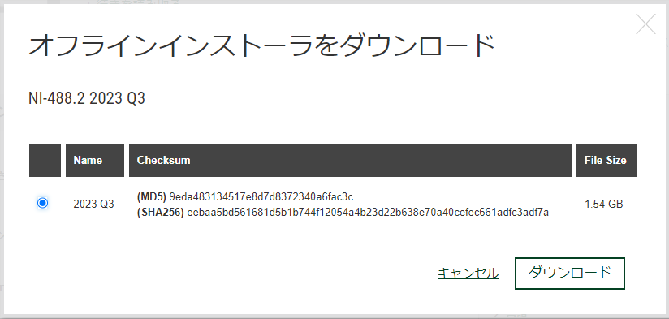

### ディスクイメージ（ISO）のマウント
ダウンロードしたISOファイルをダブルクリックし、仮想 CD-ROM としてマウントします。

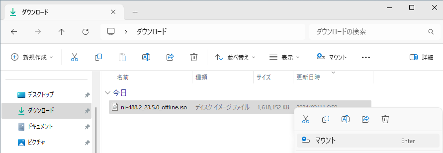
### インストーラの起動
マウントしたディレクトリにある、「**Install.exe**」をダブルクリックして実行します。

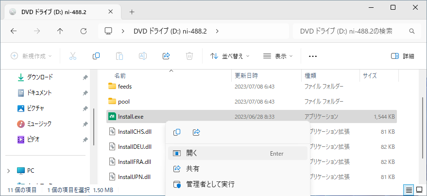
### ユーザーアカウント制御の確認
ユーザーアカウント制御が表示されたら、「**はい**」をクリックします。

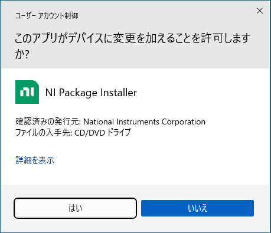
### ライセンスの同意
使用許諾契約の内容を確認して、「**上記の2ライセンス契約に同意します。**」を選択し、「**次へ**」をクリックします。

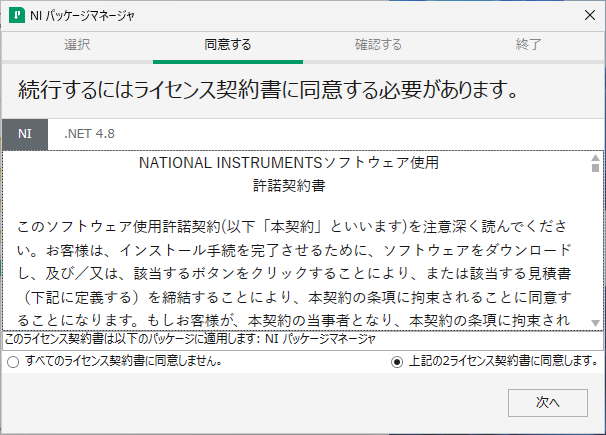

### 高速スタートアップの無効化
Windows 高速スタートアップの画面が表示されたら、「**次へ**」をクリックします。

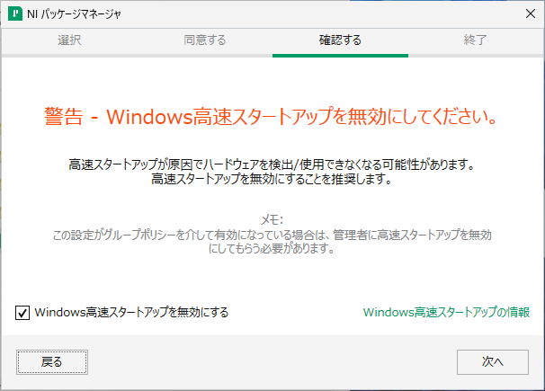

### パッケージマネージャのインストール
インストールの確認画面が表示されたら、「**次へ**」をクリックします。

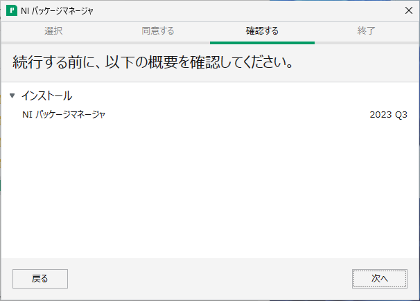
### 追加パッケージの選択
インストールする追加項目の画面が表示されたら、「**次へ**」をクリックします。

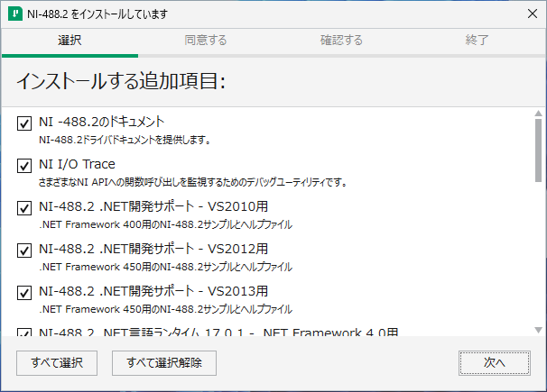
### ライセンスの同意
使用許諾契約の内容を確認して、「**上記の3ライセンス契約書に同意します。**」を選択し、「**次へ**」をクリックします。

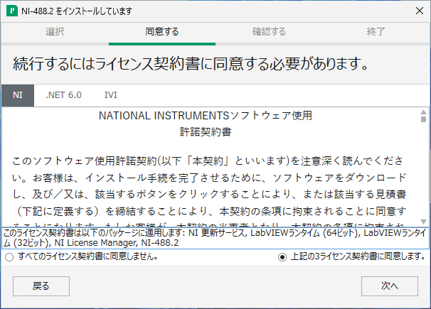
### NI 更新サービスの確認
NI 更新サービスの確認画面が表示されたら、「**いいえ**」をクリックします。

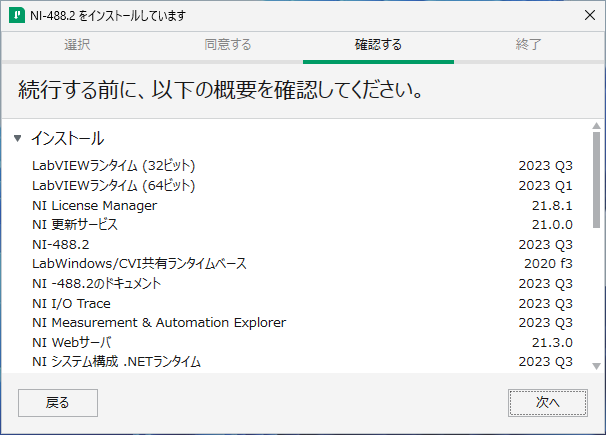
### インストールの完了
インストールの完了画面が表示されたら、「**今すぐ再起動する**」をクリックします。

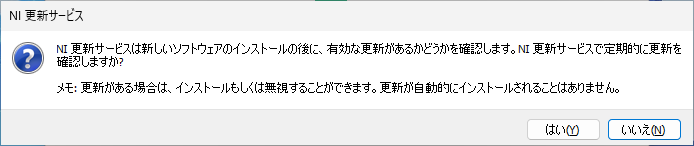
