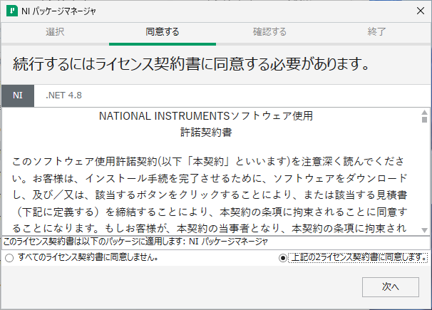

# 計測器制御ライブラリ NI-VISA のオフラインインストール
tag: GPIB VISA LabVIEW Windows11 NI

NI-VISA（読み方：えぬあい びさ） は NI（ナショナルインスツルメンツ）社の計測器と制御機器を扱うためのソフトウェアです。この記事では 18 歳の新入社員向けに NI-VISA のオフラインインストール手順を説明します。

## NI-VISA を使う目的
### テスト・計測装置の制御
NI-VISA は計測装置やテスト装置と通信し、それらの装置を制御するために使用できます。

### 高度な通信プロトコルサポート
NI-VISA は一般的な通信プロトコル（GPIB、USB、LAN、VXI、RS-232 など）をサポートし、ハードウェアとの通信を容易にします。

### 統一された API
NI-VISA は計測装置や制御装置に対する統一されたプログラムインターフェース（API）を提供します。
複数の測定器の異なる通信インターフェースを組み合わせたシステムソフトウェアを簡単に開発できます。

### 複数のプラットフォーム対応
NI-VISA は Windows、Linux、macOS などさまざまなオペレーティングシステムで動作します。

## NI-VISA の利用条件
NI-VISA は NI 社の製品と一緒に使用する場合は無料で利用できます。それ以外の場合は NI-VISA の実装ライセンスの購入が必要です。

https://www.ni.com/ja-jp/shop/product/ni-visa.html

## NI-VISA のシステム要件
NI-VISA は[以下の Windows 環境で動作します](https://www.ni.com/ja/support/documentation/release-notes/product.ni-visa.html)。

- オペレーティングシステム:  Windows 10、11

ここでは NI-VISA 2023 Q4 を Windows 11 にインストールする手順を説明します。

## NI-VISA のインストール手順
### ダウンロード
NI-VISA のダウンロードページにアクセスします。

[https://www.ni.com/ja/support/downloads/drivers/download.ni-visa.html](https://www.ni.com/ja/support/downloads/drivers/download.ni-visa.html)

ページが表示されたら、サポートされている OS に「**Windows**」、バージョンに「**2023 Q4**」を選択し、「**オフラインでインストール**」をクリックします。

### ディスクイメージ（ISO）のダウンロード
オフラインインストーラのダウンロード画面が表示されたら、「**ダウンロード**」をクリックします。

### ディスクイメージ（ISO）のマウント
ダウンロードしたISOファイルをダブルクリックし、仮想 CD-ROM としてマウントします。

### インストーラの起動
マウントしたディレクトリにある、「Install.exe」をダブルクリックして実行します。

### ユーザーアカウント制御の確認
ユーザーアカウント制御が表示されたら、「**はい**」をクリックします。

### ライセンスの同意
使用許諾契約の内容を確認して、「**上記の2ライセンス契約に同意します。**」を選択し、「**次へ**」をクリックします。

### 高速スタートアップの無効化
Windows 高速スタートアップの画面が表示されたら、「**次へ**」をクリックします。

### パッケージマネージャのインストール
インストールの確認画面が表示されたら、「**次へ**」をクリックします。

### 追加パッケージの選択
インストールする追加項目の画面が表示されたら、「**次へ**」をクリックします。

### ライセンスの同意
使用許諾契約の内容を確認して、「**上記の3ライセンス契約書に同意します。**」を選択し、「**次へ**」をクリックします。

### 追加パッケージのインストール
インストールの確認画面が表示されたら、「**次へ**」をクリックします。

### NI 更新サービスの確認
NI 更新サービスの確認画面が表示されたら、「**いいえ**」をクリックします。

### インストールの完了
インストールの完了画面が表示されたら、「**今すぐ再起動する**」をクリックします。

