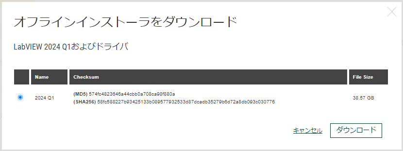
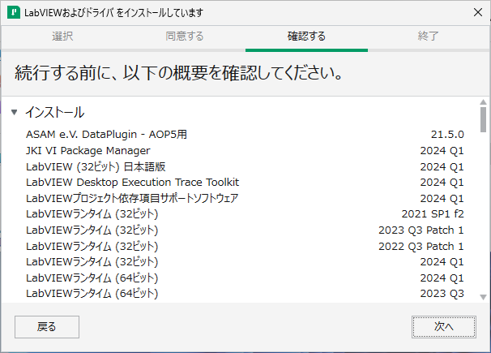

# グラフィカルプログラミング言語 LabVIEW のオフラインインストール
tag: LabVIEW VISA GPIB Ni Windows11

LabVIEW（読み方：らぶびゅー）は NI（ナショナル インスツルメンツ）社のグラフィカルプログラミング言語および開発環境です。NI 社の計測器を使ったデータ収集プログラム、自動試験プログラムを開発するために使われます。この記事では 18 歳の新入社員向けに LabVIEW のオフラインインストール手順を説明します。

## LabVIEW を使う目的
### データ収集と解析
LabVIEW はさまざまなセンサーや計測機器からのデータをリアルタイムで取得し、可視化および解析するために使用されます。

### 自動制御システム
LabVIEW は制御アルゴリズムやPIDコントローラーを実装し、産業プロセスや自動制御システムを構築するために使用されます。

### 自動試験と検査
LabVIEW は製品の自動試験や検査のための自動化ツールとして使用されます。

## LabVIEW のシステム要件
LabVIEW は[以下の Windows 環境](https://www.ni.com/ja/support/documentation/release-notes/product.labview.html)で動作します。

- オペレーティングシステム:  Windows 10、11

ここでは LabVIEW 2024 Q1 日本語版 を Windows 11 にインストールする手順を説明します。

## LabVIEW のインストール手順
### ダウンロード
LabVIEW のダウンロードページにアクセスします。

[https://www.ni.com/ja/support/downloads/software-products/download.labview.html](https://www.ni.com/ja/support/downloads/software-products/download.labview.html)

ページが表示されたら、サポートされている OS を「**Windows**」、バージョンを「**2024 Q1**」、エディションを「**Base, Full, Professional**」、ビット数を「**32ビット**」、言語を「**日本語**」、ドライバに「**あり**」を選択し、「**オフラインでインストール**」をクリックします。

### ディスクイメージ（ISO）のダウンロード
オフラインインストーラのダウンロード画面が表示されたら、「**ダウンロード**」をクリックします。

### ディスクイメージ（ISO）のマウント
ダウンロードしたISOファイルをダブルクリックし、仮想 CD-ROM としてマウントします。

### インストーラの起動
マウントしたディレクトリにある、「**Install.exe**」をダブルクリックして実行します。

### ユーザーアカウント制御の確認
ユーザーアカウント制御が表示されたら、「**はい**」をクリックします。

### ライセンスの同意
使用許諾契約の内容を確認して、「**上記の2ライセンス契約に同意します。**」を選択し、「**次へ**」をクリックします。

### 高速スタートアップの無効化
Windows 高速スタートアップの画面が表示されたら、「**次へ**」をクリックします。

### パッケージマネージャのインストール
インストールの確認画面が表示されたら、「**次へ**」をクリックします。

### インストールする機能の選択
インストールする機能の項目が表示されたら、「**次へ**」をクリックします。

### 追加パッケージの選択
インストールする追加項目の画面が表示されたら、「**次へ**」をクリックします。

### ライセンスの同意
使用許諾契約の内容を確認して、「**上記の4ライセンス契約書に同意します。**」を選択し、「**次へ**」をクリックします。

### 製品情報の確認
製品についての情報が表示されたら、「**次へ**」をクリックします。

### インストールの確認
インストールの確認画面が表示されたら、「**次へ**」をクリックします。

### NI 更新サービスの確認
NI 更新サービスの確認画面が表示されたら、「**いいえ**」をクリックします。

### ソフトウェアのアクティブ化
ソフトウェアのアクティブ化の画面が表示されたら「**キャンセル**」をクリックします。  

### インストールの完了
インストールの完了画面が表示されたら、「**今すぐ再起動する**」をクリックします。

### LabVIEW の起動
Windows が再起動したら、「**スタートメニュー　> すべてのアプリ > NI LabVIEW 2024 Q1**」をクリックします。

### 試用版の使用開始
LabVIEW が起動したら、「**7日間の試用版を開始**」をクリックします。

### 設定の完了
LabVIEW の画面が表示されたら、初期設定完了です。

