# 高速度カメラ制御ソフト PFV4 のインストール
tag: PFV4 Photoron 初心者向け 新人教育 Windows11

Photron FASTCAM Viewer4（以降 PFV4 と呼びます。）は フォトロン社の高速度カメラの制御ソフトウェアです。高速度撮影とその後のデータ解析のために使用されます。この記事では 18 歳の新入社員向けに PFV4 のインストール手順を説明します。。

## PFV4 を使う目的
### 高速度データビューア
フォトロン社の高速度カメラでキャプチャした映像や画像を表示および再生することができます。非常に高速なフレームレートで記録された映像を詳細に分析できます。

### 映像解析
キャプチャした映像の解析機能を提供し、現象の詳細な調査や分析が可能です。例えば、物体の速度、変形、挙動などを調査するために使用されます。

### カメラ制御
の高速度カメラを制御するためのユーザーインターフェースを提供します。カメラの設定、トリガリング、撮影パラメータの調整などを行えます。

## PFV4 のシステム要件
[PFV4 は以下の Windows 環境で動作します](https://photron.com/wp-content/uploads/2023/06/PFV4-2020.03.03_Online-Res.pdf)。

#### オペレーティングシステム
- Microsoft Windows 10 Pro、 Windows 10 Enterprise
- Microsoft Windows 10 Education
- Microsoft Windows 8.1 Pro、Windows 8.1 Enterprise、Windows 8.1、
- Microsoft Windows 7 Ultimate SP1、Windows 7 Enterprise SP1、
- Microsoft Windows 7 Professional SP1、Windows 7 Home Premium SP1
- 64ビット版推奨 

#### プロセッサー
- インテル Core i5 以上（インテル Core i7 以上を推奨）
- *SSE2は必須

#### RAM
- 最低4GBのRAM（8GB以上のRAMを推奨）

#### ハードディスクまたはSSD
- プログラムインストール用に1GBのハードディスク空き容量 

#### グラフィックカード
- 1 GB以上のIntel® HD Graphics VRAM (6GB以上のNVIDIA®グラフィックスカード推奨）
- OpenGL2.0以上必須
- AMDグラフィックスカードはサポートされていません。
- 複数のカメラを接続する場合は、より多くのビデオメモリが必要です。

#### ディスプレイ解像度
- WXGA（1,280×768）の24ビットカラー以上
- フルHD（1,920×1,080）の24ビットカラー以上を推奨

#### その他
- 記録画像データ保存用の大容量ハードディスクまたはリムーバブルメディアドライブ
- インストール用DVD ROMドライブ
- ギガビットイーサネット接続の場合は、「ジャンボフレーム」対応の1000Base-T対応NICを推奨。
 - SDカードに保存した画像を再生するためのSDカードリーダー
- USB経由でカメラを制御したり、FASTドライブに保存した画像を再生するためのUSBポート
- 表示する画像によっては、推奨以上の動作環境が必要な場合があります。

ここでは Photron FASTCAM Viewer 
Version 4.0.6.2 を Windows 11 にインストールする手順を説明します。

## PFV4 のインストール手順
### ダウンロード
Photoron FASTCAM Viewer のウェブサイトにアクセスし、「**Download from Google Drive - Zip Version**」をクリックします。

[https://photron.com/photron-support/](https://photron.com/photron-support/)

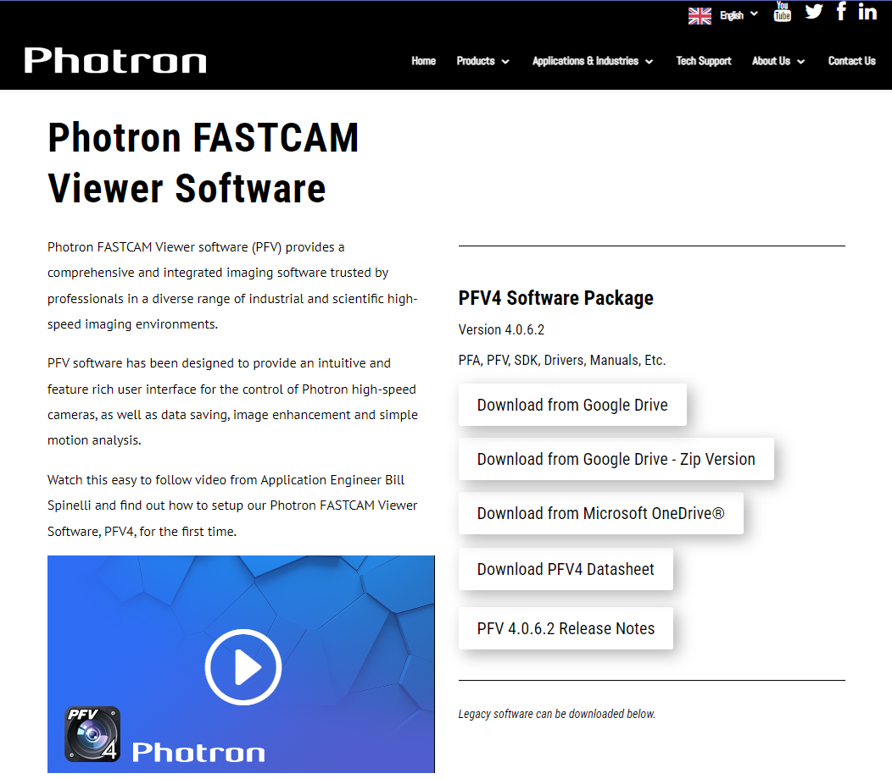
### インインストーラのダウンロード
Google ドライブの画面が表示されたら、ファイルを右クリックして、「**Download**」をクリックします。

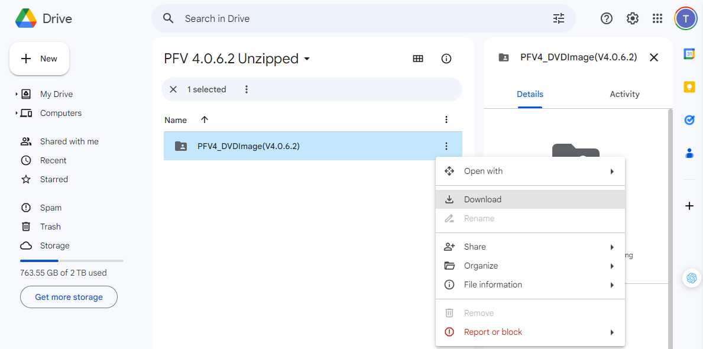
### ファイルの展開
ダウンロードが完了したら、ファイルを右クリックし、コンテキストメニューから「**すべて展開**」をクリックします。

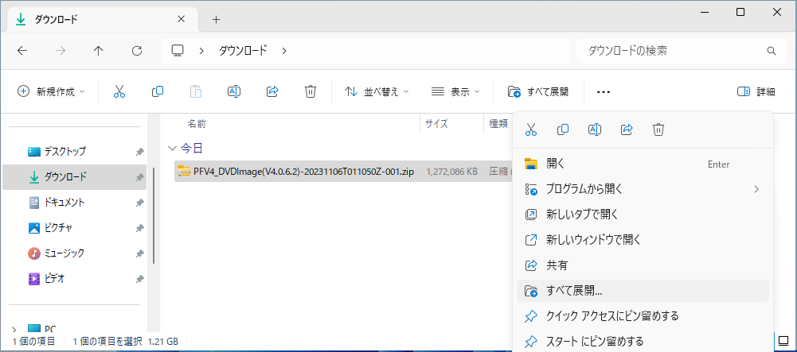
### 展開先フォルダの指定
ファイルの展開先を指定し、「**展開**」をクリックします。ここでは例としてダウンロードフォルダに展開します。

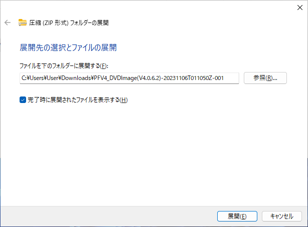
### ディレクトリの移動
ディレクトリが表示されたら、「**PFV4_DVDImage(V4.0.6.2)**」をダブルクリックします。

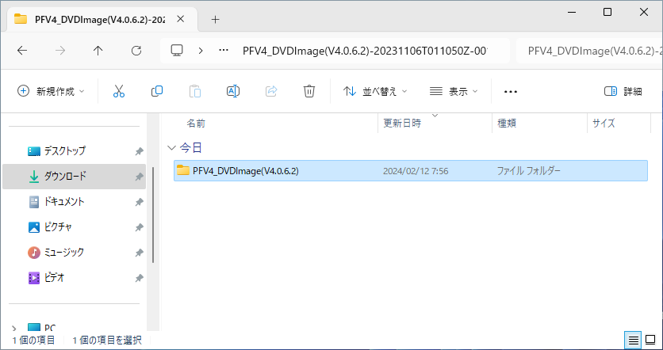
### ディレクトリの移動
「**PFV Setup64**」をダブルクリックします。

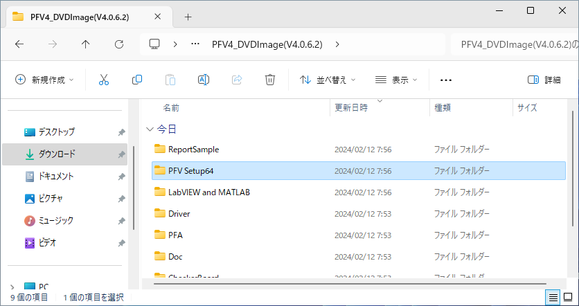
### インストーラの起動
PFV のディレクトリに移動したら、「**PFV4_x64.exe**」をダブルクリックして実行します。

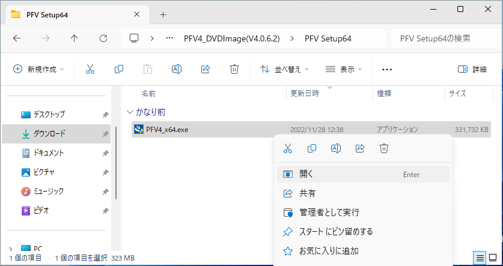
### ユーザーアカウント制御の確認
ユーザーアカウント制御が表示されたら、「**はい**」をクリックします。

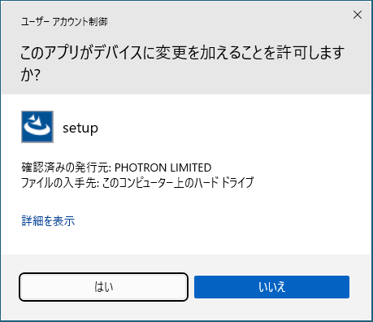
### セットアップ画面の確認
インストーラのセットアップ画面が表示されたら、「**次へ**」をクリックします。

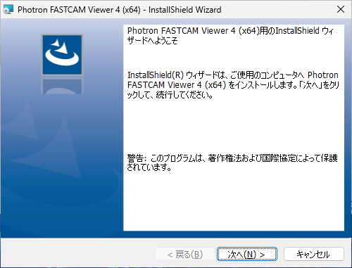
### ライセンスの同意
ライセンス契約の内容を確認して、「**使用許諾契約の条項に同意します**」を選択し、「**次へ**」をクリックします。

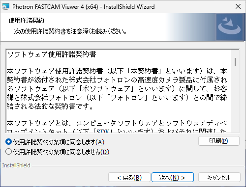
### インストール先の選択
インストール先フォルダの選択画面が表示されたら、「**次へ**」をクリックします。

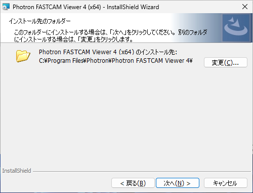
### インストールの確認
インストールの確認画面が表示されたら、「**インストール**」をクリックします。

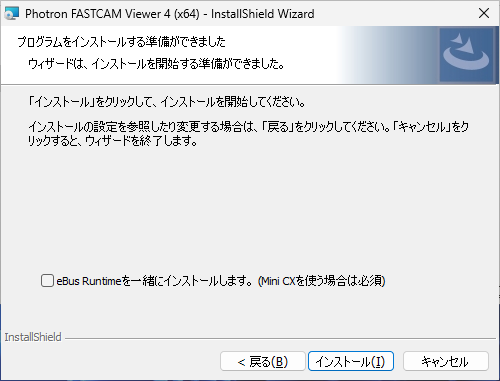
### インストール終了
インストール完了画面が表示されたら、「**完了**」をクリックします。

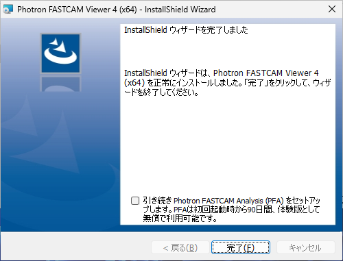
 