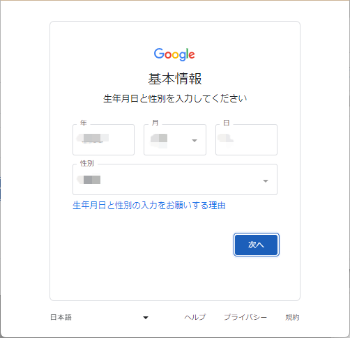
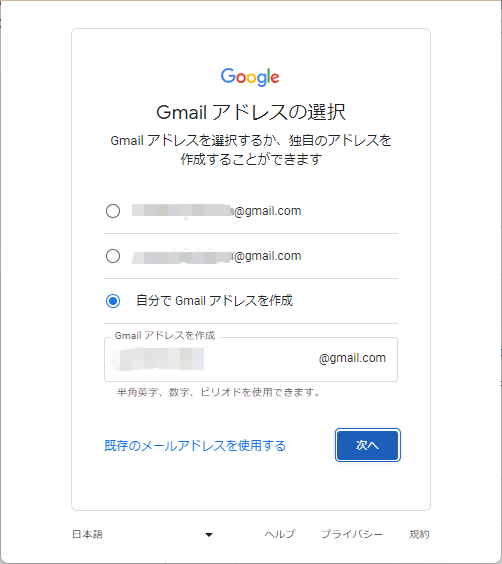

# Google アカウントの作成方法
tag: Googleアカウント 新人研修 初心者向け　

<!-- メモ：画面イメージは Chrome の 75％ 表示の 800x600 サイズで保存しています-->

## Google アカウントを作る目的
Google アカウントは、Google のオンラインサービスを使うためのアカウントです。Googleアカウントを作成すると、以下のようなサービスを利用できるようになります。

- Gmail: Googleの無料のメールサービス。
- Google ドライブ: クラウドストレージサービスで、文書、スプレッドシート、写真などを保存できます。
- Google カレンダー: 予定を管理するためのカレンダーサービス。
- Google Cloud Platform: クラウドアプリケーションを構築するための、クラウドコンピューティングサービス。

この記事では、18 歳の新入社員向けに Google アカウントの作成方法を説明します。

## Google アカウントの作成手順
### アカウントの作成ページに移動
Google アカウントの作成ページにアクセスし、性と名を入力し、「**次へ**」をクリックします。

[https://accounts.google.com/signup](https://accounts.google.com/signup)

### 基本情報の入力
基本情報の入力画面が表示されたら、生年月日と性別を入力し、「**次へ**」をクリックします。

### Gmail アドレスの選択
Gmail アドレスの選択画面が表示されたら、表示されているアドレスを選ぶか、好きなアドレスを作成し、「**次へ**」をクリックします。

### パスワードの作成
パスワードの作成画面が表示されたら、パスワード欄と確認欄にパスワード文字列を入力して、「**次へ**」をクリックします。

### SMS の送信
確認コードを受信する携帯電話の番号を入力し、「**次へ**」をクリックします。

### 確認コードの入力
携帯電話に受信した確認コードを入力し、「**次へ**」をクリックします。

### アカウント情報の確認
確認画面が表示されたら、「**次へ**」をクリックします。

### 利用規則への同意
利用規約が表示されたら、下にスクロールし、「**同意する**」をクリックします。

### 作成の完了
ようこそ画面が表示されたら、作成完了です。

## Google アカウントの削除手順
### Google アカウントのログイン
Google アカウントのログインページにアクセスし、ユーザー名を入力し、「**次へ**」をクリックします。

[https://myaccount.google.com](https://myaccount.google.com)

### パスワードの入力
パスワードの画面が表示されたら、パスワードを入力して、「**次へ**」をクリックします。

### Google アカウントの設定画面
Google アカウントの設定画面が示されたら、左側の「**データとプライバシー**」をクリックします。

### データとプライバシーの画面
データとプライバシーの画面が表示されたら、下にスクロールし、「**Google アカウントの削除**」をクリックします。

### 本人確認
本人確認画面が表示されたら、パスワードを入力し、「**次へ**」をクリックします。

### アカウントの削除
同意事項にチェックを付け、「**アカウントを削除**」をクリックします。

### 削除の完了
削除メッセージが表示されたら、削除完了です。

