# 10 ギガイーサネットアダプタの調整項目
tag: windows11 10gethernet ドライバ　チューニング

10 ギガイーサは最大 10G ビット／秒で通信できるイーサネットです。Windows 11 で 10G ビット／秒の能力を最大限発揮するにはチューニング作業が必要になります。この記事では 18 歳の新入社員向けに 10 ギガイーサのチューニング項目を説明します。

## チューニングが必要な背景
近年は1万円台で購入できる安価なネットワークインタフェースカード（NIC）が増え、企業や大学の研究室でも導入しやすい状況にあります。

Windows 11 では、一般的な10/100/1000BASE-Tとの互換性を優先し、性能の低いデスクトップパソコンでも問題なく動作するために、ドライバの設定は保守的な構成になっています。そのため、デフォルトの状態では最高のパフォーマンスを発揮できません。

図1：デフォルト構成の特徴イメージ

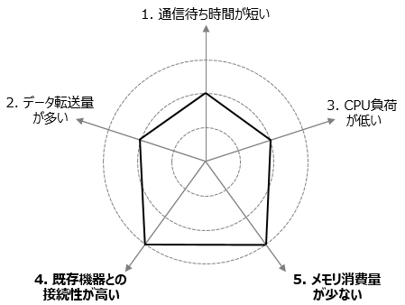

ネットワークに求められる特性は環境やアプリケーションによって異なります。配信作業や制御アプリケーションは低いレイテンシが必要される場合があり、ファイルサーバーでは低い CPU 使用率で大容量のデータ転送が要求されます。ここではインテル社の [イーサネット アダプターユーザーガイド](
https://www.intel.co.jp/content/www/jp/ja/download/19373/adapter-user-guide-for-intel-ethernet-adapters.html) を参考に、３種類の目的に合わせたドライバのチューニング内容を紹介します。

1. [リアルタイム性の向上](#短い待ち時間を実現するための最適化)
2. [時間当たりのデータ転送量の増加](#データ転送量を増やすための最適化)
2. [CPU 負荷の減少](#cpu-使用率を下げるための最適化)

# ネットワークアダプタの詳細設定を表示する方法
 「スタートボタン」を右クリックし、クイックアクセスメニューの「デバイス マネージャー」をクリックします。「デバイスマネージャー」 が表示されたら、「ネットワークアダプタ」の中にある対象インタフェースを右クリックし、「プロパティ」をクリックします。「プロパティ」が表示されたら「詳細設定」タブをクリックします。

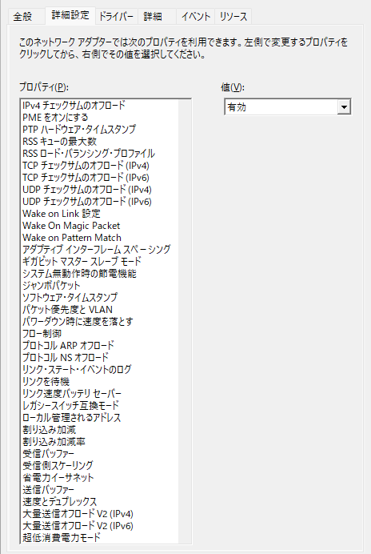

# 短い待ち時間を実現するための最適化
ビデオサーバ、オーディオサーバ、ハイパフォーマンス コンピューティングといったリアルタイム性が要求される場合の推奨設定は 以下の通りです。個別のプロパティの説明はそれぞれのリンク先をご覧ください。

さらにミリ秒未満の精度が求められる場合、コンピューターの BIOS で  「**C 状態を無効にして High Performance (高パフォーマンス)**」にする、 オペレーティング システムの電源管理プロファイルを「**高パフォーマンス システム**」に設定する、ことも重要です。

|プロパティ|設定|
|---|---|
|[割り込み加減率](#割り込み加減率)|「**オフ**」にします|
|[割り込み加減](#割り込み加減)|「**無効**」にします|
|[大量送信オフロード V2 (IPv4)](#大量送信オフロード-v2)|「**無効**」にします|
|[大量送信オフロード V2 (IPv6)](#大量送信オフロード-v2)|「**無効**」にします|
|[ジャンボパケット](#ジャンボパケット)|「**無効**」にします|
|[送信バッファー](#送信バッファー)|数を増やします|
|[受信バッファー](#受信バッファ―)|数を増やします|
|[RSS キューの最大数](#rss-キューの最大数)|数を増やします|

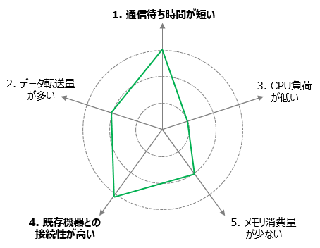

# データ転送量を増やすための最適化
ファイルサーバ向けの推奨設定は以下の通りです。

|プロパティ|設定|
|---|---|
|[ジャンボパケット](#ジャンボパケット)|「**9014 バイト**」にします|
|[送信バッファー](#送信バッファー)|数を増やします|
|[受信バッファ―](#受信バッファ―)|数を増やします|
|[RSS ロード・バランシング・プロファイル](#rss-ロード・バランシング・プロファイル)|NUMA をサポートするシステムの場合、「**NUMA スケーリング**」にします|

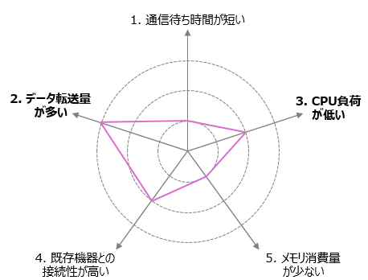

# CPU 使用率を下げるための最適化
仮想マシン環境といった限られた CPU 数や RAM 容量で動くアプリケーション、ウェブ、メール、およびデータベース・サーバー向けの推奨設定は以下の通りです。

|プロパティ|設定|
|---|---|
|[割り込み加減率](#割り込み加減率)|「**最大**」に設定します|
|[割り込み加減](#割り込み加減)|「**有効**」にします|
|[受信バッファ―](#受信バッファ―)|初期値のまま、大きな数を設定する事を避けます|
|[RSS キューの最大数](#rss-キューの最大数)|数を大きくします|

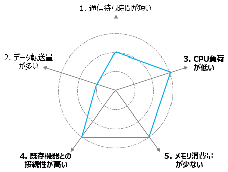

# 詳細設定の解説
## ジャンボパケット

ジャンボフレーム機能を有効、または無効にします。大型のパケットが大部分のトラフィックを構成し、追加のレイテンシーが許容可能な場合、ジャンボフレームは CPU 使用率を削減し、伝送効率を改善することができます。

イーサネット標準の1500（正確には1518）バイトよりも大きいフレームを送信できるようにする機能です。スループットの向上、CPU負荷の削減ができることがあります。

初期値は「無効」です。

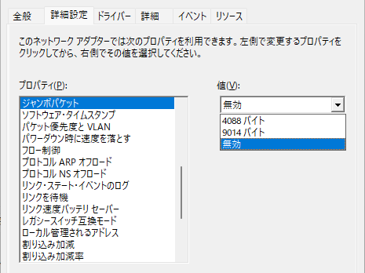

## 割り込み加減率
割り込み加減率（Interrupt Moderation Rate）は、ネットワークアダプタがCPUに割り込みを発生させる頻度を制御する設定です。ネットワークアダプタはデータの送受信や処理において、CPUに対して割り込みを通知しますが、その頻度を調整することができます。

割り込み加減率を調整することにより、ネットワークトラフィックが多い状況でも、効率的にCPUリソースを使用することが可能です。通常、割り込み加減率を増やすと、アダプタがより頻繁に割り込みを発生させ、データの処理が早くなりますが、同時にCPUリソースをより多く消費することになります。

初期値は「**アダプティブ**」です。

### 設定可能な値

|設定値|割り込みの頻度|
|---|---|
|オフ|ITR = 0、割り込み回数の制限なし|
|最小|ITR = 200|
|低|ITR = 400|
|中|ITR = 950|
|高|ITR = 2000|
|最大|ITR = 3600|
|アダプティブ|ITR=-1、割り込みなし/秒、ドライバーが動的に変更|

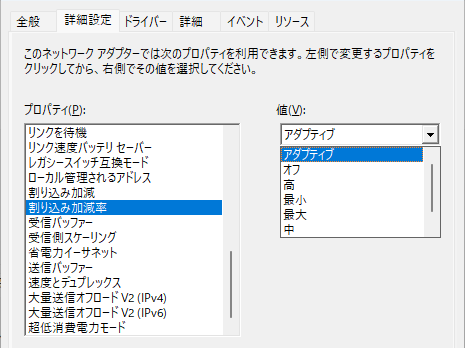

## 割り込み加減
割り込み加減（Interrupt Moderation）はネットワークトラフィックに対する割り込みの頻度を制御する機能です。ネットワークアダプタがデータを送受信するたびに、それがCPUに割り込みを発生させ、CPUがデータを処理する役割を果たします。このオプションを「**有効**」にすると、ネットワークアダプタは割り込み発生を最小限に抑え、トラフィックのパフォーマンス向上を図ります。「**無効**」にすると、より頻繁に割り込みが発生します。

初期値は「**有効**」です。

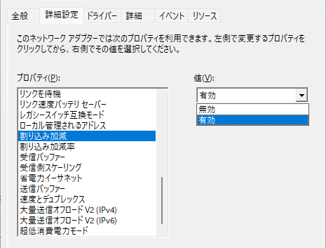

## 大量送信オフロード V2
大量送信オフロード V2（Large Send Offload V2）は、TCP/IPスタックがハードウェアによってサポートされた大きな　TCP データを生成し、その分割をネットワークアダプタにオフロードします。通常、TCPデータは小さなセグメント（MTU）に分割されて送信されますが、LSOv2ではハードウェアがセグメントを作成し、これを一度に送信することができます。

初期値は「**有効**」です。

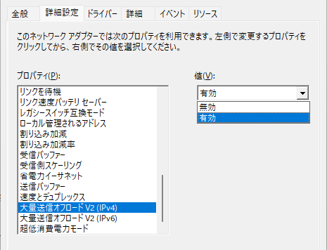

## TCP チェックサムのオフロード
アダプターが着信したパケットの TCP チェックサムを検証し、送信パケットのチェックサムを計算できるようにします。この機能を有効にすると、TCP パフォーマンスを向上させ、CPU の使用率を下げることが可能になります。IPv4 および IPv6 用に個別に設定することができます。

初期値は「**受信/送信 有効**」です。

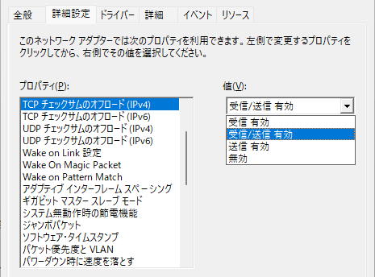
##  UDP チェックサムのオフロード
アダプターが着信したパケットの UDP チェックサムを検証し、送信パケットのチェックサムを計算できるようにします。この機能を有効にすると、UDP パフォーマンスを向上させ、CPU の使用率を下げることが可能になります。IPv4 および IPv6 用に個別に設定することができます。

初期値は「**受信/送信 有効**」です。

## 受信バッファ―

受信バッファー（Receive Buffers）は、ネットワークアダプタが受信データを格納するためのメモリバッファーの数を指定する機能です。これにより、アダプタは同時に多くの受信データを格納でき、効率的にネットワークトラフィックを処理することが期待されます。

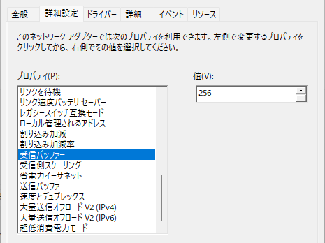

## 送信バッファー

送信バッファー（Send Buffers）は、ネットワークアダプタがデータを送信する際に使用するメモリバッファーの数を指定する機能です。これにより、アダプタは同時に多くのデータを送信でき、ネットワーク通信のパフォーマンスが向上することが期待されます。

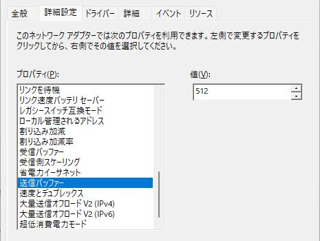

## 受信側スケーリング(RSS)

受信側スケーリング（Receive Side Scaling、RSS）はネットワークトラフィックの受信処理を複数のCPUコアに分散して処理するための技術です。これにより、マルチコアプロセッサシステムにおいてネットワークトラフィックの処理性能が向上し、ボトルネックを回避できるようになります。

初期値は「**有効**」です。

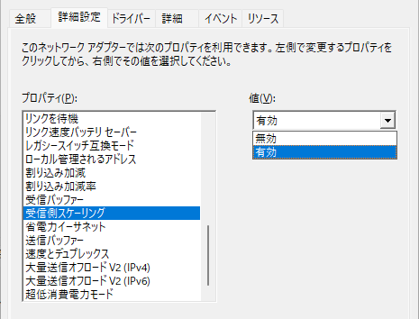

## RSS キューの最大数

RSSキューの最大数（Maximum Number of RSS Queues）は、ネットワークアダプタが受信側スケーリング（RSS）をサポートする際に、受信データを処理するために使用されるキューの数を指定します。RSSキューの最大数は、ハードウェアやアダプタの機能によって異なります。

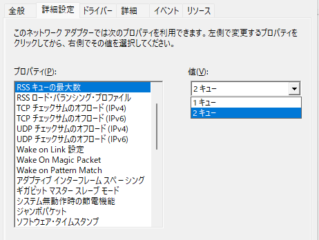

## RSS ロード・バランシング・プロファイル

RSS ロード・バランシング・プロファイル（RSS Load Balancing Profile）は、ネットワークトラフィックの受信側スケーリング（RSS）に関連する設定の一部です。RSSは、受信トラフィックを複数のCPUコアに分散して処理するための機能であり、これを制御するためのプロファイルが存在します。これによってネットワークアダプタがトラフィックをどのように処理するかが設定されます。

初期値は「**最も近いプロセッサー**」です。

|設定値|割り込みの頻度|
|---|---|
|最も近いプロセッサー|既定の動作は、Windows Server 2008 R2 の動作と一致します。|
|最も近いプロセッサー・スタティック|動的負荷分散なし - 分散しますが、実行時に負荷分散しません。|
|NUMA スケーリング|すべての NUMA ノードにラウンド ロビンベースで RSS CPU を割り当てて、NUMA サーバーで実行されているアプリケーションが適切にスケーリングできるようにします|
|NUMA スケーリング・スタティック|RSS プロセッサの選択は、動的負荷分散のない NUMA スケーラビリティの場合と同じです。|
|コンサーバティブ・スケーリング|RSS では、負荷を維持するために可能な限り少数のプロセッサを使用します。 このオプションは、割り込みの数を減らすために役立ちます。|

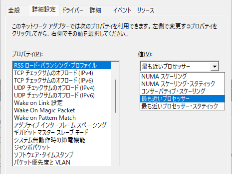

# 参考文献
-  インテル イーサネット アダプター用アダプター・ユーザーガイド > 4.20 Performance Options
https://www.intel.co.jp/content/www/jp/ja/download/19373/adapter-user-guide-for-intel-ethernet-adapters.html
<!-- 
- インテル イーサネットアダプターとデバイス ユーザーガイド
https://dl.dell.com/manuals/all-products/esuprt_data_center_infra_int/esuprt_data_center_infra_network_adapters/intel-pro-adapters_users-guide_ja-jp.pdf
 -->
- マイクロソフト > ネットワーク アダプターのパフォーマンスを調整する
https://learn.microsoft.com/ja-jp/windows-server/networking/technologies/network-subsystem/net-sub-performance-tuning-nics
- マイクロソフト > TCP/IP タスク オフロードの概要
https://learn.microsoft.com/ja-jp/windows-hardware/drivers/network/task-offload
- マイクロソフト > Receive Side Scaling の概要
https://learn.microsoft.com/ja-jp/windows-hardware/drivers/network/introduction-to-receive-side-scaling
<!--- インテル® イーサネット・アダプターの詳細設定
https://www.intel.co.jp/content/www/jp/ja/support/articles/000005593/ethernet-products.html -->
- INTERNET Watch > 10GbEでは「Jumbo Frame」が効果的、1Gとの混在環境ではMTUサイズに注意
https://internet.watch.impress.co.jp/docs/column/nettech/1088812.html

