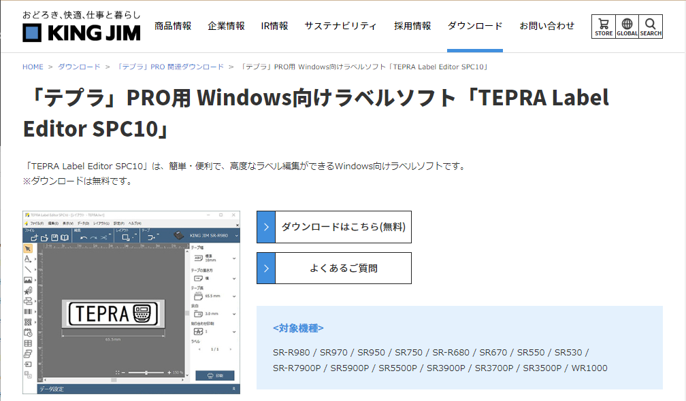

# TEPRA ラベル エディタ SPC10 のインストール

SPC10 はキングジム社のテプラのラベル印刷ソフトウェアです。Windows でテプラのラベルを作成することができます。この記事では 18 歳の新入社員向けに SPC10 のインストール方法を紹介します。

## SPC10 を使う目的
### パソコンで 好きなラベルを簡単作成
パソコンでラベルのレイアウトや文字の編集ができます。作成したラベルデザインをファイルとして保存することができます。

### オフィスの備品管理に便利なラベルを作成
注意表示や案内表示の他、「環境絵文字」「公共表示」など専門的な記号や絵文字を利用できます。

### 用途に合わせたバーコードを簡単に作成
JAN-13、QRコードなどのバーコードや二次元コードを作成できます。

## SPC10 のシステム要件
SPC10 のシステム要件は以下の通りです。

- オペレーティングシステム：Windows 10/11
- ハードディスク容量: 400 MB
- ディスプレイ: 解像度1024×768(XGA)/High Color以上
- 対応機種：SR-R980 / SR970 / SR950 / SR750 / SR-R680 / SR670 / SR550 / SR530 / SR-R7900P / SR5900P / SR5500P / SR3900P / SR3700P / SR3500P / WR1000

ここでは SPC10 Ver.3.05 を例に Windows 11 にインストールする手順を説明します。

## SPC10 のインストール手順
### ダウンロード
キングジムの SPC10 のページにアクセスします。ページが表示されたら「**ダウンロードはこちら（無料）**」をクリックします。

https://www.kingjim.co.jp/download/tepra/labeleditor.html

ソフトウェアダウンロードが表示されたら、「**ダウンロード**」をクリックします。

### ファイルの展開
ダウンロードが完了したら、ZIP ファイルを右クリックし、コンテキストメニューから「**すべて展開**」をクリックします。

### 展開先フォルダの指定
ファイルの展開先を指定します。ここではダウンロードしたフォルダに展開します。

### インストーラの起動
展開したフォルダの中にある **SetUp.exe をダブルクリック**し、インストーラを実行します。

### ユーザーアカウント制御の確認
ユーザーアカウント制御が表示されたら、「**はい**」をクリックします。

### インストールタイプの選択
インストールタイプの選択画面が表示されたら、「**アプリケーションとドライバのインストール**」をクリックします。

### ライセンスの同意
使用許諾契約の内容を確認して、「**利用情報を送信する**」のチェックを外し、「**同意する**」をクリックします。

### 機能の選択
機能の選択画面が表示されたら、「**次へ**」をクリックします。

### インストール先フォルダの選択
インストール先フォルダの選択画面が表示されたら、「**次へ**」をクリックします。

### SPC 10 のインストール完了
SPC10 のインストールが完了したら、「**完了**」をクリックします。

### ドライバのインストール
ドライバのインストール画面が表示されたら、機種を選択し、「**次へ**」をクリックします。

### 接続方法の選択
接続方法を選択し、「**次へ**」をクリックします。

### 機器の接続
接続画面が表示されたら、テプラ本体をパソコンに接続します。

### インストールの完了
インストールの完了画面が表示されたら、「**完了**」をクリックします。

### SPC10 の起動
SPC10 を使う時はスタートメニューから、「TEPRA Label Editor SPC10」を起動します。

### メイン画面の表示
SPC10 が起動したら、レイアウトを選んで、ラベルを印刷します。

## まとめ
この記事ではテプラ ラベル エディタ SPC10 のインストール方法を説明しました。

機会があれば、テプラと100均グッズを使った整理法を紹介します。

#### 参考文献
- テプラによる暮らしのスーパーラベル整理術
https://www.amazon.co.jp/dp/4924848190
- ダイソーオンラインストア
  - [すっきり書類収納ファイルＡ４](https://jp.daisonet.com/collections/stationery0289/products/4906137974114)
  - [Ｂ５ファイルケース](https://jp.daisonet.com/collections/stationery0289/products/4970404904210)
  - [すっきり書類収納ファイルＡ５](https://jp.daisonet.com/collections/stationery0289/products/4549131947144)
  - [ブックスタンド](https://jp.daisonet.com/collections/stationery0293/products/4993593013198)
  - [パソコンケース](https://jp.daisonet.com/collections/electricity0212/products/4549131508451)
  - [ネ-ムキ-ホルダ](https://jp.daisonet.com/collections/accessory0216/products/4997642137828)
