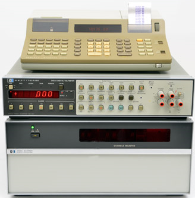

# 顧客が本当に必要だったもの（電子計測システム編）
tag: GPIB GP-IB 計測システム

自動計測システム・電気試験システムには、色々な形態・システムがあります。この記事では 18 歳の新入社員向けに様々な計測システムの形態を紹介します。

※ジョーク記事です。記事中に表示される特定の製品やシステムを貶めるつもりはありません。温かい目で御覧くださるようお願いします。

# 「顧客が本当に必要だったもの」とは

「顧客が本当に必要だったもの」はＩＴビジネスにおける多難なシステム開発プロジェクトの姿を風刺したフレーズです。

顧客が期待した通りのシステムとして完成しなかった原因は、開発側の勝手な思い込みや都合の押し付けだと思いきや、そもそも最初に顧客が説明した要件もズレていた、という話です。

出典：
https://dic.nicovideo.jp/a/%E9%A1%A7%E5%AE%A2%E3%81%8C%E6%9C%AC%E5%BD%93%E3%81%AB%E5%BF%85%E8%A6%81%E3%81%A0%E3%81%A3%E3%81%9F%E3%82%82%E3%81%AE

# 顧客が本当に必要だったもの（電子計測システム編）
## 1.顧客が説明した要件

出典：
https://www.hpmemoryproject.org/wb_pages/wall_b_page_14c.htm

## 2.プロジェクトリーダの理解

出典：
https://www.timeelectronics.com/calibration-benches/
## 3.アナリストのデザイン

出典：
https://unit.aist.go.jp/ripm/time-stdg/calibration.html
## 4.プログラマのコード

出典：
https://www.linkedin.com/pulse/you-claim-labview-real-programming-language-start-like-doroslovac

## 5.営業の表現、約束

出典：
https://twitter.com/uchujin17/status/1265706440020291584
## 6.プロジェクトの書類

出典：
https://www.irasutoya.com/2015/03/blog-post_528.html
## 7.実装された運用

出典：
https://twitter.com/teru_enoto/status/1522899094888325120
## 8.顧客への請求金額

出典：
https://ieei.or.jp/2018/01/special201310_01_050/
## 9.得られたサポート

出典：
https://www.eniacsolutions.com/about

## 10.顧客が本当に必要だったもの

出典：
https://www.jatl.or.jp/testing-facilities.html
