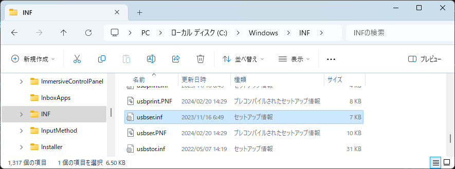
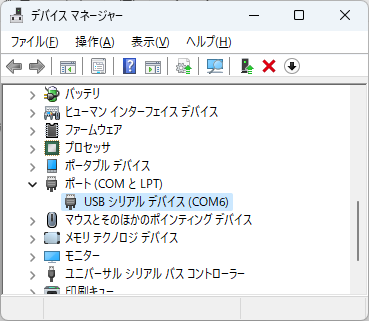
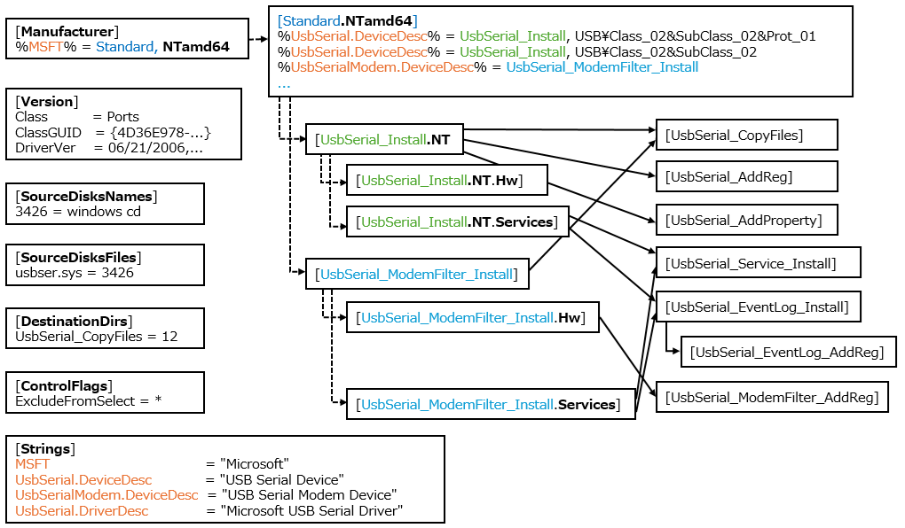

# Windows の INF ファイルの文法

Windows INF（Information）ファイルは、デバイスドライバのインストールと構成に関連する情報を含んだファイルです。この記事では３年目のプログラマ向けに INF ファイルの概要を紹介します。



## INF ファイルの概要
### 拡張子
Windows INF ファイルは通常、.infという拡張子を持ちます。例えば、MyDriver.inf のような名前が一般的です。

### プレーンテキスト形式
INF ファイルはプレーンテキスト形式です。ASCII または Unicode で記述されます。これにより、簡単に編集および読み取ることができます。

### セクション構造
INF ファイルは論理的なセクションに分かれており、各セクションには特定の機能や情報に関する設定が含まれています。例えば、Manufacturer セクション、DDInstall セクション、Strings セクションなどがあります。

### セクション内のディレクティブ
セクション内には、特定の処理や設定を行うためのディレクティブ（指示子）が含まれる場合があります。例えば、AddReg ディレクティブや CopyFiles ディレクティブなどがあります。

### シンボルと文字列の関連付け
Strings セクションを使用して、シンボルと文字列を関連付けることができます。これにより、異なる言語に対応するために文字列を簡単に変更できます。

### セクションとセクションの関連付け
あるセクションから別のセクションを参照することができます。

## USB シリアルポートドライバの例

C:\Windows\INF\usbser.inf は、Windows オペレーティングシステムで USB シリアルポート（USB to Serial）デバイスのドライバに使用されるINFファイルです。
USBシリアルポートは、USB経由でシリアル通信を行うためのデバイスであり、これにはシリアルコンソールや一般的なシリアル通信機器が含まれます。



usbser.inf には、USB シリアルドライバーをインストールおよび構成するための設定情報が含まれています。
このファイルには、デバイスの検出、リソースの割り当て、必要なファイルのコピーなど、USBシリアルデバイスの正確な動作に必要な指示が含まれています。ここでは Windows 11 に同梱されている usbser.inf を例に INF ファイルの文法を紹介します。

## INF ファイルの文法と実際の記述例
### コメント行の書き方
セミコロン記号（;）は、そこから改行までをコメントと見なします。

``` inf
;/*++
;
;Copyright (c) Microsoft Corporation.  All rights reserved.
;
;Module Name:
;    usbser.inf
;
;Abstract:
;    INF file for installing the USB Serial driver
;
;--*/
```
### usbser.inf ファイルのセクション構造
usbser.inf ファイルで定義されている各セクションの名称と参照関係を以下に図示します。



### Version セクション
Version セクションは、デバイスドライバーのバージョン情報を示します。

一般的な形式は次のとおりです。

``` inf
[Version]
Signature   = "signature-name"
Provider    = %INF-creator%
ClassGuid   = {ClassGUID}
Class       = class-name
CatalogFile = filename.cat
DriverVer   = mm/dd/yyyy,w.x.y.z
```
各フィールドの内容は次の通りです。

- signature-name: Windowsのバージョンを指定します。一般的には Windows NT となります。
- INF-creator: ドライバーパッケージを提供する会社や個人の名前を指定します。%ProviderName%などの変数を使用することがあります。
- ClassGuid: デバイスクラスのGUID（Globally Unique Identifier）を指定します。一般的なクラスは[ベンダーが使用できるシステム定義のデバイス セットアップ クラス](https://learn.microsoft.com/ja-jp/windows-hardware/drivers/install/system-defined-device-setup-classes-available-to-vendors)で定義されています。
- class-name: デバイスクラスの名前を指定します。これは一般的に、デバイスが属するカテゴリを表します。
- filename.cat: ドライバーのデジタル署名を含むカタログファイルへのパスを指定します。
- DriverVer: ドライバーのバージョン情報です。"MM/DD/YYYY"はドライバーがリリースされた日付であり、"w.x.y.z"はバージョン番号です。

実際の usbser.inf の記述は以下のとおりです。

``` usbser.inf
[Version]
Signature   = "$WINDOWS NT$"
Class       = Ports
ClassGUID   = {4D36E978-E325-11CE-BFC1-08002BE10318}
Provider    = %MSFT%
PnpLockdown = 1
DriverVer = 06/21/2006,10.0.22621.2506
```

## Manufacturer セクション
Manufacturer セクションは、デバイスの製造元（メーカー）と製品IDに関する情報を提供します。

一般的な形式は次のとおりです。

``` inf
[Manufacturer]
%strkey%=models-section-name [,TargetOSVersion]
```
各フィールドの内容は次の通りです。

- strkey: メーカーの名前を指定します。これは通常、ユーザーが認識できるメーカーの名前であり、実際のデバイスの製造元を示します。この名前は変数として指定されることがあります。
- models-section-name: メーカーに関する詳細な情報が含まれるセクションの名前を指定します。このセクションは通常、ModelsセクションやDevicesセクションなど、さらに詳細なデバイス情報を提供します。
- TargetOSVersion: 1 つ以上のターゲット オペレーティング システムのバージョンを指定します。 

実際の usbser.inf の内容は以下のとおりです。

``` usbser.inf
[Manufacturer]
%MSFT% = Standard, NTamd64
```

## Model セクション
バイスやソフトウェアのモデル固有の情報や設定を提供するセクションです。モデルセクションは、複数の異なるモデルが同じドライバーを使用している場合に、それらのモデルごとに異なる構成を提供するのに役立ちます。

一般的な形式は次のとおりです。

``` inf
[ModelName.TargetOSVersion]
device-description=install-section-name,[hw-id]
```

各フィールドの内容は次の通りです。

- ModelName: デバイスやソフトウェアのモデル名を指定します。これは、デバイスの特定のモデルやソフトウェアのバージョンを一意に識別するための名前です。
- TargetOSVersion: Windows NT カーネル（例: Windows XP、Windows 7、Windows 10）に対するセクションを指定します。異なる Windows バージョンごとに、異なるセクションが存在することがあります。
- device-description: インストールするデバイスを識別します。
- install-section-name: デバイスに使用する INF インストール セクションの名前を指定します。 
- hw-id: デバイスを識別するベンダー定義の ハードウェア ID 文字列を指定します。 

実際の usbser.inf の内容は以下のとおりです。

``` usbser.inf
[Standard.NTamd64]
%UsbSerial.DeviceDesc% = UsbSerial_Install, USB\Class_02&SubClass_02&Prot_01
%UsbSerial.DeviceDesc% = UsbSerial_Install, USB\Class_02&SubClass_02

; USB modem filter driver for use with Include/Needs only
%UsbSerialModem.DeviceDesc% = UsbSerial_ModemFilter_Install
```

## DestinationDirs セクション
DestinationDirs セクションは、ドライバーファイルをどのディレクトリに配置するかを指定するためのセクションです。

一般的な形式は次のとおりです。

``` inf
[DestinationDirs]
file-list-section=dirid[,subdir]
```
各フィールドの内容は次の通りです。

- file-list-section: INF ファイル内の他の場所で CopyFiles、RenFiles、または DelFiles ディレクティブによって参照されるセクション の INF ライターによって決定された名前を指定します。
- dirid: ファイルが配置されるディレクトリを示します。これは、プリデファインされたディレクトリIDまたはカスタムディレクトリIDとして指定できます。
- subdir: ファイルを配置するサブディレクトリを指定します。省略された場合、ファイルは直接指定されたディレクトリに配置されます。

実際の usbser.inf の内容は以下のとおりです。

``` usbser.inf
[DestinationDirs]
UsbSerial_CopyFiles = 12
```

## SourceDisksNames セクション
SourceDisksNamesセクションはドライバーパッケージ内のファイルが配置されるディスク（デバイスまたはメディア）に関する情報を提供します。このセクションは、SourceDisksFiles セクションで使用されるファイルIDと関連しています。

一般的な形式は次のとおりです。

``` inf
[SourceDisksNames]
diskid = description[,tagfile]
```
各フィールドの内容は次の通りです。

- diskid: ディスクのIDを示します。これは通常、1から始まる整数です。同じdiskidを持つファイルは同じディスクに配置されます。
- description: ディスクの説明を指定します。これはユーザーに対して表示されるディスクのラベルです。
- tagfile: ディスクの一部としてインストールされるファイルを指定します。このファイルが存在する場合、Windowsはそのディスクを要求されたときに検出し、要求されたファイルがない場合にはそのディスクを要求します。

実際の usbser.inf の内容は以下のとおりです。

``` usbser.inf
[SourceDisksNames]
3426 = windows cd
```

## SourceDisksFiles セクション
SourceDisksFiles セクションはドライバーパッケージ内の各ファイルに関する情報を提供します。このセクションは通常、CopyFiles セクションで使用されるファイルIDと関連しています。

一般的な形式は次のとおりです。

``` inf
[SourceDisksFiles]
filename = diskid[,[ subdir][,size]]
```
各フィールドの内容は次の通りです。

- filename: ファイルの名前を指定します。
- diskid: ファイルが存在するディスクのIDを指定します。通常、SourceDisksNamesセクションで指定されたディスクIDと対応しています。
- subdir: ファイルがディスク上のどのサブディレクトリに配置されているかを指定します。これは、DestinationDirsセクションで使用されるサブディレクトリと同様に、ファイルの配置先を指定します。
- size: ファイルのサイズをバイト単位で指定します。

実際の usbser.inf の内容は以下のとおりです。

``` usbser.inf
[SourceDisksFiles]
usbser.sys = 3426
```

## ControlFlags セクション
ControlFlags セクションは、デバイスのインストールや動作に関連する制御フラグを指定するために使用されます。このセクションは通常、デバイスの振る舞いを制御するために特定のフラグや設定を指定するために使われます。

一般的な形式は次のとおりです。

``` inf
[ControlFlags]
FlagName = FlagValue
```
各フィールドの内容は次の通りです。

- FlagName: 制御フラグの名前を指定します。これはデバイスのインストールや構成に関連する異なる側面を制御するためのものです。
- FlagValue: 指定された制御フラグの値を示します。具体的なフラグによって異なりますが、例えば0または1の値を取ることがあります。

実際の usbser.inf の内容は以下のとおりです。

``` usbser.inf
[ControlFlags]
ExcludeFromSelect = *
```

## DDInstall セクション
DDInstallセクションは、デバイスドライバーのインストール方法や構成を指定します。通常、DDInstallセクションはデバイスのインストールと構成に関する主要な情報を提供し、それにはデバイスドライバーのファイルコピー、レジストリの設定、サービスの作成などが含まれます。

一般的な形式は次のとおりです。

``` inf
[DDInstall]
CopyFiles = filename
AddReg = add-registry-section
AddProperty=add-property-section
```
各フィールドの内容は次の通りです。

- filename: デバイスドライバーのファイルをどのディレクトリにコピーするかを指定するためのセクション名です。このセクションにはCopyFilesセクションが含まれ、実際のファイルのコピー手順が定義されます。
- add-registry-section: レジストリに関する設定を含むセクション名です。このセクションにはAddRegセクションが含まれ、ドライバーのレジストリ設定が行われます。
- add-property-section: デバイスプロパティに関する情報が含まれるセクション名です。

実際の usbser.inf の内容は以下のとおりです。

``` inf
[UsbSerial_Install.NT]
CopyFiles   = UsbSerial_CopyFiles
AddReg      = UsbSerial_AddReg
AddProperty = UsbSerial_AddProperty
```

### CopyFiles ディレクティブ
CopyFilesディレクティブは、デバイスドライバーのファイルを特定のディレクトリにコピーするために使います。

一般的な形式は次のとおりです。

``` inf
[file-list-section]
destination-file-name[,[source-file-name][,[unused][,flag]]]
```
各フィールドの内容は次の通りです。

- destination-file-name: コピー先ファイルの名前を指定します。 
- source-file-name: ソース ファイルの名前を指定します。
- unused: このエントリは、Windows 2000 以降のバージョンの Windows ではサポートされなくなりました。
- flag: 特定のソース ファイルをコピー先にコピーする方法 (またはコピー先にコピーするかどうか) を制御するために使用できます。

実際の usbser.inf の内容は以下のとおりです。

``` inf
[UsbSerial_CopyFiles]
usbser.sys,,,0x100
```

### AddReg ディレクティブ
AddRegディレクティブは、デバイスドライバーのインストール時にレジストリの設定を行います。このディレクティブは通常、DDInstallセクション内で使用され、ドライバーの構成に関連するレジストリのエントリを追加します。

一般的な形式は次のとおりです。

``` inf
[add-registry-section]
reg-root,[subkey],[value-entry-name],[flags],[value][,[value]]
```
各フィールドの内容は次の通りです。

- add-registry-section: レジストリの設定が定義されているセクションの名前を指定します。このセクション内には、レジストリエントリの追加や変更に関する指令が含まれます。
- reg-root: このエントリで指定された他の値のレジストリ ツリーのルートを識別します。

実際の usbser.inf の内容は以下のとおりです。

``` inf
[UsbSerial_AddReg]
HKR,,PortSubClass,%REG_BINARY%,02
HKR,,EnumPropPages32,,"MsPorts.dll,SerialPortPropPageProvider"
```

### AddProperty ディレクティブ
AddPropertyディレクティブは、デバイスがプロパティや設定の値を持つ場合に、その情報を追加するために使用されます。

一般的な形式は次のとおりです。

``` inf
[add-property-section]
(property-name, , , [flags], value)
```
各フィールドの内容は次の通りです。

- add-property-section: プロパティや設定の値が定義されているセクションの名前を指定します。
- property-name: ドライバー パッケージ のプロパティを表す名前。
- flags: プロパティの追加操作の内容を示す 16 進値。
- value: でプロパティ値を変更するために使用される値。

DeviceModel

実際の usbser.inf の内容は以下のとおりです。

``` inf
[UsbSerial_AddProperty]
GenericDriverInstalled,,,,1
```

## DDInstall.Services セクション
DDInstall.Servicesセクションは、デバイスドライバーが提供するサービスのインストールと構成に関する情報を指定します。

一般的な形式は次のとおりです。

``` inf
[install-section-name.Services]
AddService = ServiceName, flags, service-install-section
```
各フィールドの内容は次の通りです。

- ServiceName: インストールされるサービスの名前を指定します。これは一般的に、デバイスドライバーが提供するサービスを一意に識別するための名前です。
- flags: サービスのインストール時のオプションを指定します。一般的なフラグには、サービスが自動起動するかどうかや、手動起動するかどうかなどが含まれます。例えば、0x00000002はサービスを手動で起動することを指定します。
- service-install-section: サービスの構成に関する情報が含まれるセクションの名前を指定します。このセクションには、サービスの依存関係や起動の設定、デバイス関連の情報が含まれます。

実際の usbser.inf の内容は以下のとおりです。

``` inf
[UsbSerial_Install.NT.Services]
AddService = usbser,0x00000002,UsbSerial_Service_Install, UsbSerial_EventLog_Install
```

## ServiceInstall セクション
ServiceInstall セクションは、デバイスドライバーが提供するサービスをシステムにインストールするための情報を指定します。

一般的な形式は次のとおりです。

``` inf
[ServiceInstall]
DisplayName    = %ServiceDisplayName%
ServiceType    = %ServiceType%
StartType      = %StartType%
ErrorControl   = %ErrorControl%
ServiceBinary  = %12%\your_driver_service.exe
```
各フィールドの内容は次の通りです。

- DisplayName: サービスの表示名を指定します。通常は %ServiceDisplayName% のように、Strings セクション内の文字列を参照します。
- ServiceType: サービスのタイプを指定します。例えば、0x1はカーネルドライバー、0x10はWin32サービスなどです。
- StartType: サービスの起動の仕方を指定します。例えば、0x2は手動、0x3は自動です。
- ErrorControl: サービスのエラー制御を指定します。通常は 0x1（正常）が使われます。
- ServiceBinary: サービスの実行可能ファイルのパスを指定します。

実際の usbser.inf の内容は以下のとおりです。

``` inf
[UsbSerial_Service_Install]
DisplayName   = %UsbSerial.DriverDesc%
ServiceType   = 1           ; SERVICE_KERNEL_DRIVER
StartType     = 3           ; SERVICE_DEMAND_START
ErrorControl  = 1           ; SERVICE_ERROR_NORMAL
ServiceBinary = %12%\usbser.sys
```

## Strings セクション
Stringsセクションは、テキスト文字列やメッセージリソースの定義を提供します。

一般的な形式は次のとおりです。

``` inf
[Strings]
SymbolName = String
```

各フィールドの内容は次の通りです。

- SymbolName: 文字列を参照するためのシンボルまたは変数名を指定します。これは通常、AddServiceや他のセクション内で使用されるシンボルです。
- String: 実際のテキスト文字列やメッセージリソースの定義を指定します。これは、ユーザーに表示されるメッセージやデバイスの説明などが含まれます。

実際の usbser.inf の内容は以下のとおりです。

``` inf
[Strings]
MSFT                      = "Microsoft"
UsbSerial.DeviceDesc      = "USB Serial Device"
UsbSerialModem.DeviceDesc = "USB Serial Modem Device"
UsbSerial.DriverDesc      = "Microsoft USB Serial Driver"
```

## 参考資料
- Microsoft > Learn > INF ファイルの概要
https://learn.microsoft.com/ja-jp/windows-hardware/drivers/install/overview-of-inf-files
- Microsoft > Learn > USB シリアル ドライバー (Usbser.sys)
https://learn.microsoft.com/ja-jp/windows-hardware/drivers/usbcon/usb-driver-installation-based-on-compatible-ids
