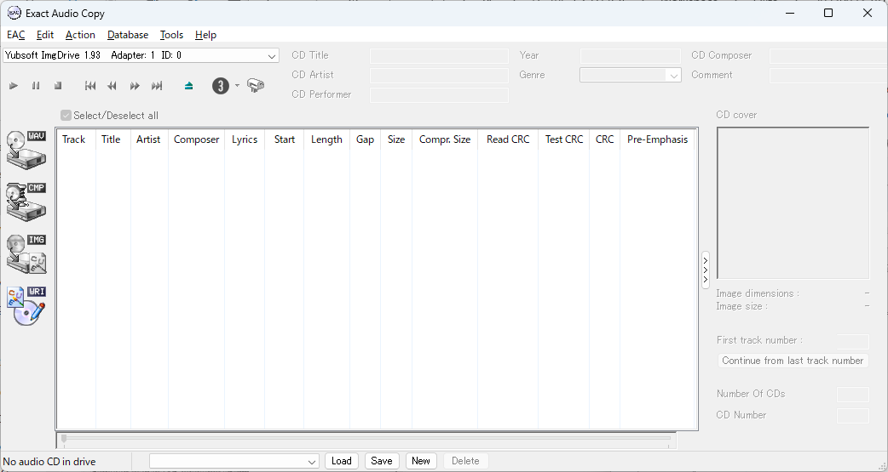
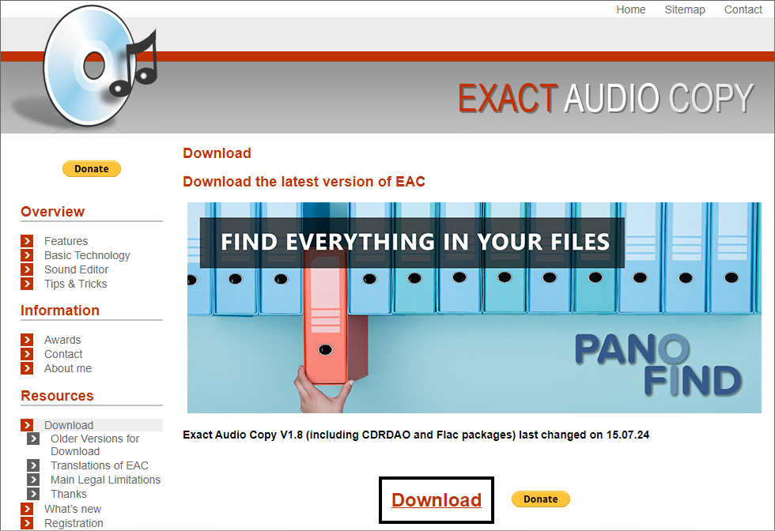
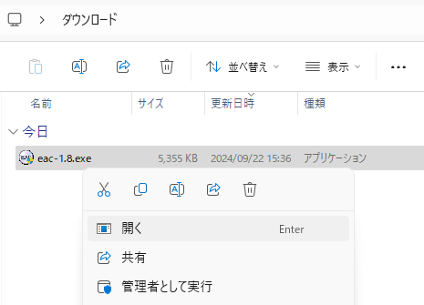
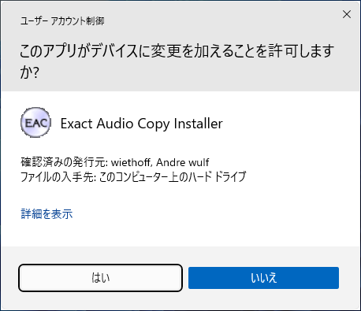
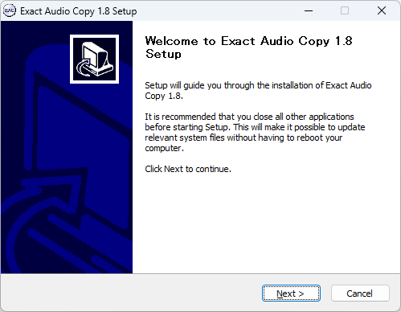
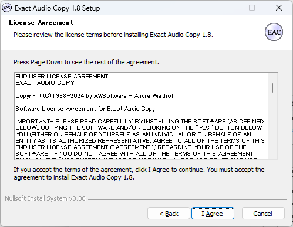
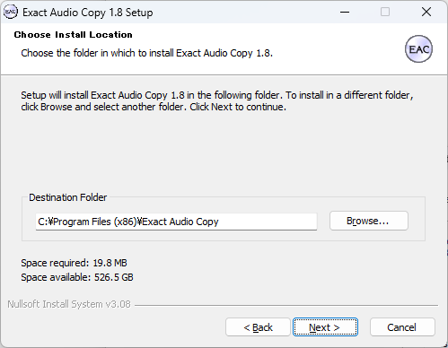
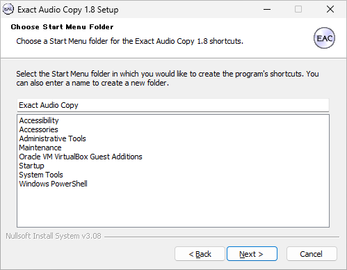
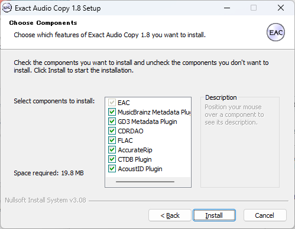
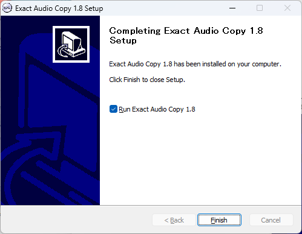

オーディオ CD のバックアップソフト Exact Audio Copy のインストール

環境構築 初心者向け 新人教育 ExactAudioCopy Windows11

Exact Audio Copy (EAC) は、オーディオCDを高品質でリッピング（デジタル化）できるソフトウェアです。EACはその正確さと詳細なエラー検出機能が評価されています。この記事では 個人ユーザ向けに EAC のインストール方法を紹介します。

## Exact Audio Copy を使う目的
### オーディオCDのアーカイブ
FLACやWAVなどのロスレスフォーマットでCDをデジタルアーカイブとして保存できます。

### エラーチェックと訂正
CD の表面に傷や汚れがある場合でも、EACはデータを何度も読み込み、エラーを検出・訂正しながらデジタルコピーを作成します。

### ギャップ検出
オーディオ CD のトラック間の無音部分（ギャップ）を正確に検出し、リッピング時にそれを保持することができます。

## Exact Audio Copy のシステム要件

Exact Audio Copy のシステム要件は以下の通りです。

- オペレーティングシステム: Windows XP, Vista, 7, 8/8.1, 10, 11
- .NET Framework: .NET Framework 2.0 以降

ここでは Exact Audio Copy 1.8 を例にして、Windows 11 へのインストール方法を紹介します。

## Exact Audio Copy のインストール手順

Exact Audio Copyのダウンロードページにアクセスします。

[https://www.exactaudiocopy.de/en/index.php/resources/download/](https://www.exactaudiocopy.de/en/index.php/resources/download/)

ページが表示されたら、「Download」のリンクをクリックします。

### インストーラの起動
ダウンロードが完了したら、ファイルをダブルクリックし、インストーラを実行します。

### ユーザーアカウント制御の確認
ユーザーアカウント制御が表示されたら、「**はい**」をクリックします。

### セットアップ画面の確認
セットアップ画面が表示されたら、「**Next**」をクリックします。

### ライセンスの確認
使用許諾契約の内容を確認して、「**I Agree**」をクリックします。

### インストール先の選択
インストール先フォルダの選択画面が表示されたら、「**Next**」をクリックします

### スタートメニューの選択
スタートメニューフォルダの選択画面が表示されたら、「**Next**」をクリックします

### インストールする機能の確認
インストールする機能の選択画面が表示されたら、「**Install**」をクリックします。

### インストールの終了確認
インストールの完了画面が表示されたら、「**Finish**」をクリックします。

