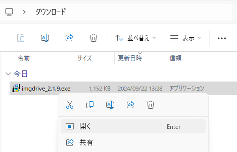
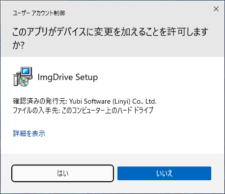
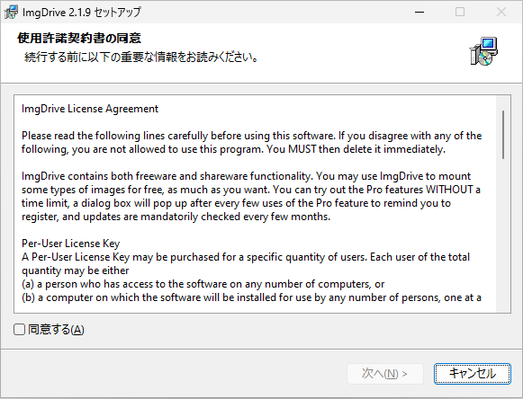
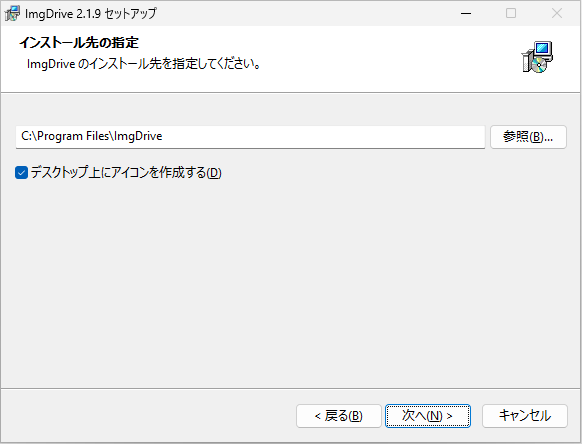

仮想ドライブソフト ImgDrive のインストール

環境構築 初心者向け 新人教育 ImgDrive Windows11

ImgDriveは CD/DVD のバックアップを作成できるソフトウェアです。作成されたディスクイメージは仮想ドライブにマウントすることができます。個人は無料で使うことができ、商業利用の場合にはライセンスの購入が必要です。ここでは 個人ユーザ向けに ImgDrive のインストール方法を説明します。

## ImgDrive を使う目的
### ディスクバックアップの作成
物理的な CD/DVD/Blu-ray ディスクをISOイメージとしてバックアップすることができます。ただし、オーディオ CD や映画の DVD/Blu-ray のバックアップには対応していません。

### ディスクイメージのマウント
バックアップされたディスクイメージファイルを仮想ドライブにマウントできます。※最新の Windows 10/11 は標準で ISO マウント機能が組み込まれてます。

### 大量のディスクの管理
大量のディスクを物理的に持ち運ぶ代わりに、ISO イメージに変換することで、パソコンに入れて楽に持ち運ぶことができます。

## ImgDrive のシステム要件
ImgDriveのシステム要件は次のとおりです。

- OS: Windows 7/10/11

ここでは ImgDrive 2.1.9 を例にして、Windows 11 へのインストール方法を紹介します。

## ImgDrive のインストール手順
### ダウンロード
窓の杜の ImgDrive の紹介ページにアクセスし、「窓の杜からダウンロード」をクリックします。
https://forest.watch.impress.co.jp/library/software/imgdrive/

### インストーラの起動
ダウンロードが完了したら、ファイルをダブルクリックし、インストーラを実行します。

### ユーザーアカウント制御の確認
ユーザーアカウント制御が表示されたら、「はい」をクリックします。

### ライセンスの同意
使用許諾契約の内容を確認して、「同意する」を選択し、「次へ」をクリックします。

### インストール先の選択
インストールするフォルダの選択画面が表示されたら、「次へ」をクリックします

### インストール終了
Tera Term のインストール完了画面が表示されたら、「完了」をクリックします。

## 参考文献
- Yubsoft
[https://yubsoft.com/imgdrive/](https://yubsoft.com/imgdrive/)
