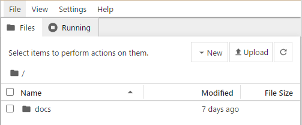

インストール不要で使える WinPython のセットアップ

環境構築 初心者向け 新人教育 Python Windows11

WinPython はインストール不要で使える無料の Python 実行環境です。Python 科学計算、データ分析、グラフィックスなどの多くのライブラリが含まれており、Windows 環境でですぐに使う事ができます。ここでは18歳の新入社員向けに WinPython のインストール方法を紹介します。

## WinPython を使う目的
### インストール作業が不要
WinPython はダウンロードしてファイルを展開するだけで実行することができます。

### すぐに使えるデータサイエンス向けライブラリ
WinPython にはデータサイエンティストや学生向けの様々な追加ライブラリ（NumPy, SciPy, Pandas, Matplotlibなど）が含まれています。

### 特定環境を持ち運ぶ
WinPython は USB ドライブや外部メディアから直接実行できます。特定の Python 環境を他の PC に簡単に持ち運ぶ事ができます。

## WinPython のシステム要件
<!-- https://github.com/winpython/winpython/wiki/Installation -->

WinPython のシステム要件は以下の通りです。

- オペレーティングシステム：Windows 8, 10, 11 （64 ビット）
- プロセッサ：64 ビットの Intel または AMD プロセッサ
- メモリ：2 GB 以上のRAM
- ストレージ：10 GB 以上の空きディスク容量

ただし、大規模なデータセットや計算負荷の高いタスクを処理する場合、より高速なプロセッサや大容量のストレージが必要となる事があります。

ここでは WinPython 3.12.6.0slim を例にして、Windows 11 へのインストール方法を紹介します。

## WinPython のインストール手順

### ダウンロード

Github の WinPython のダウンロードページにアクセスします。WinPython 2024-04 final of September 14th 2024 の「Assets」セクションから「Winpython64-x.x.x.xslim.exe 」（x はバージョン番号）のリンクをクリックします。 

[https://github.com/winpython/winpython/releases/tag/10.7.20240908final](https://github.com/winpython/winpython/releases/tag/10.7.20240908final)

### 自己解凍ファイルの実行
ダウンロードが完了したら、ファイルをダブルクリックし、実行します。

### 展開先フォルダの指定
ファイルの展開先を指定するダイアログが表示されたら、対象フォルダを指定します。ここでは例として **C:\ProgramFiles** というフォルダに展開します。

以上でインストール作業は終了です。

## WinPython の使い方
### Jupyter Notebook の起動
Jupyter Nottobook を使う時は **C:\ProgramFiles\WPy64-31260\Jupyter Notebook.exe** をダブルクリックします。

ブラウザが立ち上がり、Jupyter 環境が表示されたら、起動完了です。

Jupyter の作業フォルダは **C:\ProgramFiles\WPy64-31260\notebooks\\** になります。

### Pythonスクリプトの実行
コマンドラインから Python を実行する時は、**C:\ProgramFiles\WPy64-31260\WinPython Command Prompt.exe** をダブルクリックします。

表示されたコマンドプロンプト画面から Python スクリプトを実行したり、インタラクティブシェルを利用できます。

### 外部ライブラリの追加
コマンドプロンプト画面から pip コマンドを使って、新しいライブラリやパッケージをインストールできます。

パッケージのインストールフォルダは **C:\ProgramFiles\WPy64-31260\python-3.12.6.amd64\Lib\site-packages\\** になります。

## WinPython に含まれる外部ライブラリ

WinPython 3.12.6.0slim に同梱されている外部ライブラリの一覧を以下に示します。

|パッケージ名|バージョン|
|---|---|
|about-time|4.2.1|
|absl-py|2.0.0|
|adbc-driver-manager|0.11.0|
|adodbapi|2.6.1.3|
|affine|2.4.0|
|aiofiles|23.2.1|
|aiohttp|3.9.5|
|aiosignal|1.3.1|
|aiosqlite|0.20.0|
|alabaster|0.7.16|
|alembic|1.13.1|
|alive-progress|3.1.5|
|altair|5.4.1|
|aniso8601|9.0.1|
|annotated-types|0.6.0|
|ansicolors|1.1.8|
|anyio|4.4.0|
|anywidget|0.9.12|
|appdirs|1.4.4|
|argon2-cffi|23.1.0|
|argon2-cffi-bindings|21.2.0|
|array_api_compat|1.8|
|arrow|1.3.0|
|asgi-csrf|0.9|
|asgiref|3.8.1|
|asn1crypto|1.5.1|
|asteval|0.9.31|
|astroid|3.1.0|
|astropy|6.1.0|
|astropy-iers-data|0.2024.4.29.0.28.48|
|asttokens|2.4.1|
|async-lru|2.0.4|
|atomicwrites|1.4.0|
|attrs|23.2.0|
|autograd|1.6.2|
|autopep8|2.0.4|
|azure-core|1.30.2|
|azure-cosmos|4.7.0|
|azure-identity|1.16.1|
|Babel|2.15.0|
|baresql|0.8.0|
|bcrypt|4.0.1|
|beautifulsoup4|4.12.2|
|binaryornot|0.4.4|
|black|24.8.0|
|bleach|6.1.0|
|blinker|1.7.0|
|bokeh|3.5.1|
|branca|0.7.2|
|Brotli|1.1.0|
|build|1.2.1|
|cachelib|0.13.0|
|cachetools|5.3.3|
|Cartopy|0.23.0|
|certifi|2024.6.2|
|cffi|1.16.0|
|cftime|1.6.3|
|chardet|5.2.0|
|charset-normalizer|3.3.2|
|clarabel|0.9.0|
|click|8.1.7|
|click-default-group|1.2.4|
|click-plugins|1.1.1|
|cligj|0.7.2|
|cloudpickle|3.0.0|
|clr-loader|0.2.6|
|clrmagic|0.0.1a2|
|cma|3.2.2|
|colorama|0.4.6|
|colorcet|3.1.0|
|colorlog|6.8.2|
|comm|0.2.2|
|contourpy|1.2.1|
|cookiecutter|2.6.0|
|cryptography|41.0.5|
|cvxopt|1.3.2|
|cvxpy|1.5.0|
|cycler|0.12.1|
|Cython|3.0.11|
|cytoolz|0.12.3|
|dask|2024.7.1|
|dask-expr|1.1.9|
|datasette|0.64.8|
|datasette-graphql|2.2|
|datashader|0.16.3|
|db.py|0.5.4b1|
|deap|1.4.1|
|debugpy|1.8.0|
|decorator|5.1.1|
|defusedxml|0.7.1|
|Deprecated|1.2.13|
|diff-match-patch|20230430|
|dill|0.3.7|
|dirty-cat|0.4.1|
|distributed|2024.7.1|
|distro|1.8.0|
|Django|5.0.7|
|dnspython|2.6.1|
|docopt|0.6.2|
|docstring-to-markdown|0.13|
|docutils|0.20.1|
|duckdb|1.0.0|
|ecos|2.0.13|
|email_validator|2.2.0|
|entrypoints|0.4|
|et-xmlfile|1.1.0|
|executing|2.0.1|
|fast-histogram|0.14|
|fastapi|0.111.1|
|fastapi-cli|0.0.4|
|fastjsonschema|2.18.0|
|filelock|3.14.0|
|filterpy|1.4.5|
|fiona|1.9.6|
|flake8|7.1.1|
|Flask|3.0.3|
|Flask-Mail|0.9.1|
|Flask-Session|0.5.0|
|Flask-SQLAlchemy|3.0.5|
|flit|3.9.0|
|flit_core|3.9.0|
|folium|0.17.0|
|fonttools|4.53.0|
|formlayout|1.2.1a1|
|fqdn|1.5.1|
|frozenlist|1.4.1|
|fsspec|2024.6.1|
|future|0.18.2|
|fuzzywuzzy|0.18.0|
|geographiclib|2.0|
|geopandas|0.12.2|
|geopy|2.4.1|
|gitdb|4.0.10|
|GitPython|3.1.32|
|grapheme|0.6.0|
|graphene|3.3|
|graphql-core|3.2.3|
|graphql-relay|3.2.0|
|greenlet|3.0.3|
|guidata|3.6.2|
|h11|0.14.0|
|h2|4.1.0|
|h5py|3.10.0|
|hatchling|1.25.0|
|holoviews|1.19.1|
|hpack|4.0.0|
|html5lib|1.1|
|httpcore|1.0.5|
|httpie|3.2.3|
|httptools|0.6.1|
|httpx|0.27.0|
|huggingface-hub|0.24.5|
|hupper|1.12|
|hvplot|0.10.0|
|Hypercorn|0.16.0|
|hyperframe|6.0.1|
|hypothesis|6.108.5|
|idna|3.7|
|imageio|2.33.1|
|imagesize|1.4.1|
|imbalanced-learn|0.12.3|
|importlib_metadata|7.1.0|
|inflection|0.5.1|
|iniconfig|2.0.0|
|intervaltree|3.0.2|
|ipycanvas|0.13.2|
|ipykernel|6.29.5|
|ipyleaflet|0.19.2|
|ipympl|0.9.4|
|ipython|8.26.0|
|ipython-genutils|0.2.0|
|ipython-sql|0.5.0|
|ipywidgets|8.1.5|
|isoduration|20.11.0|
|isort|5.13.2|
|itsdangerous|2.2.0|
|janus|1.0.0|
|jaraco.classes|3.4.0|
|jaraco.context|5.3.0|
|jaraco.functools|4.0.1|
|jedi|0.19.1|
|jellyfish|1.0.3|
|Jinja2|3.1.2|
|jiter|0.5.0|
|joblib|1.4.2|
|json5|0.9.14|
|jsonpointer|2.4|
|jsonschema|4.19.2|
|jsonschema-specifications|2023.12.1|
|julia|0.6.2|
|jupyter|1.0.0|
|jupyter_bokeh|4.0.5|
|jupyter_client|8.6.2|
|jupyter-console|6.6.3|
|jupyter_core|5.7.2|
|jupyter-events|0.10.0|
|jupyter-leaflet|0.19.2|
|jupyter-lsp|2.2.5|
|jupyter_server|2.14.2|
|jupyter_server_terminals|0.5.3|
|jupyterlab|4.2.5|
|jupyterlab_pygments|0.3.0|
|jupyterlab_server|2.27.3|
|jupyterlab_widgets|3.0.13|
|keras|3.5.0|
|keyring|25.2.1|
|kiwisolver|1.4.5|
|lazy_loader|0.4|
|linkify-it-py|2.0.2|
|llvmlite|0.43.0|
|lmfit|1.3.1|
|locket|1.0.0|
|lxml|5.2.2|
|Mako|1.3.5|
|Markdown|3.5.1|
|markdown-it-py|2.2.0|
|MarkupSafe|2.1.1|
|matplotlib|3.9.0|
|matplotlib-inline|0.1.7|
|maturin|1.7.0|
|mccabe|0.7.0|
|mdit-py-plugins|0.3.5|
|mdurl|0.1.2|
|mercantile|1.2.1|
|mergedeep|1.3.4|
|missingno|0.5.1|
|mistune|2.0.5|
|mizani|0.11.4|
|ml-dtypes|0.4.0|
|mlxtend|0.22.0|
|more-itertools|10.2.0|
|mpl-scatter-density|0.7|
|mpld3|0.5.8|
|mpmath|1.3.0|
|msal|1.30.0|
|msal-extensions|1.2.0|
|msgpack|1.0.4|
|msvc_runtime|14.40.33807|
|multidict|6.0.5|
|multipledispatch|1.0.0|
|mutagen|1.47.0|
|mypy|1.11.1|
|mypy-extensions|1.0.0|
|mysql-connector-python|8.0.21|
|namex|0.0.8|
|narwhals|1.5.5|
|nbclient|0.10.0|
|nbconvert|7.16.1|
|nbformat|5.10.4|
|nest-asyncio|1.6.0|
|netCDF4|1.7.1.post2|
|networkx|3.3|
|nltk|3.8.1|
|notebook|7.2.1|
|notebook_shim|0.2.4|
|ntlm-auth|1.5.0|
|numba|0.60.0|
|numexpr|2.10.1|
|numpy|2.0.1|
|numpydoc|1.6.0|
|openai|1.42.0|
|opencv-python|4.10.0.84|
|openpyxl|3.1.2|
|optree|0.11.0|
|optuna|3.6.1|
|orjson|3.9.15|
|outcome|1.3.0.post0|
|overrides|7.7.0|
|packaging|24.1|
|pandas|2.2.2|
|pandocfilters|1.5.0|
|panel|1.5.0b4|
|papermill|2.6.0|
|param|2.1.1|
|paramiko|2.8.0|
|parso|0.8.4|
|partd|1.4.0|
|pathspec|0.11.0|
|patsy|0.5.6|
|pdfrw|0.4.post2|
|pep8|1.7.1|
|pexpect|4.8.0|
|pg8000|1.23.0|
|pickleshare|0.7.5|
|pillow|10.4.0|
|Pint|0.23|
|pip|24.2|
|pkginfo|1.9.6|
|platformdirs|4.2.2|
|plotly|5.23.0|
|plotnine|0.13.6|
|PlotPy|2.6.2|
|pluggy|1.5.0|
|ply|3.11|
|pmdarima|2.0.4|
|polars|1.6.0|
|portalocker|2.7.0|
|ppci|0.5.9|
|prettytable|3.3.0|
|priority|2.0.0|
|prometheus-client|0.18.0|
|prompt_toolkit|3.0.47|
|protobuf|5.27.3|
|psutil|5.9.8|
|psygnal|0.11.1|
|ptpython|3.0.29|
|ptyprocess|0.7.0|
|PuLP|2.6.0|
|pure-eval|0.2.2|
|pyarrow|17.0.0|
|PyAudio|0.2.14|
|pybars3|0.9.7|
|pybind11|2.13.1|
|pycodestyle|2.12.0|
|pycosat|0.6.6|
|pycparser|2.22|
|pycryptodomex|3.20.0|
|pyct|0.5.0|
|pydantic|2.8.2|
|pydantic_core|2.20.1|
|pydeck|0.9.1|
|pydocstyle|6.3.0|
|pydub|0.25.1|
|pyerfa|2.0.1.4|
|pyflakes|3.2.0|
|Pygments|2.18.0|
|PyJWT|2.8.0|
|pylint|3.1.0|
|pylint-venv|3.0.3|
|pyls-spyder|0.4.0|
|PyMeta3|0.5.1|
|pymongo|4.7.2|
|pymoo|0.6.1.3|
|Pympler|1.0.1|
|PyNaCl|1.5.0|
|pynndescent|0.5.12|
|pyodbc|5.1.0|
|Pyomo|6.8.0|
|pypandoc|1.5|
|pyparsing|3.1.2|
|pypdf|3.15.2|
|pypng|0.20220715.0|
|pyproj|3.6.1|
|pyproject_hooks|1.1.0|
|PyQt5|5.15.10|
|PyQt5-Qt5|5.15.2|
|PyQt5-sip|12.13.0|
|pyqtgraph|0.13.7|
|PyQtWebEngine|5.15.6|
|PyQtWebEngine-Qt5|5.15.2|
|pyserial|3.5|
|pyshp|2.3.1|
|PySimpleGUI|4.60.4|
|PySocks|1.7.1|
|pytest|8.2.2|
|python-barcode|0.15.1|
|python-dateutil|2.8.2|
|python-dotenv|1.0.1|
|python-json-logger|2.0.7|
|python-lsp-black|2.0.0|
|python-lsp-jsonrpc|1.1.2|
|python-lsp-server|1.12.0|
|python-multipart|0.0.9|
|python-slugify|8.0.4|
|pythonnet|3.0.3|
|PythonQwt|0.12.7|
|pytoolconfig|1.3.1|
|pytz|2024.1|
|pyviz_comms|3.0.3|
|pywin32|306|
|pywin32-ctypes|0.2.2|
|pywinpty|2.0.12|
|pywinusb|0.4.2|
|PyYAML|6.0.1|
|pyzmq|26.0.3|
|QDarkStyle|3.2.3|
|qrcode|7.4.2|
|qstylizer|0.2.2|
|QtAwesome|1.3.1|
|qtconsole|5.5.2|
|QtPy|2.4.1|
|quantecon|0.7.2|
|Quart|0.19.4|
|rapidfuzz|3.9.3|
|rasterio|1.3.10|
|readme-renderer|35.0|
|redis|5.0.3|
|referencing|0.35.1|
|regex|2023.10.3|
|reportlab|4.2.2|
|requests|2.31.0|
|requests-ntlm|1.1.0|
|requests-toolbelt|1.0.0|
|rfc3339-validator|0.1.4|
|rfc3986|2.0.0|
|rfc3986-validator|0.1.1|
|rich|13.7.1|
|rope|1.12.0|
|rpds-py|0.13.2|
|Rtree|1.1.0|
|Rx|3.1.1|
|scikit-image|0.24.0|
|scikit-learn|1.5.1|
|scipy|1.14.1|
|scramp|1.4.1|
|scs|3.2.4.post1|
|seaborn|0.13.2|
|Send2Trash|1.8.2|
|setuptools|72.2.0|
|shapely|2.0.4|
|shellingham|1.5.0.post1|
|simplegeneric|0.8.1|
|simplejson|3.19.2|
|simpy|4.0.1|
|six|1.16.0|
|smmap|5.0.0|
|sniffio|1.3.0|
|snowballstemmer|2.2.0|
|snuggs|1.4.7|
|sortedcontainers|2.4.0|
|sounddevice|0.4.6|
|soupsieve|2.5|
|Sphinx|7.3.7|
|sphinx-rtd-theme|2.0.0|
|sphinxcontrib-applehelp|1.0.8|
|sphinxcontrib-devhelp|1.0.6|
|sphinxcontrib-htmlhelp|2.0.5|
|sphinxcontrib-jquery|4.1|
|sphinxcontrib-jsmath|1.0.1|
|sphinxcontrib-qthelp|1.0.7|
|sphinxcontrib-serializinghtml|1.1.9|
|spyder|5.5.6|
|spyder-kernels|2.5.2|
|SQLAlchemy|2.0.30|
|sqlite_bro|0.13.1|
|sqlite-fts4|1.0.3|
|sqlite-utils|3.37|
|sqlparse|0.4.3|
|sspyrs|0.3|
|stack-data|0.6.3|
|starlette|0.37.2|
|statsmodels|0.14.2|
|streamlit|1.37.1|
|streamz|0.6.3|
|swifter|1.3.4|
|sympy|1.13.2|
|tabulate|0.9.0|
|tbats|1.1.0|
|tblib|3.0.0|
|tenacity|8.5.0|
|terminado|0.18.1|
|text-unidecode|1.3|
|textdistance|4.6.2|
|threadpoolctl|3.5.0|
|three-merge|0.1.1|
|tifffile|2024.7.2|
|tile-operator|0.0.6|
|tinycss2|1.3.0|
|toml|0.10.2|
|tomli|2.0.1|
|tomli_w|1.0.0|
|tomlkit|0.12.3|
|toolz|0.12.0|
|tornado|6.4.1|
|tqdm|4.66.4|
|traitlets|5.14.1|
|traittypes|0.2.1|
|trio|0.26.2|
|trove-classifiers|2023.2.20|
|twine|4.0.1|
|typer|0.12.3|
|types-python-dateutil|2.9.0.20240316|
|typing_extensions|4.12.2|
|tzdata|2024.1|
|tzlocal|5.2|
|uc-micro-py|1.0.1|
|ujson|5.8.0|
|umap-learn|0.5.6|
|uncertainties|3.1.7|
|uri-template|1.3.0|
|urllib3|2.0.3|
|uvicorn|0.30.3|
|vega-datasets|0.9.0|
|waitress|3.0.0|
|watchdog|4.0.1|
|watchfiles|0.21.0|
|wcwidth|0.2.13|
|webcolors|1.12|
|webencodings|0.5.1|
|websocket-client|1.8.0|
|websockets|12.0|
|Werkzeug|3.0.3|
|whatthepatch|1.0.2|
|wheel|0.44.0|
|widgetsnbextension|4.0.13|
|winpython|10.7.20240908|
|wordcloud|1.9.3|
|wrapt|1.16.0|
|wsproto|1.2.0|
|xarray|2024.7.0|
|XlsxWriter|3.1.9|
|xlwings|0.24.7|
|xmltodict|0.13.0|
|xyzservices|2023.10.1|
|yapf|0.40.1|
|yarl|1.7.2|
|yt-dlp|2023.7.6|
|zict|3.0.0|
|zipp|3.17.0|
|zstandard|0.23.0|

## 参考文献
- WinPython 公式サイト

[https://winpython.github.io/](https://winpython.github.io/)

- WinPython 3.12.6.0 に含まれるパッケージ一覧

[https://github.com/winpython/winpython/blob/master/changelogs/WinPython-64bit-3.12.6.0.md](https://github.com/winpython/winpython/blob/master/changelogs/WinPython-64bit-3.12.6.0.md)
