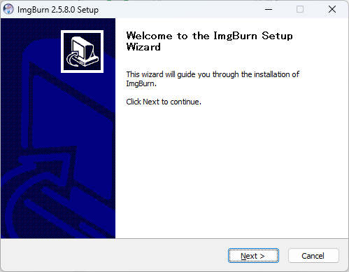
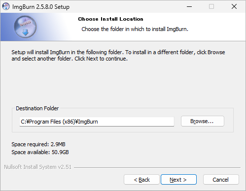

仮想ドライブソフト ImgBurn のインストール

環境構築 初心者向け 新人教育 ImgBurn Windows11

ImgBurn は CD/DVD のバックアップイメージを作成できるソフトウェアです。作成したディスクイメージは仮想ドライブとして Windows にマウントすることができます。この記事では 18 歳の新入社員けに ImgBurn のインストール方法を説明します。

## ImgBurn を使う目的
### ディスクバックアップの作成
物理的な CD/DVD/Blu-ray ディスクをISOイメージとしてバックアップすることができます。ただし、オーディオ CD や映画の DVD/Blu-ray のバックアップはできません。

### イメージファイルをディスクに書き込む
ディスクイメージを CD-R メディアや DVD-R メディアに書き込む事ができます。

### 大量のディスクの管理
大量のディスクを物理的に持ち運ぶ代わりに、ISO イメージに変換することで、パソコンに入れて楽に持ち運ぶことができます。

## ImgBurn のシステム要件
ImgBurn のシステム要件は次のとおりです。

- オペレーティングシステム:  Windows 95, 98, Me, NT4, 2000, XP, Vista, 7
- 書き込み可能メディア：CD-R, CD-RW, DVD-R, DVD-RW, DVD+R, DVD+RW, DVD-R DL, DVD-RW DL, DVD+R DL, DVD+RW DL, DVD-RAM, BD-R, BD-RE
- 光学ドライブ：ディスクのバックアップを作成したり、ディスクへの書き込みを行う際は光学ドライブが必要です。

ここでは ImgBurn 2.5.8.0 を例にして、Windows 11 へのインストール方法を紹介します。

## ImgBurn のインストール手順
### 公式ホームページにアクセス
ImgBurn の公式ホームページにアクセスします。

https://www.imgburn.com/index.php?act=download

ページが表示されたら、「**Mirror 4 - Provided by Free-Codecs.com**」をクリックします。

:::note info

ImgBurn はミラーサイト毎にダウンロードできるファイルが異なります。広告のないインストーラを取得するために Mirror 1 ではなく Mirror 4 を選択してください。。

:::

|ミラーサイト|サーバ名|ダウンロードできるファイル|備考|
|---|---|---|---|
|Mirror 1|Digital Digest|ImgBurn-261599.zip|「望ましくない可能性のあるアプリ」|
|Mirror 2|BetaNews|なし|リンク切れ|
|Mirror 3|Softpedia|SetupImgBurn_2.5.8.0.exe||
|Mirror 4|Free-Codecs.com|SetupImgBurn_2.5.8.0.exe|[https://www.free-codecs.com/imgburn_download.htm](https://www.free-codecs.com/imgburn_download.htm)|
|Mirror 5|TechSpot|Setup_ImgBurn_Clean_2580.exe|独自インストーラ|
|Mirror 6|MajorGeeks|SetupImgBurn_2.5.8.0.exe||
|Mirror 7|ImgBurn|SetupImgBurn_2.5.8.0.exe||

### ミラーサイトにアクセス
ミラーサイトが表示されたら、「**▼DOWNLOAD**」 をクリックします。

### ミラーサイトからダウンロード
ダウンロードページが表示されたら、「**DOWNLOAD EU MAIN LINK**」をクリックします。

### インストーラの起動
ダウンロードが完了したら、ファイルをダブルクリックし、インストーラを実行します。

### ユーザーアカウント制御の確認
ユーザーアカウント制御が表示されたら、「**はい**」をクリックします。

### セットアップ画面の確認
ImgBurn セットアップ画面が表示されたら、「**Next**」をクリックします。

### ライセンスの確認
使用許諾契約の内容を確認して、「**I accept the terms of the License Agreement**」を選択し、「**Next**」をクリックします。

### コンポーネントの選択
コンポーネントの選択画面が表示されたら、「**Next**」をクリックします。

### インストール先の選択
インストールするフォルダの選択画面が表示されたら、「**Next**」をクリックします

### スタートメニュー名の確認
スタートメニューに登録する名前の確認画面が表示されたら、「**Next**」をクリックします。

### 最新版のチェックの確認
定期的な更新チェックのダイアログが表示されたら、「**いいえ**」をクリックします。

### インストール終了
インストール完了画面が表示されたら、「**Finish**」をクリックします。

## ImgBurn の日本語化手順
### 言語ファイルのダウンロード
再び ImgBurn のダウンロードページにアクセスします。

https://www.imgburn.com/index.php?act=download

ページが表示されたら、下にスクロールし、Japanese のダウンロード欄の「**Click Here**」をクリックします。

### ファイルの展開
ダウンロードが完了したら、ZIP ファイルをダブルクリックし、ZIP ファイルの内容を表示します。

### 言語ファイルのコピー
ZIP ファイルに入っている「**Japanese.lng**」を「**C:\Program Files (x86)\ImgBurn\Languages**」にコピーします。

### 管理者権限の確認
「対象のフォルダーへのアクセスは拒否されました」画面が表示されたら、「**続行**」をクリックします。

### 日本語化の確認
ImgBurn を起動して日本語メニューが表示されたら、日本語化完了です。

