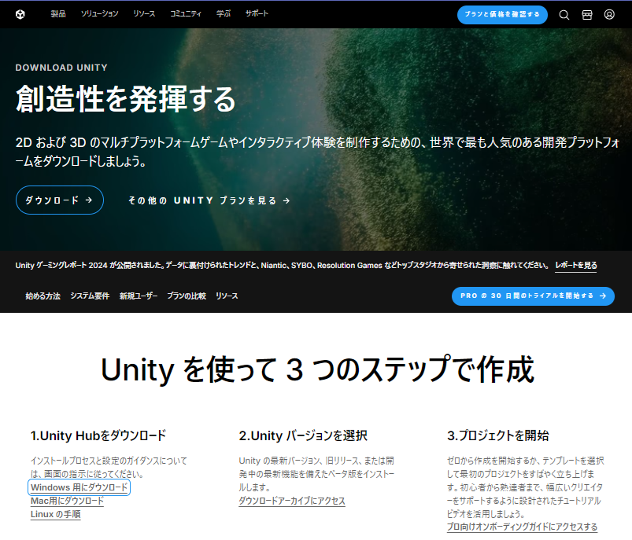

ゲーム開発エンジン Unity 2022.3 のオフラインインストール

Unity は人気の高い 2D, 3D ゲームエンジンです
Unity は3Dオブジェクトをリアルタイムでレンダリングする技術に優れており、ゲーム以外にも建築や医療など様々な分野で使われています。
この記事では 18 歳の新入社員向けに Unity のインストール手順を紹介します。

## Unity を使う目的
Unity を使う目的を 3 つ挙げます。

### ゲーム開発
Unity は独自の開発環境をそなえ、モバイルゲームからコンソールゲーム、PCゲームまで、幅広いプラットフォームの2D・3Dゲームの制作に使われます。

### クロスプラットフォーム対応
Unityを使うと、同じコードベースで Windows、macOS、iOS、Android、VR/AR（Oculus、HoloLens）などの異なるプラットフォームに対応したアプリを簡単に作成できます。

### VR/ARコンテンツ制
ゲーム以外にも、教育、医療、建築、エンターテイメントなどの分野で現実世界の物体を仮想空間に再現するために使われます。

## Unity のシステム要件

Unity 2022.3 Windows 版のシステム要件を以下に示します。

- OS: バージョン	Windows 7 (SP1+)、Windows 10、Windows 11、64 ビット版のみ
- CPU: SSE2 命令セットをサポートする X64 アーキテクチャ
- グラフィックス API: DX10、DX11、DX12 対応のGPU

の最小 GB 要件は記載されていませんが、
実際にゲームを作成する際は、メモリ：、ストレージ：
一般的な目安としては、ビルドしたゲームを実行するために必要なメモリと同量以上のメモリを用意してください。8 GB あれば問題なく動作しますが、ほとんどのプロジェクトでは 16 GB あれば十分です。


この記事では Unity Hub V 3.9.1 と Unity 2022.3.12f1 を Windows 11 にインストールする方法を紹介します。

## Unity のインストール手順
### Unity Hub のダウンロード
Unity Hub のダウンロードページにアクセスします。
https://unity.com/ja/download

ページが表示されたら、「**Windows 用にダウンロード**」をクリックします。




## Unity Hub のインストール
### インストーラの起動
ダウンロードが完了したら、**ファイルをダブルクリック**し、インストーラを実行します。


### ユーザーアカウント制御の確認
ユーザーアカウント制御が表示されたら、「**はい**」をクリックします。


### ライセンスの同意
使用許諾契約の内容を確認して、「**同意する**」をクリックします。


### インストール先の選択
インストールするフォルダの選択画面が表示されたら、「**インストール**」をクリックします


### インストール終了
Unity Hub のインストール完了画面が表示されたら、「**完了**」をクリックします。


###  Unity Hub の起動確認
Unity Hub の画面が表示されたら、右下のタスクトレイから 手織り


## Unity のインストール
### Unity Editor のダウンロード
Unity 2022.3.12f1 のダウンロードページにアクセスします。

https://unity.com/releases/editor/whats-new/2022.3.12


ページが表示されたら、「**Windows**」をクリックします。

### インストーラの起動
ダウンロードが完了したら、**ファイルをダブルクリック**し、インストーラを実行します。


### ユーザーアカウント制御の確認
ユーザーアカウント制御が表示されたら、「**はい**」をクリックします。


### セットアップ画面の確認
Unity セットアップ画面が表示されたら、「**Next**」をクリックします。


### ライセンスの同意
使用許諾契約の内容を確認して、「**I accept the terms of the License Aggrement**」にチェックを付け、「**Next**」をクリックします。


### インストールする機能の選択
インストールする機能の選択画面が表示されたら、「**Next**」をクリックします


### インストール先の選択
インストールするフォルダの選択画面が表示されたら、「**Next**」をクリックします


### インストール終了
Unity Hub のインストール完了画面が表示されたら、「**Finish**」をクリックします。


### Unity Hub の動作設定
プロジェクトを作成すると、Unityエディターが起動し、開発を始めることができます。

これで、Unityのインストールと基本設定は完了です。

```
C:\ProgramData\Unity\config
```

```services-config.json
{
    "hubDisableWelcomeScreen": true,
    "hubDisableSignin": true,
    "hubDisableSignInRequired": true
}
```

## 参考文献
Unity User Manual / Install Unity / ハブなしでUnity をオフラインでインストールする
http://docs.unity3d.com/ja/2023.2/Manual/DeployingUintyOffline.html

Unity User Manual / Unity を使用する / 分析 / ログファイル
http://docs.unity3d.com/ja/2022.3/Manual/LogFiles.html

Activating Your Education Grant License
https://learn.unity.com/tutorial/activating-your-education-grant-license-egl


Hubのログファイル
C:\users\{yourusername}\AppDAta\Roaming\UnityHub\logs

Editor のログファイル
C:\users\{yourusername}\AppData\Loacl\Unity\Editor\Editor.log


