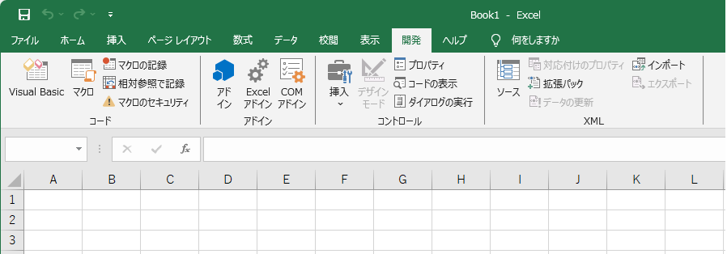

Excel VBA 開発環境の構築手順
環境構築
Excel VBA
初心者向け
新人教育

Excel VBA（えくせる　ぶいびーえー）は Excel に付属するプログラミング言語（マクロ言語）です。
Excel VBA を使うと Excel のセルやシートのデータを自動的に操作する事ができます。
Excel の初期状態では Excel VBA の開発機能は非表示
ここでは 18 歳の新入社員向けに Excel VBA の環境構築方法を紹介します。

### VBA を使う利点
###  繰り返し作業の自動化
VBA を使うと繰り返し行う作業を自動化できます。例えば、毎日行作業作業ータの加工処理、レポートの印刷作業を自動化することができます。

### 複雑な処理の実行
数式では実現するのが難しい、複雑な条件の処理を VBA で実装できます。

### どこでも使えるプログラム環境
Excel は職場を問わず、日本の 9 割以上の業務用 PC にインストールされています。
VBA で作ったプログラムは、日本のほとんどのパソコンで動かすことができます。

## Excel VBA のバージョンの歴史
1994 年の Excel 5.0 で初めてVBA が搭載され、その後、複数回のバージョンアップがありました。

|Office 製品|年|VBA のバージョン|備考|
|---|---|---|---|
|Excel 4.0|1993 年|-|マクロ機能（通称: Excel 4.0 マクロ）が初めて搭載された|
|Excel 5.0|1994 年|VBA|Excel VBA が初めて搭載された|
|Office 95|1995 年|VBA 4.0|Access と Word にも VBA が搭載された|
|Office 97|1997 年|VBA 5.0|PowerPoint にも VBA が搭載された|
|Office 2000|1999 年|VBA 6.0|-|
|Office 2003|2003 年|VBA 6.4|-|
|Office 2007|2006 年|VBA 6.5|リボンUIになり、ファイル形式や拡張子が変わった|
|Office 2010|2010 年|VBA 7.0|初めての 64 ビット版製品|
|Office 2013-2024|2013年-|VBA 7.1|-|
|Office 365|2011年-|VBA 7.1|Excel 4.0 マクロを無効化|

## Excel VBA のシステム要件
最新版の VBA 7.1 の動作環境は以下の通りです。

- Excel : 2013、2016、2019, 2021, 2024, Microsoft 365

この記事では Microsoft 365 バージョン 2406 を例に VBA 環境の構築手順を説明します

## VBA 開発環境の構築手順
### Excel を起動する
スタートメニューから Excel を起動します。

### 「ファイル」メニューを開く
Excel が起動したら、リボン UI の「**ファイル**」タブをクリックします。

### 「オプション」メニューを開く
ファイルの詳細メニューが表示されたら、「**その他**」の「**オプション**」をクリックします。

### リボンのユーザー設定
オプションが表示されたら、左側のリストの「**リボンのユーザー設定**」をクリックします。
次に右側の「**リボンのユーザー設定**」が「**メインタブ**」になっていることを確認し、リスト内の「**開発**」にチェックをつけます。
右下の「**OK**」をクリックします。

### リボンの表示確認
リボン UI に「**開発**」タブが表示されたら、設定完了です。

