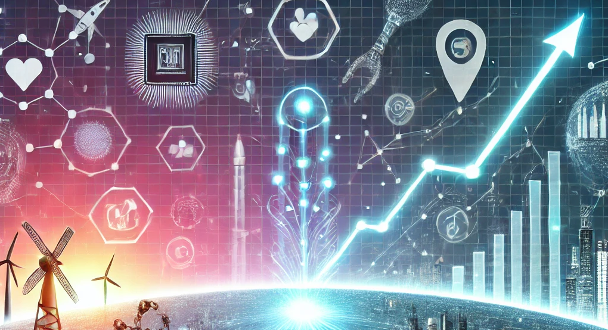
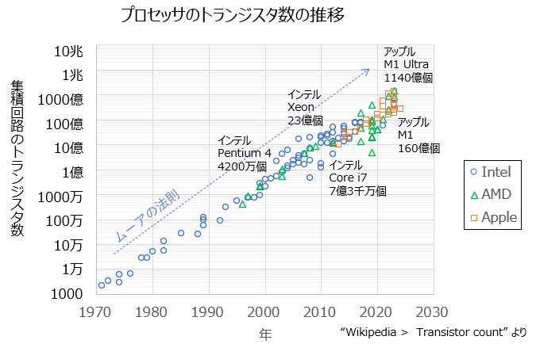
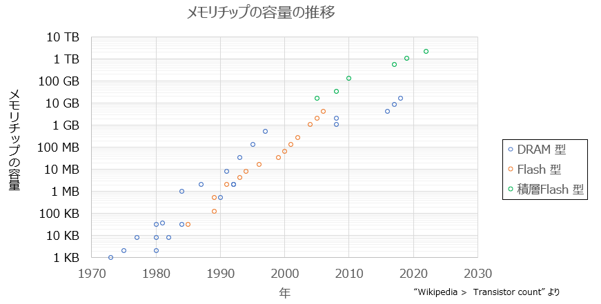
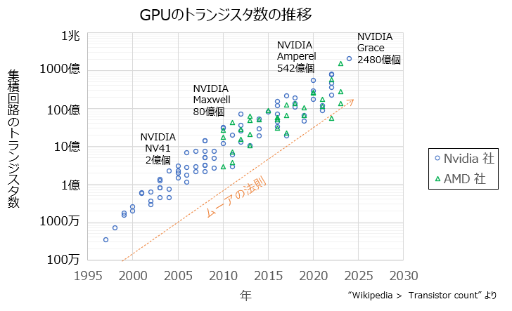
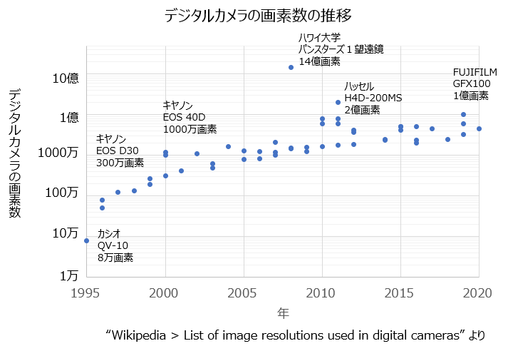
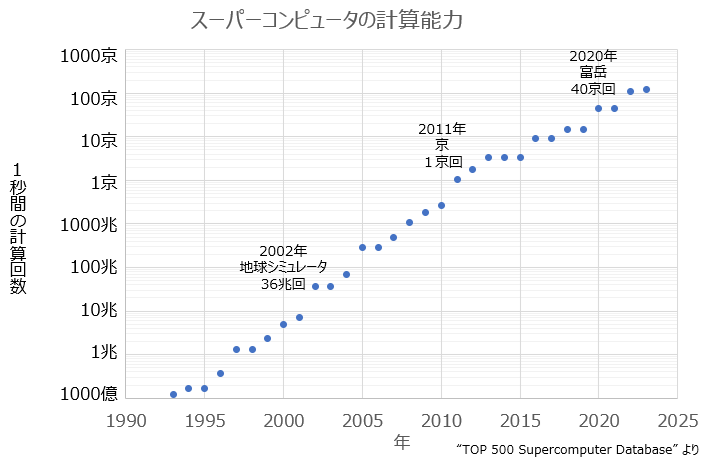

## ムーアの法則とは？
初心者向け
新人教育
パソコン未経験

ムーアの法則とは、コンピュータに含まれる論理回路の数が飛躍的に増加するという予測です。
ムーアの法則はスマートフォン、パソコン、天気予報といった身近な技術から、
生成AI、ドローン、人工衛星といった最新の科学研究まで幅広い分野に影響しています。
この記事では 18 歳の文系の新入社員向けにムーアの法則を紹介します。

## ムーアの法則とは

ムーアの法則は、1965年にインテルの共同創業者のゴードン・ムーアが提唱した考え方です。
彼は「コンピュータのチップ（半導体）の性能は、約2年ごとに2倍になる」と予測しました。

インテルをはじめ、数多くの会社がムーアの法則を実現するために努力した結果、
コンピュータの性能が指数関数的に進化し、私たちの生活が便利になりました。

例えば、15 年前の携帯電話は通話や簡単なメールしかできませんでした。
現在のスマートフォンは写真を綺麗に加工したり、動画を編集したり、AIと話ができるようになりました。

## ムーアの法則の技術的な実例

ここからはムーアの法則によって、コンピュータのどの部品が向上したのか、グラフも使って説明します。

### プロセッサのトランジスタ数
ムーアの法則の直接的な例です。
1971年に登場したインテルの最初のマイクロプロセッサ「4004」は、トランジスタ数が約2,300個でした。
2023年のインテルの「Xeon W-3400 プロセッサ」はトランジスタ数が 440 億個に増えています。
また個数の増加だけでなく、１つ１つの部品の動作速度（クロック速度）も向上しています。
これにより計算速度が飛躍的に向上し、複雑な処理が可能になりました。
    

### メモリの容量
ムーアの法則はメモリの容量の増加にも影響しています。
1990年代にはパソコンの標準的なRAM容量は4MB～8MB程度でした。
2020年代には一般的なノートパソコンで16GB（16,000MB）以上のRAMが搭載されています。
これにより動画編集や3Dゲームなど、大量のデータを扱う作業が可能になっています。

### GPU（Graphics Processing Unit、グラフィックス処理装置）のトランジスタ数
1990年代のGPUには数百万個程度のトランジスタが搭載されていましたが、
2020年代の高性能GPUには数百億個のトランジスタが搭載されています。
これにより、レイトレーシングなどの、よりリアルな3Dレンダリングが可能になり、
また科学シミュレーションや人工知能（AI）モデルの学習など、大量のデータを扱う計算が可能になりました。

### 4. デジタルカメラの画素数
デジタルカメラもムーアの法則の影響を受けています。
2000年代初頭のデジタルカメラは、画素数が100万～300万画素程度でした。
現在のスマートフォンには、1億画素を超えるカメラセンサーが搭載されるモデルもあります。（ちなみに人間の視神経の）
トランジスタ数の増加により、高性能な画像処理チップが小型化され、より高解像度の写真や動画が撮影可能になりました。

### スーパーコンピュータの計算能力
スーパーコンピュータの計算能力（FLOPS: 1秒間に実行できる浮動小数点演算回数）は、
ムーアの法則に従って指数的に進化しています。
1990年代のスーパーコンピュータは、数十ギガFLOPS程度の性能でした。
2020年代の「富岳」などのスーパーコンピュータは、**1エクサFLOPS（= 10¹⁸ FLOPS）**を超える計算能力を持っています。
これにより、気象予測や薬の開発、宇宙シミュレーションなどの分野で革新が起きています。

## ムーアの法則の限界について
ムーアの法則によると約 7 年でコンピュータの性能は 10 倍になります。

過去 50 年にわたって法則を達成し続けた結果、次のような物理的な限界が指摘されています
- トランジスタのサイズを無限に小型化することはできない。（原子サイズの限界）
- 微細化に伴う発熱問題や製造コストの増加。

実際に2010年代以降は「性能が2倍になるペース」が遅くなってきています。
それでも、科学者やエンジニアたちは新しい技術（チップレット技術や3D積層チップ等）を生み出し、この法則に近づけようと頑張っています。

## さいごに
2024年のノーベル物理学賞は「機械学習」の基礎に関わった2人、ノーベル化学賞はAIでたんぱく質の構造予測に成功した研究者ら3人が選ばれました。この記事では、AI の性能向上の源泉となったムーアの法則について紹介しました。

