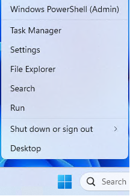
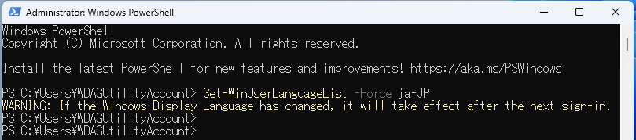
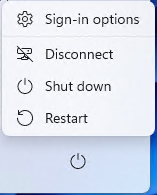

[DRAFT] １分でわかる Windows サンドボックスの使い方
tag:

「Windowsサンドボックス」は、Windows に搭載されている仮想 OS 環境です。デスクトップアプリケーションの評価環境として使う事ができます。
ここでは 18 歳の新人技術者向けに Windows サンドボックスを紹介します。

## Windows サンドボックスの特徴

Windows サンドボックスの特徴は以下の通りです。

### 統合された環境
サンドボックスは Windows に組み込まれており、別途ダウンロードやインストールの必要がありません。

### 簡単な起動・終了
サンドボックスはアプリケーションのように簡単に起動・終了できます。

### 一時的な環境:
サンドボックスは一時的なもので、使用後に閉じるとすべてのソフトウェア、ファイル、状態は消去されます。これにより、新しいソフトウェアを安全にテストすることができます。

## Windows サンドボックスのシステム要件

Windows サンドボックスは以下の環境で動作します

- オペレーティングシステム：Windows 10 または 11で、エディションが Pro または Enterprise であること
- ハードウェア：仮想化が有効になっていることと、

## Windows サンドボックスの使い方

### Windows サンドボックスのUIを日本語にする

スタートを右クリックし、「Windows PowerShell(Admin)」をクリックする

Windows PowerShellのプロンプトに以下の内容をコピー&ペーストし、「Enter」キーを押す

> Set-WinUserLanguageList -Force ja-JP

3.スタートメニューを開き、「Power」→「Restart」と順にクリック/タップする

### Windows サンドボックスに USB デバイスを接続する

