# HiSLIP 通信プロトコルの概要
タグ：C#

HiSLIP（読み方：はいすりっぷ）はオシロスコープ等の計測器の制御に使われるイーサネット通信プロトコルです。HiSLIP プロトコルは、古くから電子計測器の通信インタフェースとして使われる GP-IB（読み方：じーぴーあいびー）からネットワーク環境に容易に移行することを目的としています。

HiSLIP を説明するには、GP-IB の知識を必要とします。そこでまず GP-IB を紹介し、次に HiSLIP の概要を説明します。対象読者はイーサネットの基本（IPアドレスとTCP ポート番号）がわかる 18 歳の新人技術者を想定しています。

# GP-IB について

GP-IB は1960年代に HP 社が計測機器や制御機器などの間でデータ通信を行うために設計した通信規格です。
 
コネクタや電気信号のタイミングを定義した [IEEE488.1-1978](https://standards.ieee.org/ieee/488/6465/) (読み方：あい・とりぷるいー・よんはちはち・ぽいんとわん、通称：ぽいんとわん)と、コマンド形式や共通コマンドを定義した [IEEE488.2-1987](https://standards.ieee.org/ieee/488.2/717/) (読み方：あい・とりぷるいー・よんはちはち・ぽいんとつー、通称：ぽいんとつー)の２つの規格があります。日本語版は [JIS C 1901:1987 計測器用インタフェースシステム](https://kikakurui.com/c1/C1901-1987-01.html) です。

### 計測機器の接続例
「[JIS C 1901:1987 計測器用インタフェースシステム](https://kikakurui.com/c1/C1901-1987-01.html) 付属書A 計測システムの一例」より引用

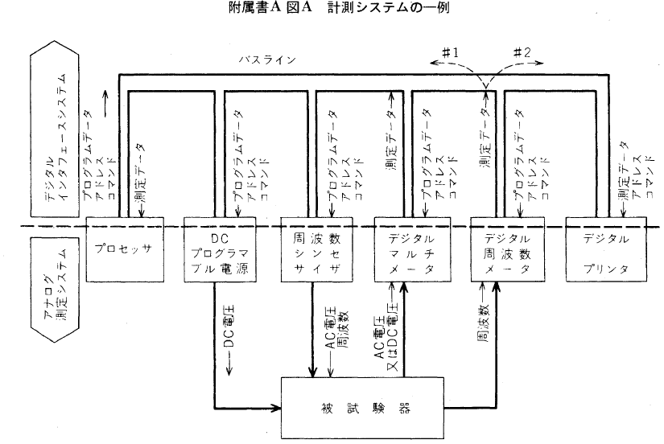

GP-IB は24ピンの頑丈なコネクタでねじ止めし制御信号はグランド線とツイストぺアで配線されているため、外部の電子ノイズに強く、三線式ハンドシェークによりトラブル発生時の原因の特定が容易なため、高い信頼性が必要な工場の生産ラインの通信方式として利用されます。

### コネクタの形状
「[JIS C 1901:1987 計測器用インタフェースシステム](https://kikakurui.com/c1/C1901-1987-01.html) 28. 装置用コネクタの取り付け方法」より引用
 

### コネクタピンの割付
|ピン番号|信号線名|ピン番号|信号線名|
|--|--|--|--|
|1|DIO 1|13|DIO 5|
|2|DIO 2|14|DIO 6|
|3|DIO 3|15|DIO 7|
|4|DIO 4|16|DIO 8|
|5|EOI(24)|17|REN(24)|
|6|DAV|18|Gnd,(6)|
|7|NRFD|19|Gnd,(7)|
|8|NDAC|20|Gnd,(8)|
|9|IFC|21|Gnd,(9)|
|10|SRQ|22|Gnd,(10)|
|11|ATN|23|Gnd,(11)|
|12|SHIELD|24|Gnd,LOGIC|

備考：Gnd,(n)は、括弧内の数字で示した信号のリターン用グランドであることを示しています。また、EOI とREN のリターン用グランドは 24 番ピンです。

### 三線式ハンドシェークのタイミングチャート
「[JIS C 1901:1987 計測器用インタフェースシステム](https://kikakurui.com/c1/C1901-1987-01.html) 付属書B ハンドシェークのタイミング」より引用

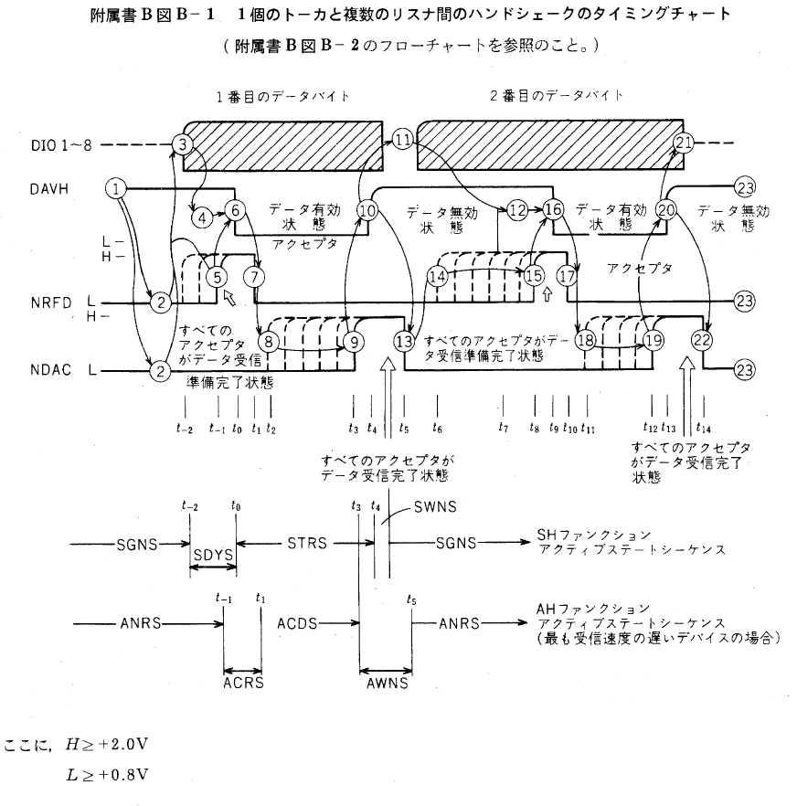

次に、HiSLIP に関係する GP-IB の用語を説明します。

### リモートローカルファンクション
計測機器を通信制御中に機器のパネルキーを操作すると設定内容に齟齬が生じます。そのような事態を避けるための仕組みがリモートローカルファンクションです。計測機器をリモート状態にするとパネルキー操作が無効になります。

### トリガファンクション
コントローラから複数台の計測機器に同時に測定開始や出力開始を指示する仕組みです。

 ### サービスリクエストファンクション
計測機器からコントローラに起動の完了やエラーの発生を非同期で通知する仕組みです。

 ### ステータスバイト
サービスリクエストの発生理由を示す 8 ビットの数値です。計測機器の応答データの準備完了やエラーの発生を示します。

「EIAJ TT-5004：計測器用インターフェースシステムのためのコード、フォーマット、プロトコル及び共通コマンド 4.4.1 要求されるステータス・レポーティング能力」より引用

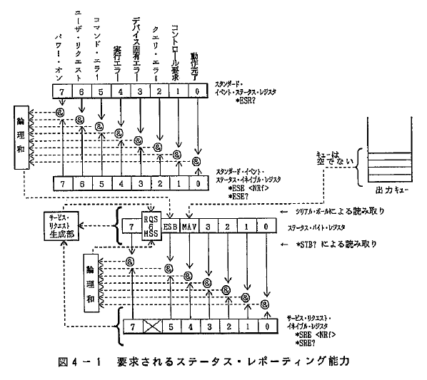

### デバイスクリアファンクション
計測機器の通信の入力バッファと出力キューをクリアし通信機能を初期状態に戻す機能です。

「EIAJ TT-5004：計測器用インターフェースシステムのためのコード、フォーマット、プロトコル及び共通コマンド 6.1.2 ステータス・レポーティング」より引用

### インタラプテッド(TODO)

### アンターミネイテッド(TODO)

# HiSLIP の概要と仕組み

HiSLIP は 2010 年にイーサネット通信で GP-IB の機能を実現するために作られた通信プロトコルです。仕様書は [IVI-6.1: IVI High-Speed LAN Instrument Protocol](https://www.ivifoundation.org/specifications/default.aspx) で公開されています。

HiSLIP はトランスポート層に TCP　を利用し、VXI-11 はアプリケーション層に相当します。

|No.|OSI階層|プロトコル|規格番号|
|-|---------|----------|--------|
|5|セッション層|Network Instrument|HiSLIP|
|4|トランスポート層|TCP|RFC 793|
|3|ネットワーク層|IPv4, IPv6|RFC 791, RFC 1883|
|2|データリンク層|Ethernet|IEEE 802.3|
|1|物理層|10BASE-T|IEEE 802.3|

同様の目的で 1995 年に作られた VXI-11 プロトコルと異なり IPv4 と IPv6 に対応しています。
HiSLIPは [TCP ポート番号 4880](https://www.iana.org/assignments/service-names-port-numbers/service-names-port-numbers.xhtml?&page=87) を利用します。

|機能|VXI-11|HiSLIP|
|--|--|--|
|GPIB 互換|互換あり|互換|
|ポート番号|動的構成|4880ポート固定|
|IPv6サポート|なし|あり|
|機器のロック|排他ロック|排他ロックまたは共有ロック|
|高速動作|なし|オーバーラップモード|

### 同期チャネル、非同期チャネル(TODO)

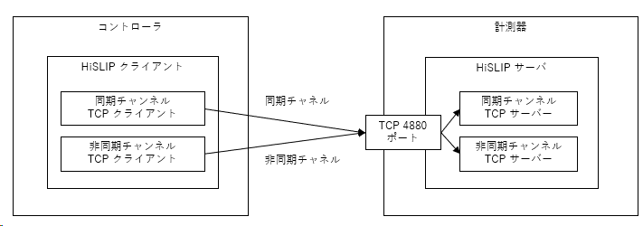    

### 同期モードとオーバーラップモード(TODO)

(TODO)

### メッセージ番号(TODO)

|メッセージ種別|チャンネル|メッセージ番号|説明|
|--|--|--|--|
|Initialize|同期|0|初期化|
|InitializeResponse|同期|1|初期化レスポンス|
|FatalError|同期|2|致命的なエラー|
|Error|非同期|3|エラー|
|AsyncLock|非同期|4|非同期ロック|
|AsyncLockResponse|非同期|5|AsyncLockResponse|
|Data|非同期|6|データ|
|DataEnd|非同期|7|データ終了|
|DeviceClearComplete|非同期|8|デバイスクリア完了|
|DeviceClearAcknowledge|非同期|9|デバイスクリアアクノリッジ|
|AsyncRemoteLocalControl|非同期|10|非同期リモート・ローカル・コントロール|
|AsyncRemoteLocalResponse|非同期|11|非同期リモートローカルレスポンス|
|Trigger|非同期|12|トリガー|
|Interrupted|非同期|13|中断|
|AsyncInterrupted|非同期|14|非同期割り込み|
|AsyncMaximumMessageSize|非同期|15|非同期最大メッセージサイズ|
|AsyncMaximumMessageSizeResponse|非同期|16|非同期MaximumMessageSizeResponse|
|AsyncInitialize|非同期|17|非同期初期化|
|AsyncInitializeResponse|非同期|18|AsyncInitializeResponse|
|AsyncDeviceClear|非同期|19|非同期デバイスクリア|
|AsyncServiceRequest|非同期|20|非同期ServiceRequest|
|AsyncStatusQuery|非同期|21|非同期ステータスクエリ（AsyncStatusQuery|
|AsyncStatusResponse|非同期|22|AsyncStatusResponse|
|AsyncDeviceClearAcknowledge|非同期|23|AsyncDeviceClearAcknowledge|
|AsyncLockInfo|非同期|24|AsyncLockInfo|
|AsyncLockInfoResponse|非同期|25|AsyncLockInfoResponse（非同期ロック情報レスポンス|

### データフォーマット(TODO)

HiSLIP のデータ構成

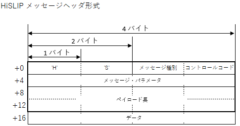

+ メッセージ番号
+ コントロールコード
+ メッセージ・パラメータ
+ ペイロード長

HiSLIP の主なメッセージのデータ構成

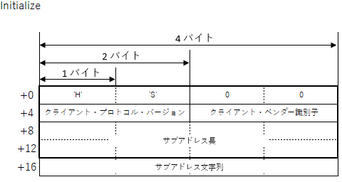

+ クライアント・プロトコル・バージョン
+ クライアント・ベンダー・識別子
+ サブアドレス

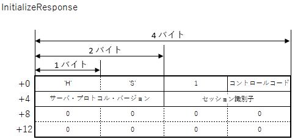

+ コントロールコード
+ サーバ・プロトコル・バージョン
+ セッション識別子

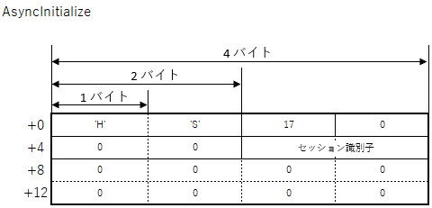

+ セッション識別子

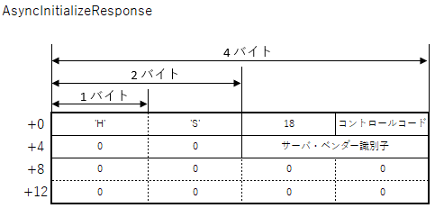

+ コントロールコード
+ サーバ・ベンダー・識別子

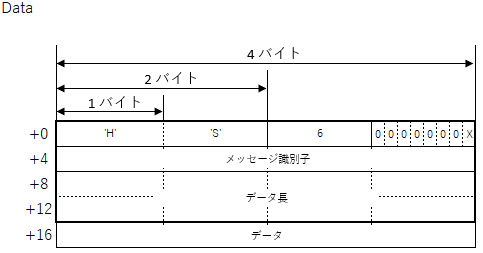
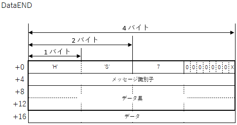

+ コントロールコード
+ メッセージ識別子
+ データ

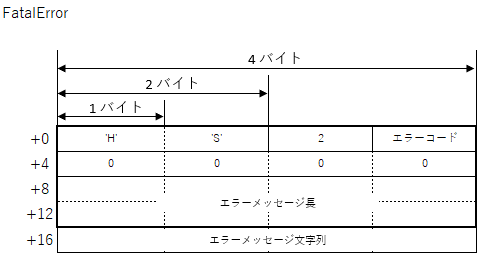

+ エラーコード
+ エラーメッセージ

|致命的エラー番号|メッセージ|
|---------|----|
|0|未確認のエラー|
|1|メッセージヘッダの形成不良|
|2|両チャンネルが確立されていない状態で接続を試行した|
|3|無効な初期化シーケンス|
|4|最大クライアント数を超えたため、サーバーが接続を拒否した|

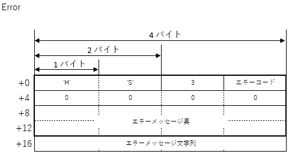

+ エラーコード
+ エラーメッセージ

|通常のエラー番号|メッセージ|
|---------|----|
|0|未確認のエラー|
|1|認識できないメッセージタイプ|
|2|認識できない制御コード|
|3|認識できないベンダ定義メッセージ|
|4|メッセージが大きすぎる|

### 接続シーケンス(TODO)

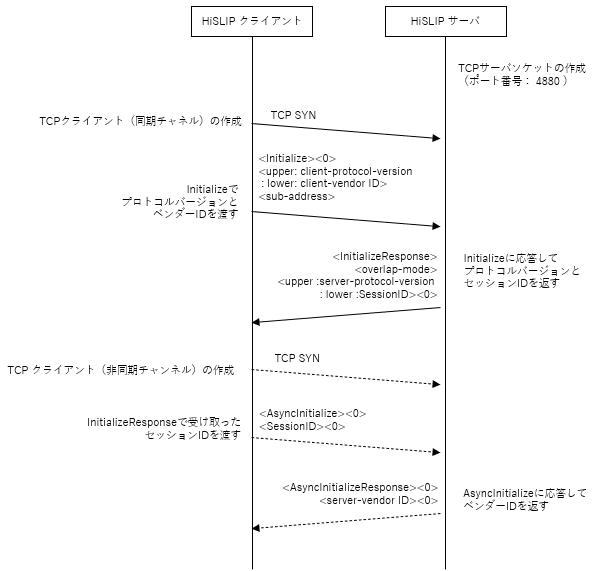

# HiSLIP の関連規格について
HiSLIP に関連する規格を紹介します。

### VISA ライブラリ
1995 年に計測器業界団体が策定した、GP-IB, RS-232, USB, イーサネットといった異なる通信規格に対して同一関数でメッセージをやりとりするための通信ライブラリです。C言語、LabView, C++(COM), C# を対象としています。GP-IB や VXI-11 を対象とするメッセージ送受信関数群と、VXI バスや PXI バスを想定したメモリ読み書き関数群があります。最新の仕様書が [VPP-4.3: The VISA Library](https://www.ivifoundation.org/specifications/) で公開されています。

### SCPI コマンド
1999 年に計測器業界団体が策定した、オシロスコープ、デジタルマルチメータ、任意信号発生器などの製品カテゴリ毎の共通コマンド文字列の仕様です。最新の仕様書が [Standard Commands for Programmable Instruments-1999](https://www.ivifoundation.org/docs/scpi-99.pdf) です。

### IVI ドライバ
1998 年に計測器業界団体が策定した、SCPI 準拠機器を同一の関数で操作するためのライブラリ仕様です。C言語, C++(COM), C# に対応しています。各社の測定器ドライバの関数や引数を統一し、仮想測定器クラスによるPC上でのシミュレーション動作に対応しています。最新の仕様が [IVI Specifications](https://www.ivifoundation.org/specifications/) で公開されています。

### LXI 規格
2005 年に計測器業界団体が策定した、人手による操作を介さずかつ特別なコンフィギュレーションサーバを使わずに自動的に計測器ネットワークを作成するための一連のルールです。接続状態を表示するインジケータ、LAN 設定のリセットボタン、VXI-11 プロトコル, IVI ドライバ, Web サーバが必須とされています。オプションとして、トリガコネクタ、IEEEE1588 時刻同期などが規定されています。最新の仕様書は [LXI Device Specification 2022](https://www.lxistandard.org/Specifications/Specifications.aspx) です。

# 参考文献
本ページで引用した参考文献を挙げます。
- [JIS C 1901:1987 計測器用インタフェースシステム](https://webdesk.jsa.or.jp/books/W11M0090/index/?bunsyo_id=JIS+C+1901%3A1987) 日本規格協会 税込4840円
