# HiSLIP 通信プロトコルの概要と仕組み
タグ：C#

HiSLIP（読み方：はいすりっぷ）はオシロスコープ等の計測器の制御に使われるイーサネット通信プロトコルです。HiSLIP プロトコルは、古くから電子計測器の通信インタフェースとして使われる GP-IB（読み方：じーぴーあいびー）からネットワーク環境に容易に移行することを目的としています。

HiSLIP を説明するには、GP-IB の知識を必要とします。そこでまず GP-IB を紹介し、次に HiSLIP の概要を説明します。対象読者としてイーサネットの基本（IPアドレスとTCP ポート番号）がわかる 18 歳の新人技術者を想定しています。

# GP-IB について

GP-IB は1960年代に HP 社が計測機器や制御機器などの間でデータ通信を行うために設計した通信規格です。
 
コネクタや電気信号のタイミングを定義した [IEEE488.1-1978](https://standards.ieee.org/ieee/488/6465/) (読み方：あい・とりぷるいー・よんはちはち・ぽいんとわん、通称：ぽいんとわん)と、コマンド形式や共通コマンドを定義した [IEEE488.2-1987](https://standards.ieee.org/ieee/488.2/717/) (読み方：あい・とりぷるいー・よんはちはち・ぽいんとつー、通称：ぽいんとつー)の２つの規格があります。日本語版は [JIS C 1901:1987 計測器用インタフェースシステム](https://kikakurui.com/c1/C1901-1987-01.html) です。

### 計測機器の接続例
「[JIS C 1901:1987 計測器用インタフェースシステム](https://kikakurui.com/c1/C1901-1987-01.html) 付属書A 計測システムの一例」より引用

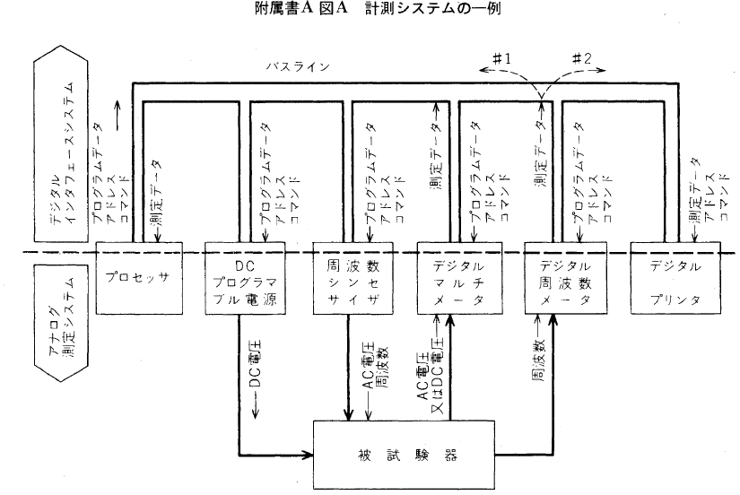

GP-IB は24ピンの頑丈なコネクタでねじ止めし制御信号はグランド線とツイストぺアで配線されているため、外部の電子ノイズに強く、三線式ハンドシェークによりトラブル発生時の原因の特定が容易なため、高い信頼性が必要な工場の生産ラインの通信方式として利用されます。

### コネクタの形状
「[JIS C 1901:1987 計測器用インタフェースシステム](https://kikakurui.com/c1/C1901-1987-01.html) 28. 装置用コネクタの取り付け方法」より引用
 
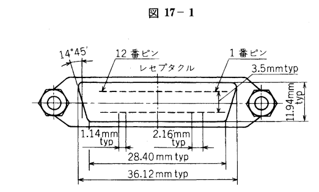

### コネクタピンの割付
|ピン番号|信号線名|ピン番号|信号線名|
|--|--|--|--|
|1|DIO 1|13|DIO 5|
|2|DIO 2|14|DIO 6|
|3|DIO 3|15|DIO 7|
|4|DIO 4|16|DIO 8|
|5|EOI(24)|17|*REN(24)*|
|6|DAV|18|Gnd,(6)|
|7|NRFD|19|Gnd,(7)|
|8|NDAC|20|Gnd,(8)|
|9|IFC|21|Gnd,(9)|
|10|*SRQ*|22|Gnd,(10)|
|11|ATN|23|Gnd,(11)|
|12|SHIELD|24|Gnd,LOGIC|

備考：Gnd,(n)は、括弧内の数字で示した信号のリターン用グランドであることを示しています。また、EOI とREN のリターン用グランドは 24 番ピンです。

### 三線式ハンドシェークのタイミングチャート
「[JIS C 1901:1987 計測器用インタフェースシステム](https://kikakurui.com/c1/C1901-1987-01.html) 付属書B ハンドシェークのタイミング」より引用

GP-IB の用語の内、VXI-11 に関係する用語を説明します。

### リモートローカルファンクション
計測機器を通信制御中に機器のパネルキーを操作すると設定内容に齟齬が生じます。そのような事態を避けるためにパネルキーの操作を無効にする仕組みがリモートローカルファンクションです。

### トリガファンクション
コントローラ から複数台の計測機器に一斉に測定開始や出力開始を指示する仕組みです。

 ### サービスリクエストファンクション
計測機器からコントローラに起動の完了やエラーの発生を非同期で通知する仕組みです。

 ### ステータスバイト
サービスリクエストの発生理由を示す 8 ビットの数値です。計測機器の応答データの準備完了やエラーの発生を示します。

「EIAJ TT-5004：計測器用インターフェースシステムのためのコード、フォーマット、プロトコル及び共通コマンド 図4-1 要求されるステータス・レポーティング能力」より引用

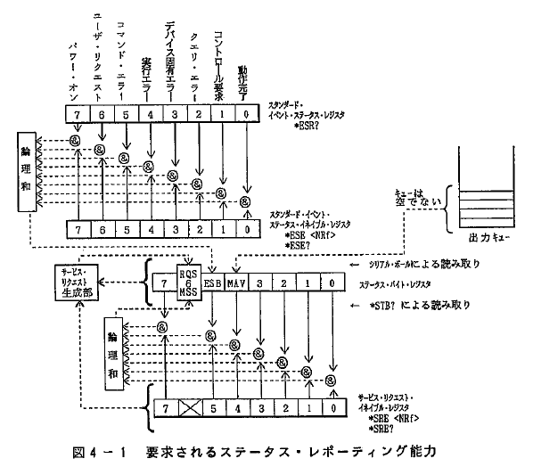

### デバイスクリアファンクション
計測機器の通信の入力バッファと出力キューをクリアし通信機能を初期状態に戻す機能です。

「EIAJ TT-5004：計測器用インターフェースシステムのためのコード、フォーマット、プロトコル及び共通コマンド」より引用

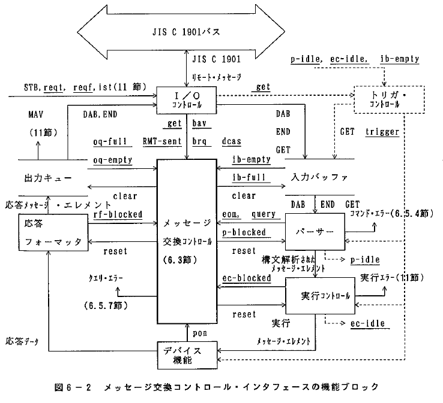

# HiSLIP について

2010 年にイーサネット通信で GP-IB の機能を実現するために作られた通信プロトコルです。

同様の目的で 1995 年に作られた VXI-11 プロトコルは 10BASE-T を想定していましたが、HiSLIPが、より高速な10GBASE-T 等を想定しています。仕様書は [VXI-11 REVISION 1.0](https://www.vxibus.org/specifications.html) で公開されています。

ポート番号

HiSLIP はトランスポート層に TCP、セッション層に TLS を利用し、VXI-11 はアプリケーション層に相当します。

|No.|OSI階層|プロトコル|規格番号|
|-|---------|----------|--------|
|7|アプリケーション層|Network Instrument|VXI-11|
|6|プレゼンテーション層|XDR|RFC 1014|
|5|セッション層|ONC RPC|RFC 1057|
|4|トランスポート層|TCP|RFC 793|
|3|ネットワーク層|IP|RFC 791|
|2|データリンク層|Ethernet|IEEE 802.3|
|1|物理層|10BASE-T|IEEE 802.3|

### ポート番号

### 同期チャネル、非同期チャネル

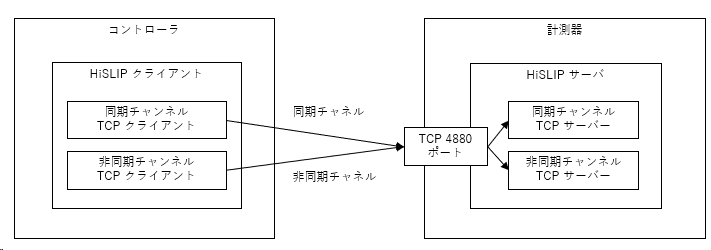

### リンク番号とロック

複数のコントローラが別々のリンクを介して単一のデバイスにアクセスすることができます。このような状況では、VXI-11 サーバーはリンクへのアクセスをロックすることができます。これにより、そのリンクに関連付けられたデバイスへの排他的なアクセスが、そのリンクだけに保証されます。コントローラがデバイスへの排他的なアクセスを必要とする場合、ロックを取得する必要があります。ロックがない場合、複数のコントローラがデータを送信し、一般的にデバイスの状態を操作することができます。そのような状況下では、デバイスの振る舞いは予測できなくなります。ロックが取得されていないデバイスに対する最初のdevice_lock呼び出しは、ロックを取得します。同じデバイスに対する後続のdevice_lock呼び出しはエラーを返します。device_unlockは、このリンクがロックを持っている場合にデバイスのロックを解除します。そうでない場合、device_unlockはエラーを返します。

### HiSLIP のシーケンス

### HiSLIP のメッセージ種別と番号

|メッセージ種別|チャンネル|メッセージ番号|説明|
|--|--|--|--|
|Initialize|同期|0|初期化|
|InitializeResponse|同期|1|初期化レスポンス|
|FatalError|同期|2|致命的なエラー|
|Error|非同期|3|エラー|
|AsyncLock|非同期|4|非同期ロック|
|AsyncLockResponse|非同期|5|AsyncLockResponse|
|Data|非同期|6|データ|
|DataEnd|非同期|7|データ終了|
|DeviceClearComplete|非同期|8|デバイスクリア完了|
|DeviceClearAcknowledge|非同期|9|デバイスクリアアクノリッジ|
|AsyncRemoteLocalControl|非同期|10|非同期リモート・ローカル・コントロール|
|AsyncRemoteLocalResponse|非同期|11|非同期リモートローカルレスポンス|
|Trigger|非同期|12|トリガー|
|Interrupted|非同期|13|中断|
|AsyncInterrupted|非同期|14|非同期割り込み|
|AsyncMaximumMessageSize|非同期|15|非同期最大メッセージサイズ|
|AsyncMaximumMessageSizeResponse|非同期|16|非同期MaximumMessageSizeResponse|
|AsyncInitialize|非同期|17|非同期初期化|
|AsyncInitializeResponse|非同期|18|AsyncInitializeResponse|
|AsyncDeviceClear|非同期|19|非同期デバイスクリア|
|AsyncServiceRequest|非同期|20|非同期ServiceRequest|
|AsyncStatusQuery|非同期|21|非同期ステータスクエリ（AsyncStatusQuery|
|AsyncStatusResponse|非同期|22|AsyncStatusResponse|
|AsyncDeviceClearAcknowledge|非同期|23|AsyncDeviceClearAcknowledge|
|AsyncLockInfo|非同期|24|AsyncLockInfo|
|AsyncLockInfoResponse|非同期|25|AsyncLockInfoResponse（非同期ロック情報レスポンス|

### HiSLIP のデータフォーマット

HiSLIP のデータ構成

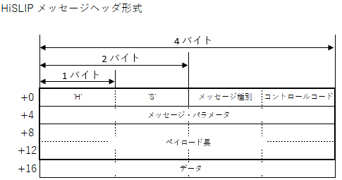

HiSLIP の主な関数の引数や戻り値のデータ構成

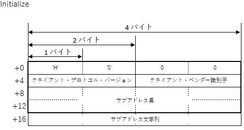
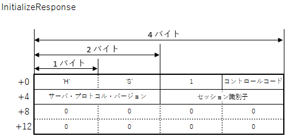

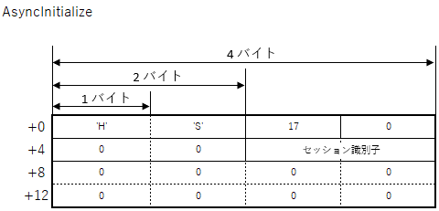
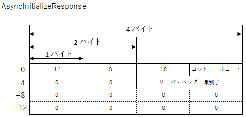

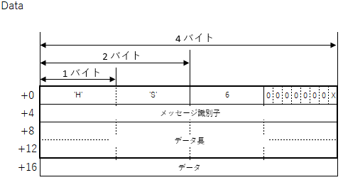
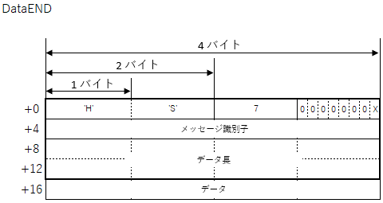

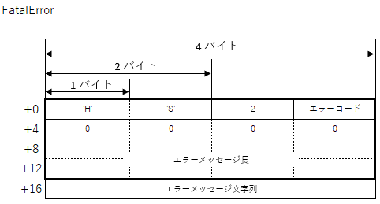
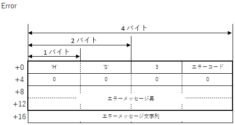

### HiSLIP のエラー番号

|エラー番号|意味|
|---------|----|
|0|エラーなし|
|1|文法エラー|
|3|デバイスにアクセスできない|
|4|不正な識別子リンク|
|5|引数エラー|
|6|チャネルが確立されていない|
|8|動作未対応|
|9|リソースがない|
|11|他のリンクによってロックされたデバイス|
|12|このリンクでロックされていない|
|15|入出力タイムアウト|
|17|入出力エラー|
|21|無効なアドレス|
|23|処理を中断した|
|29|チャネルが既に確立されている|

# VXI-11.Netについて

VXI-11.NET はクラスルームでの学習を目的とする HiSLIP 通信ソフトウェアです。サーバアプリケーションとクライアントアプリケーションがあります。２つのアプリケーション間の通信内容を パケットキャプチャソフトの Wireshark でモニタする事で通信のシーケンスを見ることができます。
- https://github.com/mitakalab1/VXI-11.Net

# HiSLIP の関連規格について
HiSLIP に関連する主な規格を紹介します。

### ソケット通信
GP-IB のリモート機能やトリガ機能は不要で RS-232 のようにコマンドの送受信だけできればよい、という簡易用途でよく使われます。

### mDNS

### VISA ライブラリ
1995年に計測器業界団体が策定した、GP-IB, RS-232, USB, イーサネットといった異なる通信規格に対して同一関数で操作するための通信ライブラリです。VXI バスを想定したメモリ読み書き関数群と、GP-IB や VXI-11 を対象とするメッセージ送受信関数群があります。C言語、LabView, C++(COM), C# を対象としています。最新の仕様書は [VPP-4.3: The VISA Library](https://www.ivifoundation.org/specifications/) で公開されています。

### SCPI コマンド
1999年に計測器業界団体が策定した、オシロスコープ、デジタルマルチメータ、任意信号発生器などの製品カテゴリ毎の共通コマンドの書式や引数の仕様です。仕様書は [Standard Commands for Programmable Instruments-1999](https://www.ivifoundation.org/docs/scpi-99.pdf) です。

### IVI ドライバ
1998年に計測器業界団体が策定した、SCPI 準拠機器を制御するC言語, C++(COM), C# の関数ライブラリ仕様です。各社の測定器の振る舞いを抽象化し仮想測定器クラスによるPC上でのシミュレーション動作に対応しています。最新の仕様が [IVI Specifications](https://www.ivifoundation.org/specifications/) で公開されています。

### LXI 規格
2005 年に計測器業界団体が策定した、LAN 接続可能な計測機器が搭載すべき機能の仕様です。接続状態を表示するインジケータ、LAN 設定のリセットボタン、VXI-11 プロトコル, IVI ドライバ, Web サーバが必須とされています。オプションとして、トリガコネクタ、IEEEE1588 時刻同期などが規定されています。最新の仕様書は [LXI Device Specification 2022](https://www.lxistandard.org/Specifications/Specifications.aspx) です。

# 参考文献

本ページで引用した参考文献を挙げます。
- [JIS C 1901:1987 計測器用インタフェースシステム](https://webdesk.jsa.or.jp/books/W11M0090/index/?bunsyo_id=JIS+C+1901%3A1987) 日本規格協会 税込4840円
