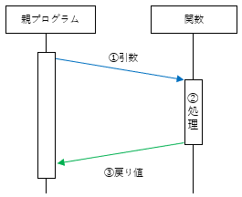
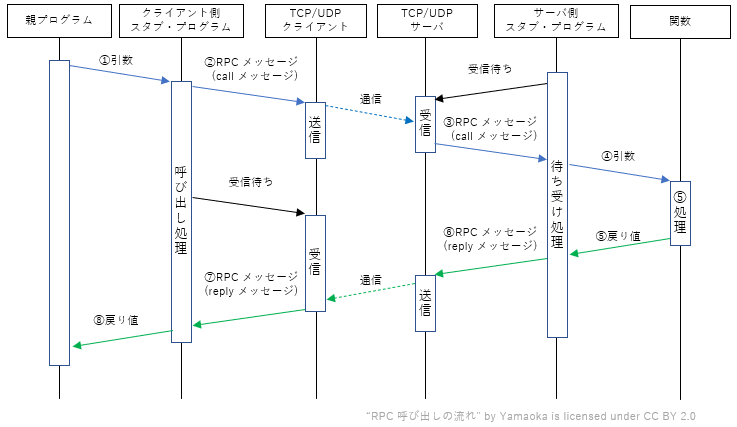
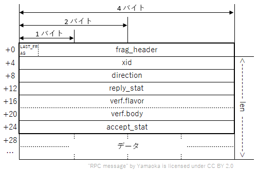
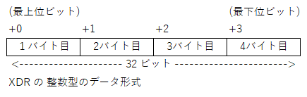
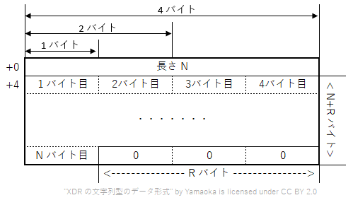

# RPCの概要と仕組み
タグ：C#

Vここではまず RPC の概要を説明します。
対象読者としてイーサネットの基本（IPアドレスとTCP ポート番号）とプログラムの基本（関数、変数、引数、戻り値）がわかる 18 歳の新人技術者を想定しています。

# RPC について

RPC は遠隔にあるシステムの関数を実行するための仕組みです。VXI-11 が採用する ONC RPC は 1988 年にインターネット標準 [RFC 1057: RPC: Remote Procedure Call Protocol specification Version 2](https://www.ietf.org/rfc/rfc1057.txt) として公開されました。

## RPC のコンセプト

一般的なプログラムでの関数呼び出しは

1. 親プログラムが関数名と引数を指定して、特定の関数を呼び出す
2. その関数の処理が実行される
3. 結果の戻り値が、親プログラムに渡される

という順序で行われます。

RPC は分散環境におけるクライアントとサーバ間の通信を、一般的な関数呼び出しのように見せることを目的にしています。関数呼び出しをクライアントとサーバ間の通信に変換する動作は以下の通りです。

1. クライアント側の親プログラムは、その処理を実行する巻子が自分のプログラム内に存在するかのように、特定の関数を呼び出します。
2. 呼び出した関数名、引数などは「スタブ (Stub)」と呼ばれるプログラムによって、RPC のプロトコルで定められた RPC メッセージ(callメッセージ)に組み立てられます
3. TCP や UDP といったトランスポートプロトコルによって、このメッセージがサーバ側に転送されます。
4. サーバ側のスタブ・プログラムは呼び出された関数、引数を取り出して、該当するプログラムを実際に呼び出します。
5. サーバ側でプログラムで要求された関数が実行されます。
6. 関数の実行結果が、サーバ側のスタブ・プログラムに戻され、結果を返すための RPC メッセージ(repy メッセージ)に組み立てられます
7. そのRPCメッセージがクライアント側に転送されます。
8. クライアント側のスタブ・プログラムが戻り値（結果）を取り出して、処理を依頼した親プログラムに戻します。

## ONC RPC のヘッダフォーマット

関数呼び出し時のヘッダフォーマット

+ RMレコード
+ メッセージ長
+ トランザクション識別子
xid はトランザクション識別子とも呼ばれ１つの RPC の call メッセージと reply メッセージで同一の値をとります。
+ メッセージ種別
msg_type は call メッセージか repy メッセージの区別を示します。

|値|定数名|意味|
|--|--|--|
|0|CALL|関数の呼び出し|
|1|REPLY|関数の応答|

+ RPCプロトコルのバージョン
rpcvers は RPC プロトコルのバージョンを示し、2をとります。
+ プログラム番号、プログラム・バージョン番号、プロシージャ番号
prog（プログラム番号）, vers（バージョン番号）, proc（プロシージャ番号） の組がサーバの論理名を示します。
+ 認証に関するパラメータ
VXI-11 では認証を使わないため、認証に関するパラメータは 0 を設定します。

応答を返す時のヘッダフォーマット

+ トランザクション識別子
xid はトランザクション識別子とも呼ばれ１つの RPC の call メッセージと reply メッセージで同一の値をとります。

+ メッセージ種別
msg_type は call メッセージか repy メッセージの区別を示します。

|値|定数名|意味|
|--|--|--|
|0|CALL|関数の呼び出し|
|1|REPLY|関数の応答|

+ 応答ステータス

|値|定数名|意味|対処方法|
|--|--|--|--|
|0|MSG_ACCEPTED|正常に実行された||
|1|MSG_DENIED|エラーが発生した||

+ 受け入れステータス

|値|定数名|意味|対処方法|
|--|--|--|--|
|0|SUCCESS|RPCが正常に実行された||
|1|PROG_UNAVAIL|リモートがプログラムをエクスポートしていない||
|2|PROG_MISMATCH|リモートがバージョン#をサポートできない||
|3|PROC_UNAVAIL|プログラムがプロシージャをサポートできません||
|4|GARBAGE_ARGS|プロシージャはパラメータをデコードできません||

# XDR について
XDR はネットワークを流れるデータの構造を明確にするたに、1987 年にインターネット標準 [RFC 1014 XDR: External Data Representation Standard](https://www.ietf.org/rfc/rfc1014txt) として公開されました。

## XDR のデータ形式

# ポート・マッパー・プログラム・プロトコル について

ポート・マッパー・プログラム・プロトコルは RFC 1057 内で規定されている、サーバのプログラム番号とプログラム・バージョン番号から、ポート番号を検索するプロトコルです。ポートマッパ自身もプログラム番号10000 をもつ RPC として定義されています。次のような機能をもちます

|関数名|プログラム番号|バージョン番号|プロシージャ番号|説明|
|--|--|--|--|--|
|PMAPPROC_SET|10000|2|1|同一のコンピュータで動作しているポートマッパ・プログラムに、サーバのプログラム番号、プログラム・バージョン番号、使用するプロトコルの種別、ポート番号を登録します|
|PMAPPROC_UNSET|10000|2|2|登録されたサーバ・プログラムの情報を抹消します|
|PMAPPROC_GETPORT|10000|2|3|ポートマッパ・プログラムに登録されているプログラムのポート番号を得ます|
|PMAPPROC_DUMP|10000|2|4|ポートマッパ・プログラムのデータベースの全ての情報をリストアップします|

# 参考文献
本ページで引用した参考文献を挙げます。
